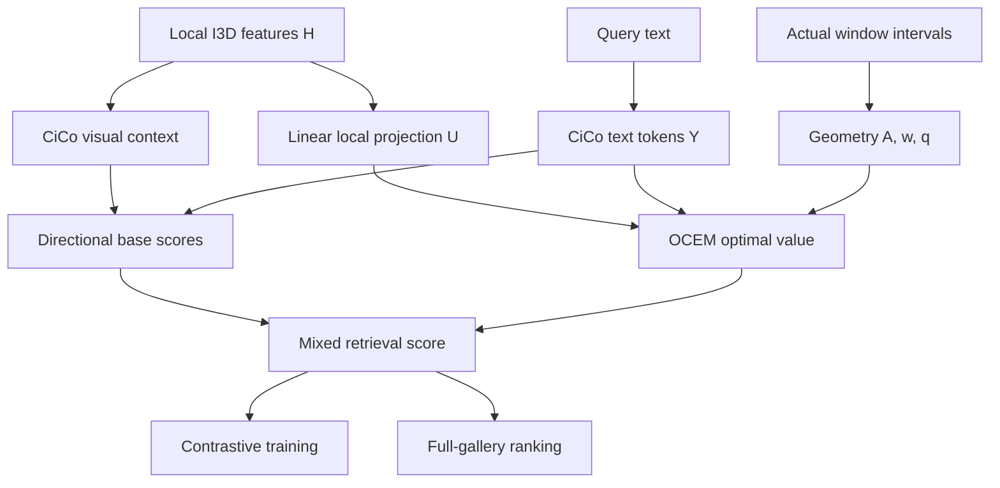

# OCEM — Đặc tả triển khai end to end cho AI Agent

**Phiên bản:** 1.0 · **Ngày:** 10/09/2026 · **Ngôn ngữ:** tiếng Việt; identifier trong mã dùng tiếng Anh.

**Phương pháp:** Overlap-Constrained Evidence Matching (OCEM).

**Trạng thái:** đặc tả cần triển khai. Đã có bộ giải tham chiếu CPU và kiểm tra toán học nhỏ; chưa có neural trainer, baseline reproduction hoặc kết quả SLRet của OCEM. Quyết định nghiên cứu vẫn là **GO WITH CONDITIONS**.

Tài liệu này chuyển proposal thành các hợp đồng phần mềm, thứ tự công việc, thuật toán, cấu hình và tiêu chí nghiệm thu. Các lệnh `python -m ocem ...`, lớp và đường dẫn dự án bên dưới là **giao diện Agent phải tạo**, không phải tuyên bố chúng đã tồn tại. Không chạy toàn bộ lệnh như một pipeline đã hoàn thiện.

## 0. Cách AI Agent sử dụng tài liệu

1. Đọc mục 1–4 và kiểm tra trạng thái thực tế của workspace.
2. Đọc `RESEARCH_STATE_CHECKPOINT.md` **Checkpoint 8**, `slret_research_report.md` mục M–W và `ocem_reference.py` nếu các file đi kèm có mặt.
3. Tạo project theo mục 5; triển khai từng milestone trong mục 25. Mỗi milestone phải có artifact nghiệm thu.
4. Hoàn thành hạ tầng và kiểm tra toán học dù dữ liệu đang thiếu. Chưa vượt gate baseline thì không huấn luyện neural OCEM trên dữ liệu SLRet.
5. Khi bị chặn, phân biệt lỗi kỹ thuật, thiếu tài nguyên và giả thuyết bị bác bỏ. Không chuyển `BLOCKED` hoặc `NO_GO` thành `PASS` bằng cách giảm yêu cầu.
6. Sau mỗi milestone, cập nhật `implementation_state.json` và checkpoint theo mục 27. Không khởi động lại literature review hoặc sinh lại phương pháp đã loại bỏ.

### 0.1 Thứ tự thẩm quyền

Chỉ dẫn hiện hành của người dùng và các ràng buộc truy cập có ưu tiên cao nhất. Checkpoint 8 giữ trạng thái khoa học; proposal giữ định nghĩa phương pháp; file này cụ thể hóa cách hiện thực. Code tham chiếu là oracle số cho bài toán nhỏ, không phải lý do để bỏ qua phương trình hoặc chứng chỉ tối ưu.

Nếu phát hiện mâu thuẫn: ghi `docs/decisions/ADR-xxxx.md`, chỉ rõ nguồn, tác động và kiểm tra cần làm. Các lựa chọn kỹ thuật thông thường được giải quyết tự chủ. Thay đổi core method, dữ liệu, supervision, tiêu chí gate hoặc protocol phải được nhận diện là thay đổi thiết kế; không sửa ngầm để làm kết quả đẹp hơn.

### 0.2 Nhãn bằng chứng

| Nhãn | Ý nghĩa |
|---|---|
| `VERIFIED_SOURCE` | Đã đọc paper/code/tài nguyên chính thức được dẫn |
| `MEASURED_AUDIT` | Đã đo trong audit; phạm vi phép đo phải được nêu |
| `DESIGN_CONTRACT` | Quy định triển khai của phiên bản này, chưa phải kết quả thực nghiệm |
| `STARTING_HYPOTHESIS` | Giá trị khởi đầu cần kiểm chứng trên train/validation |
| `UNVERIFIED` | Chưa xác minh; không được biến thành số liệu hoặc mặc định được gán cho paper |

## 1. Mục tiêu, bất biến và điều kiện thành công

### 1.1 Luận điểm cần kiểm chứng

Các cặp video–text gần đúng nhưng sai có thể được chấm điểm quá cao khi nhiều text token cùng dựa vào các cửa sổ video có hỗ trợ thời gian chồng lấn. OCEM giới hạn tổng lượng matching dùng chung trên những khoảng thời gian thực sự được quan sát, giữ một nhánh ngữ cảnh và dùng cùng score khi train/test.

**Đây là giả thuyết.** SAN cho thấy bài toán fine discrimination và standard retrieval có thể tiến triển khác nhau; chưa có thực nghiệm xác nhận chính việc tái sử dụng hỗ trợ là nguyên nhân của lỗi. Không viết README hoặc abstract theo dạng “OCEM đã giải quyết” trước khi qua các gate.

### 1.2 Các bất biến bắt buộc

| ID | Quy tắc |
|---|---|
| INV-01 | Không phụ thuộc SEDS pretrained checkpoints hoặc SEDS/Baidu precomputed features |
| INV-02 | Dữ liệu chính: PHOENIX-2014T và How2Sign, giữ các split/gallery hiện hữu |
| INV-03 | Raw video → preprocessing công khai → I3D tự trích → retrieval; không có kho feature không rõ nguồn |
| INV-04 | Không thêm pose, gloss, LLM, synthetic captions, translation decoder hoặc corpus bên ngoài cho OCEM |
| INV-05 | Target-domain adaptation chỉ dùng train; không dùng test để mining, tuning hoặc chọn checkpoint |
| INV-06 | Nhánh local dùng I3D window features **trước** visual contextual Transformer |
| INV-07 | Core mới chỉ gồm linear local projection và shared-support score; không ghép C2–C5 vào OCEM |
| INV-08 | Toàn bộ control dùng cùng feature, crop, ID manifest, local head, update budget và negative pool phù hợp |
| INV-09 | Full-gallery T2V và V2T là đánh giá chính; reranking top-K phải là track riêng |
| INV-10 | T2V inference không đọc caption gốc của candidate video |
| INV-11 | Test metric, seed, failed run và resource mismatch phải được lưu; không chỉ báo seed/direction tốt nhất |
| INV-12 | Một điểm R@1 cao hơn trên gallery khác không phải baseline reproduction hoặc fair SOTA |

Các tài nguyên BSL của I3D, CLIP và detector dùng cho crop là supervision/pretraining đã có của backbone. Chúng phải được khai báo cho cả baseline và OCEM; “gloss-free trên target” không có nghĩa “không có pretraining supervision”.

### 1.3 Ba mức hoàn thành khác nhau

- **Implementation complete:** data contracts, solver, gradient, training loop, inference và test phần mềm hoạt động.
- **Research validated:** failure hypothesis, controls, thống kê và cross-dataset gates đạt.
- **SOTA claim supported:** vượt baseline mạnh nhất thực sự comparable, không chỉ CiCo; resource/protocol tương đương đã được chứng minh.

Agent không được đồng nhất ba mức này.

## 2. Trạng thái đầu vào phải kế thừa

| Hạng mục | Trạng thái tại Checkpoint 8 | Hành động tiếp |
|---|---|---|
| Oxford `bsl5k.pth.tar` | Download đủ 142,594,302 bytes; có SHA-256 cục bộ; chưa load model | Kiểm tra file còn tồn tại; nếu cần tải lại nguồn chính thức; kiểm tra state dict/layer |
| How2Sign annotations | Train/dev/test đã download, parse, hash; quota test trước đó đã hết | Giữ snapshot; đối chiếu usable-video manifest |
| How2Sign test | Snapshot 2,357 hàng, khác gallery 2,348 trong CiCo | Không xóa chín hàng tùy ý; xác định ID và lý do loại từ protocol |
| Raw P14T/H2S | Kiểm tra endpoint/byte range; chưa kiểm tra toàn bộ archive | Provision storage và xác minh dữ liệu đầy đủ |
| CLIP | Xác minh ID và checksum kỳ vọng của OpenAI; HF range thành công; full transfer cả hai route timeout | Hoàn tất transfer, load và conversion parity nếu dùng HF |
| CiCo | Code và nhiều đường xử lý đã đọc; chưa reproduce | Là baseline đầu tiên |
| UPRet | Baseline mạnh thuộc nhóm RGB tương tự; recipe/resource cần khóa cho matched run | Reproduce/rebuild sau CiCo; không bỏ qua khi định tuyên bố SOTA |
| CMCM | Thiếu full text/runnable reproduction đáng tin cậy | Giữ novelty/SOTA risk mở; chỉ search khi có lead cần giải quyết |
| CPU scorer | `ocem_reference.py`; synthetic checks đã pass | Dùng làm oracle cho solver mới |
| GPU/SLRet training | Chưa thực hiện | Không tự điền run ID/metric thành công |

Các đường `/workspace/...` ở phiên trước có thể không tồn tại trên máy triển khai. Chúng là vị trí của artifact nghiên cứu, không phải hard-coded data root của project.

## 3. Tài nguyên, phiên bản và environment

### 3.1 Registry tài nguyên chính thức

| ID | Nguồn / model | Kiểm tra bắt buộc |
|---|---|---|
| `cico_source` | [SLRT/CiCo](https://github.com/FangyunWei/SLRT/tree/38a4f7b00da7a858d59b7fabe5093876a84db8e0/CiCo); commit `38a4f7b00da7a858d59b7fabe5093876a84db8e0` | Commit hiện diện; giữ upstream và patch riêng |
| `oxford_i3d` | [Oxford bsl5k](https://www.robots.ox.ac.uk/~vgg/research/bslattend/data/bsl5k.pth.tar) | Local expected hash từ audit: `6430592464a357dfdaa7f31973cb684663237655fdf23f3999608d162167fc6f` |
| `openai_clip` | [OpenAI ViT-B/32](https://openaipublic.azureedge.net/clip/models/40d365715913c9da98579312b702a82c18be219cc2a73407c4526f58eba950af/ViT-B-32.pt) | Official expected SHA-256 `40d365715913c9da98579312b702a82c18be219cc2a73407c4526f58eba950af` |
| `clip_source` | [OpenAI CLIP](https://github.com/openai/CLIP/tree/d05afc436d78f1c48dc0dbf8e5980a9d471f35f6) | Commit `d05afc436d78f1c48dc0dbf8e5980a9d471f35f6` |
| `clip_hf_fallback` | [openai/clip-vit-base-patch32](https://huggingface.co/openai/clip-vit-base-patch32) | Pin revision; hash; map state dict; numerical parity. Không chỉ đổi loader rồi coi tương đương |
| `p14t_raw` | [P14T v3 archive](https://www-i6.informatik.rwth-aachen.de/ftp/pub/rwth-phoenix/2016/phoenix-2014-T.v3.tar.gz) | Object audit 41,699,758,035 bytes; full transfer/extract/hash còn pending |
| `h2s_raw_annotations` | [How2Sign portal](https://how2sign.github.io/), [download script](https://raw.githubusercontent.com/how2sign/how2sign.github.io/main/download_how2sign.sh) | Tải theo các ID chính thức; kiểm tra nội dung, không chỉ HTTP200 |
| `crop_detector` | [Torchvision Faster R-CNN ResNet50 FPN](https://docs.pytorch.org/vision/main/models/generated/torchvision.models.detection.fasterrcnn_resnet50_fpn.html), `COCO_V1` | Chỉ cần nếu bbox gốc thiếu; detector/crop dùng giống nhau cho mọi method |
| `target_i3d` | Tự huấn luyện bằng code adaptation của CiCo | Train-only pseudo-labels; lưu vocabulary, threshold, training IDs và hash checkpoint |
| `seds_artifacts` | **UNAVAILABLE / DO NOT DEPEND ON** | `required=false`; config/loader không được đọc |

Hash Oxford là hash đo từ download chính thức, không phải tuyên bố có chữ ký hoặc publisher checksum. Model vẫn phải load/shape-check. Hash CLIP ở đường OpenAI là checksum kỳ vọng được code chính thức dùng. [CiCo loader](https://github.com/FangyunWei/SLRT/blob/38a4f7b00da7a858d59b7fabe5093876a84db8e0/CiCo/CLCL/modules/module_clip.py).

H2S annotation snapshot SHA-256:

```text
train  67a8f4fb6dc066f38006b89ac84c27a4b05d7fa07d5e6952f997042724d7a847
val    1bf5d57ce90d61571776d06a179335d99648d8c94fc22b327d2abb328d26137c
test   d1799dcbf100eda822eeb1a0e6e754d82b12b2a57756bd47073c4e4b8a02ae4d
```

Nếu snapshot mới khác hash: giữ cả hai phiên bản, so sánh hàng theo sample ID, tạo manifest mới và invalidation cache; không ghi đè rồi dùng feature cũ.

### 3.2 Ba environment, không coi là ba baseline

| Environment | Vai trò | Chính sách |
|---|---|---|
| `reference_cpu` | Oracle NumPy/SciPy và unit test toán | Đã chạy Python 3.12.14, NumPy 2.3.5, SciPy 1.17.0 trong audit |
| `cico_legacy` | Xác minh implementation chính thức | README ghi Python 3.7, PyTorch 1.7.1, CUDA 11.0; đây là recipe nguồn, không phải environment đã cài trong phiên này |
| `ocem_train` | Port PyTorch hiện đại và GPU scorer | Chọn wheel/CUDA theo phần cứng, pin toàn bộ dependency; phải qua parity với oracle/legacy trước chạy claim |

Agent phải tạo lockfile thực từ environment đã resolve: Python, torch, torchvision, CUDA runtime/driver, NumPy, SciPy, tokenizer, FFmpeg, OpenCV/Pillow và các package dùng thực tế. Không viết `torch>=...`, `latest` hoặc suy ra rằng phiên bản trong docs là môi trường đã được kiểm chứng.

Không cần đưa legacy environment lên production hay mở network service. Giữ code upstream chỉ đọc; patch tương thích được ghi riêng. Không `strict=False` khi load state dict mà bỏ qua danh sách missing/unexpected keys.

### 3.3 Tài nguyên tính toán

Khởi đầu bằng một GPU cho parity/pilot; 2–4 GPU là dự kiến kỹ thuật cho batch lớn, không phải yêu cầu đã benchmark. Baseline batch contrastive phải được bảo toàn bằng global gather hoặc gradient caching đã kiểm tra; gradient accumulation đơn thuần không tạo thêm negatives.

Dự kiến data volume 0.5–1 TB nếu materialize raw H2S/caches. Workspace trước có khoảng 29 GiB trống, ít hơn archive P14T: không thử download dữ liệu đầy đủ vào đó rồi xử lý lỗi hết đĩa bằng cách bỏ mẫu. Dùng data volume thích hợp hoặc strategy streaming/sharding đã xác minh, giữ cùng dữ liệu.

## 4. Gate và trạng thái vận hành

```text
S0 SPEC_READY
S1 SOFTWARE_READY
S2 RESOURCES_LOCKED(dataset)
S3 BASELINE_REPRODUCED(dataset)
S4 FAILURE_PROXY_PASS(dataset)
S5 LOCAL_FAILURE_PASS(dataset)
S6 SOLVER_CERTIFIED
S7 MINIMAL_PILOT_PASS(dataset)
S8 CORE_VALIDATED(dataset)
S9 CROSS_DATASET_CONFIRMED
S10 PAPER_CLAIM_REVIEWED
```

`S6` có thể làm song song về mặt thứ tự công việc với việc chờ raw data, vì chỉ cần synthetic inputs. Không cần spawn nhiều Agent để làm vậy. Một pilot P14T có thể bắt đầu sau các gate tương ứng của P14T; H2S phải có gate riêng trước khi dùng cho xác nhận cross-dataset.

Trạng thái kết thúc bước gồm `PASS`, `FAIL_TECHNICAL`, `BLOCKED_RESOURCE`, `NO_GO_SCIENTIFIC`, `NOT_RUN`. `NOT_RUN` không được thay bằng `PASS` vì code compile. Không cung cấp `--ignore-gates` trong training CLI.

Agent được tiếp tục những việc không bị chặn: schema, parser, unit tests, solver synthetic, docs và adapter parity với fixture phù hợp. Khi cần tài nguyên/truy cập chưa có, ghi blocker chính xác; không xin lại quyền đã được người dùng cấp và không tự tạo credential/quota bypass.

## 5. Cấu trúc project cần tạo

| Đường dẫn tương đối | Trách nhiệm |
|---|---|
| `pyproject.toml`, `env/` | Package, environment lock và build instructions |
| `configs/resources.yaml` | Resource registry; URL, expected hash, access status |
| `configs/protocols/{dataset}.yaml` | Official split/gallery, baseline recipe và score contract |
| `configs/experiments/*.yaml` | Baseline/control/OCEM; không trộn flags mơ hồ |
| `src/ocem/__main__.py`, `cli.py` | Các subcommand và gate validation |
| `src/ocem/data/{schema,manifests,video,features,collate}.py` | Data contracts, decode, extraction index, batch |
| `src/ocem/data/datasets/{phoenix,how2sign}.py` | Dataset adapters; không có metric/training logic |
| `src/ocem/baselines/cico_adapter.py` | Wrapper upstream, chuẩn hóa output conventions, giữ parity |
| `src/ocem/models/{local_head,retriever}.py` | Local projection, composition của model |
| `src/ocem/scoring/{geometry,reference,dual_gpu,autograd,controls}.py` | Geometry, oracle, solver, gradient và control scores |
| `src/ocem/training/{losses,mining,loop,grad_cache,distributed}.py` | Loss, pair pool, tối ưu hóa, memory strategies |
| `src/ocem/evaluation/{full_gallery,ranking,metrics,bootstrap}.py` | Inference và đánh giá độc lập model |
| `src/ocem/diagnostics/{concentration,shortcuts,errors}.py` | Chỉ diagnostics, không được import vào inference scorer |
| `src/ocem/provenance/{hashes,locks,gates,state}.py` | IDs, checksum, trạng thái và resume |
| `tests/{unit,integration,parity}/` | Test theo mục 22 |
| `docs/decisions/`, `docs/runbooks/` | ADR và hướng dẫn vận hành |
| `third_party/SLRT/` | Checkout đúng commit; patch ngoài thư mục upstream nếu khả thi |
| `runs/<run_id>/` | Config resolved, metrics, logs, checkpoint, gate artifacts |

`raw/`, `processed/`, `features/`, `pretrained/` nằm dưới `OCEM_DATA_ROOT`, bên ngoài repository. Dùng biến `OCEM_PROJECT_ROOT`, `OCEM_DATA_ROOT`, `OCEM_RUN_ROOT`; không dùng lại `HOME` hoặc `CODEX_HOME` làm data path.

Model, scorer và evaluation không được tự download tài nguyên khi import. Data/download là bước riêng, có log và checksum. Script bị chạy từ working directory khác vẫn phải resolve đúng path từ config.

## 6. Hợp đồng dữ liệu

### 6.1 Manifest mẫu — JSONL UTF-8

Một dòng ứng với một pair ID gốc. Tối thiểu các field:

```json
{
  "schema_version": "ocem.sample.v1",
  "dataset": "phoenix2014t",
  "split": "train",
  "sample_id": "EXAMPLE_ONLY",
  "video_id": "EXAMPLE_SOURCE_VIDEO",
  "source_group_id": null,
  "signer_id": null,
  "raw_relpath": "videos/EXAMPLE_ONLY",
  "caption_raw": "EXAMPLE_TEXT",
  "caption_sha256": "TO_BE_COMPUTED",
  "annotation_sha256": "TO_BE_COMPUTED",
  "start_time_s": 0.0,
  "end_time_s": 2.0,
  "fps_num": 25,
  "fps_den": 1,
  "decode_status": "pending",
  "include_in_protocol": null,
  "exclusion_reason": null
}
```

Đây là ví dụ schema, không phải sample thật. `source_group_id`/`signer_id` không có trong nguồn thì để null; không suy đoán danh tính.

`caption_raw` giữ đúng chuỗi đọc từ annotation sau parse TSV hợp lệ; không tự lowercase/loại dấu/sửa câu. `caption_sha256 = SHA256(UTF-8(caption_raw))`. Chuỗi chuẩn hóa chỉ dùng trong diagnostic field riêng. Exact-duplicate mask dùng raw caption hash, không tự coi paraphrase là positive.

Join annotation–video–feature bằng ID rõ ràng. Cấm ghép bằng thứ tự filename, số hàng hoặc index của dataframe sau filter.

### 6.2 Manifest split và protocol lock

Mỗi split phải có:

- Danh sách IDs gốc, IDs usable, lý do loại từng ID và thứ tự evaluation.
- Hash annotation, raw-file index, crop manifest, preprocessing config và feature index.
- Gallery IDs theo từng direction; target mapping theo ID, không dựa vào diagonal cho tới khi đã kiểm tra ordering.
- Dataset release, resource group, metric/tie policy, baseline code/config và environment hash.

Khi usable IDs chưa khớp paper: `protocol_equivalence=UNVERIFIED`, baseline gate không pass dù recall gần số báo cáo. Được chạy smoke test trên subset có nhãn `SMOKE_ONLY`; không đăng nó vào bảng SOTA.

### 6.3 Feature shard — đề xuất `.npy` + JSONL index

Chọn định dạng đơn giản, memory-map được. Một shard chứa các window nối tiếp:

| Tensor / index | Shape, dtype | Ý nghĩa |
|---|---|---|
| `features_agnostic.npy` | `[N_windows,1024]`, float16 hoặc float32 đã khóa | I3D domain-agnostic |
| `features_adapted.npy` | `[N_windows,1024]`, cùng dtype | I3D target-adapted |
| `intervals.npy` | `[N_windows,2]`, float64 | Khoảng thời gian thực, half-open |
| `window_index.jsonl` | Một record/window | Sample ID, start/end, original frame indices, padding, layer/hash |
| `sample_index.jsonl` | Một record/sample | Shard, offset, number of windows, feature checksums |

Hai stream phải có cùng sample/window IDs và cùng intervals trước khi fusion. Nếu upstream trộn feature theo công thức/normalization riêng, copy chính xác. Không mặc định phép trộn `alpha*h1+(1-alpha)*h2` cho tới khi kiểm tra hướng trọng số, normalization và đường code thực thi.

Cache full dense windows nếu cần random selection của baseline. Cache chỉ 64 windows cố định có thể thay distribution huấn luyện; chỉ hợp lệ khi baseline cũng dùng chính selection đó trong matched track và reproduction status được ghi rõ.

### 6.4 Batch contract nội bộ

| Field | Shape / type | Quy ước |
|---|---|---|
| `sample_ids` | List[str], length B | Unique IDs trong global batch |
| `local_h` | `[B,M_max,1024]` | Fused pre-contextual features |
| `video_valid` | `[B,M_max]`, bool | **True là token hợp lệ** |
| `intervals` | `[B,M_max,2]`, float64 | Chỉ xét vị trí valid |
| `text_ids` | `[B,L_max]`, int64 | Tokenizer baseline |
| `text_input_valid` | `[B,L_max]`, bool | Input encoder, theo mapping adapter |
| `text_local_valid` | `[B,L_max]`, bool | Exclude BOS/EOS/PAD cho local score |
| `caption_hashes` | List[str] | Exact duplicate exclusion khi train |
| `geometry_ids` | List[str] | Cache key sau window selection |

Mask upstream CiCo có thể dùng polarity khác nhau. Adapter chuyển sang contract `True=valid` một lần; không đảo mask tùy tiện trong nhiều module.

## 7. Raw data → representation có provenance

### 7.1 Chuẩn bị dataset

**P14T:** 7,096/519/642 là split chuẩn đã audit. Các file dưới `features/fullFrame` là ảnh frame gốc. Kiểm tra thứ tự frame theo chỉ số thật; không sort lexicographic nếu tên thiếu zero-padding.

**H2S:** dùng full frontal recordings và realigned annotations theo route CiCo. Sentence clips cũ không mặc nhiên tương đương. Snapshot annotations 31,165/1,741/2,357 khác published filtered 31,085/1,739/2,348; phải reconstruct ID selection. Không dùng số lượng để suy ra mẫu cần loại.

### 7.2 Decode và crop

1. Giữ mapping từ decoded frame tới original timestamp/frame ID.
2. Giữ FPS theo baseline; không tự đổi về 24 FPS của SEDS.
3. Ưu tiên crop boxes gốc nếu đầy đủ và xác minh được. Nếu tái tạo bằng detector công khai, ghi detector/version/box policy và dùng đúng một crop manifest cho mọi method.
4. Theo code CiCo đã đọc: BGR→RGB, scale [0,1], mean `(0.5,0.5,0.5)`, std `(1,1,1)`, resize/crop theo cấu hình 256/224. Xác nhận execution path thực tế trước khóa config; không thay bằng CLIP image normalization cho I3D.
5. Padding không tạo thời gian quan sát mới. Repeated last frame của clip ngắn phải được đánh dấu.
6. Decode lỗi hoặc annotation ngoài bounds phải vào exclusion report chung. Không skip âm thầm từng worker rồi để methods dùng gallery khác nhau.

[Nguồn loader](https://github.com/FangyunWei/SLRT/blob/38a4f7b00da7a858d59b7fabe5093876a84db8e0/CiCo/I3D_feature_extractor/datasets/videodataset.py).

### 7.3 Định nghĩa interval của window

Window 16 decoded frames liên tiếp, stride 1 như route đã audit. Với video CFR, có thể dùng frame-index units hoặc thời gian rational thống nhất; không trộn hai đơn vị giữa windows.

`I_i=[start_i,end_i)` là hỗ trợ của **các frame thật đã được đưa vào I3D**. Window padding cuối clip chỉ kéo dài tensor input, không kéo dài `end_i` vượt dữ liệu quan sát. Clip một frame vẫn cần duration dương tương ứng frame đó. Với VFR, dùng timestamps đã kiểm tra; nếu không thể xác định support chính xác thì đánh dấu sample/route chưa hợp lệ cho OCEM.

Window selection/cap tối đa 64 phải áp dụng đồng thời lên H và intervals. Sau mọi selection, tính lại geometry trên tập windows được dùng. Không dùng geometry của full video cho một tập features đã subsample.

### 7.4 Domain adaptation và extraction

- Dùng Oxford checkpoint và official CiCo adaptation recipe để tạo target checkpoint từ **train videos**.
- Khóa pseudo-label vocabulary, thresholds, sampling, optimizer, số epoch và training IDs theo nguồn. Field chưa xác minh thì dừng adaptation ở trạng thái cấu hình thiếu; không lấy default từ SEDS.
- I3D agnostic/adapted ở `eval()` khi cache feature; ngừng gradient; xác nhận layer output thực tế là 1024-D local descriptor.
- Lưu checksums của extractor weights và preprocessing vào shard metadata. Feature của test được trích bằng model đã đóng băng, không thích nghi trên test.
- Pin dtype cache và ghi sai số FP16 so với FP32 trên một sample train cố định. Mọi baseline/control đọc cùng cache.

### 7.5 Cache invalidation

Feature cache key phải phụ thuộc raw index, annotation, crops, timestamps, extractor checkpoint/layer, normalization và augmentation policy. Geometry cache key còn phụ thuộc window selection và phiên bản thuật toán geometry. Contextual/local projected caches ở inference còn phụ thuộc retrieval checkpoint.

Không reuse inference embeddings qua hai epoch khi encoder đang train. Không reuse `F(0)` nếu κ, ε, π, q hoặc geometry đổi.

## 8. CiCo adapter và reproduction gate

### 8.1 API cần cung cấp

```python
class CiCoAdapter:
    def encode(self, batch, *, training: bool):
        # Z: contextual video tokens [B,M,512]
        # Y: canonical contextual text tokens [B,L,512]
        # plus original/augmented text views and upstream masks if required
        ...

    def directional_scores(self, encoded, pairs):
        # raw_t2v, raw_v2t: [Q], BEFORE the external logit scale
        # pairs[q] = (video_batch_index, text_batch_index)
        ...

    def original_training_loss(self, encoded, protocol):
        # Reproduce upstream forward path, flags, views and normalization.
        ...

    def logit_scale(self):
        # Positive scalar, e.g. exp(upstream logit_scale parameter).
        ...
```

Không copy một helper không được `forward()` thực sự gọi rồi tuyên bố reproduce. Code đã đọc có `dual_mix`, `mix_design`, text augmentation view, mask conversion và nhiều helper khác nhau. Adapter phải trace đúng entrypoint/config của run. [CiCo modeling](https://github.com/FangyunWei/SLRT/blob/38a4f7b00da7a858d59b7fabe5093876a84db8e0/CiCo/CLCL/modules/modeling.py).

### 8.2 Score units: tránh nhân temperature hai lần

`VERIFIED_SOURCE`: hàm `flip_similarity_softmax` của CiCo tạo local affinity từ normalized features, có softmax nội bộ với scale `0.07`, sau đó nhân score tổng hợp với `exp(clip.logit_scale)`.

`DESIGN_CONTRACT`:

- `base_score_raw`: score aggregation **chưa** nhân external scale.
- `scale`: positive external multiplier của loss baseline.
- `logits = scale * score_raw`.
- Softmax temperature nội bộ của CiCo, entropy ε của OCEM và external loss scale là **ba khái niệm khác nhau**.
- Trộn `base_score_raw` với φ; sau đó mới nhân `scale` một lần cho InfoNCE.

Nếu wrapper chỉ nhận scaled logits: chia đúng `scale` để khôi phục raw score, kiểm tra numerical parity. Không trộn logits khoảng hàng chục với φ khoảng đơn vị rồi kết luận γ=0.25 không có tác dụng.

### 8.3 Score direction và matrix orientation

Mọi matrix nội bộ có shape `[N_video,N_text]`. Giữ hai matrix riêng:

- `S_t2v[v,t]`: với query text t, rank video theo cột t.
- `S_v2t[v,t]`: với query video v, rank text theo hàng v.

Tên `I2T_sim`/`T2I_sim` của upstream không đủ để suy ra transpose đúng. Viết test bằng scores bất đối xứng và sample IDs khác thứ tự. T2V và V2T không được vô tình dùng cùng một matrix nếu baseline có hai aggregation khác nhau.

### 8.4 Parity trước reproduce

Dùng fixture train nhỏ, cố định dropout/augmentation seed:

1. So sánh tokenizer IDs, masks và window selection.
2. So sánh Z/Y và hai raw scores sau mapping trục.
3. So sánh original loss và gradient của các parameter đại diện.
4. So sánh một optimizer update; không chỉ forward.
5. So sánh full-gallery metric trên fixture có tie, duplicate captions và ID ordering khác nhau.

Ngưỡng khởi đầu cho FP32 port: score/loss absolute error ≤1e−5, gradient `atol=1e−5, rtol=1e−4` ở fixture không gần zero. Nếu upstream FP16 tạo sai số khác, đo và ghi tolerance trước pilot; không tăng tolerance để giấu đổi thuật toán.

Reproduction giữ original duplicate treatment/tie evaluator để kiểm tra số paper. Sau đó tạo **matched corrected baseline** có common duplicate-negative mask và evaluator được quy định ở mục 19. Ghi cả hai, không gộp gain của sửa evaluator vào OCEM.

### 8.5 Điều kiện pass baseline

| Dataset | Published CiCo T2V R@1 | V2T R@1 | Gate |
|---|---:|---:|---|
| PHOENIX-2014T | 69.5 | 70.2 | Cùng protocol/resources; mỗi direction lệch ≤1.0 điểm phần trăm |
| How2Sign | 56.6 | 51.6 | Cùng protocol/resources; mỗi direction lệch ≤1.0 điểm phần trăm |

Nguồn: [CiCo official results](https://github.com/FangyunWei/SLRT/tree/38a4f7b00da7a858d59b7fabe5093876a84db8e0/CiCo). Giá trị UPRet reproduce CiCo khác không được dùng thay thế chỉ vì dễ đạt hơn.

Lưu `baseline_reproduction.json`: run/config/code/feature/protocol hashes, seeds, full metrics, differences, gallery IDs và trạng thái. Số gần paper trên manifest khác vẫn FAIL equivalence. Khắc phục lỗi reproduction bằng config/code có bằng chứng, không tuning OCEM trên test.

## 9. Kiến trúc OCEM và API tensor



### 9.1 Module contract

| Module | Input → output | Trainability |
|---|---|---|
| I3D feature extractor | `[N,3,16,224,224]` → `[N,1024]` | Frozen khi train retrieval |
| CiCo context | H/text IDs → Z/Y | Frozen ở pilot đầu; train ở core theo baseline |
| `LocalHead` | H `[B,M,1024]` → U `[B,M,512]` | `Linear(1024,512,bias=True)` + L2 normalize |
| `SupportGeometry` | Valid intervals `[M,2]` → A `[L,M]`, w `[L]`, q `[M]` | Deterministic, không parameter |
| `OCEMValue` | C `[Q,m,M]` + geometry → φ `[Q]`, certificates | Không learned solver; có gradient theo C |
| `Retriever` | Hai base scores và φ → hai mixed scores | γ cố định trong một run |

LocalHead thêm đúng `1024*512+512 = 524800` parameters. Không layer norm/MLP/Transformer mới. Nếu layer output của backbone khác 1024, dừng shape contract và kiểm tra layer; không tự chèn projection thứ hai.

Khởi tạo head bằng cùng một deterministic initialization cho toàn bộ control/OCEM trong một seed; lưu hash initial state. Có thể dùng khởi tạo mặc định `nn.Linear` sau seed lock, nhưng không coi đó là pretraining.

### 9.2 Những điều local score không tuyên bố

Window không phải sign unit; BPE token không phải một từ hay một gloss. Không ép một từ–một sign, không ép monotonicity giữa signed order và spoken order. Text token có thể contextual; **video feature được gán support local phải thực sự local**.

φ bất biến với việc nhân bản chính xác cùng feature/interval và chia q đúng. Toàn bộ mixed score không được hứa bất biến nếu việc nhân bản làm thay đổi contextual baseline. Test invariance đúng đối tượng.

## 10. Geometry: định nghĩa và thuật toán chính xác

### 10.1 Time atoms

Với windows \(I_i=[s_i,e_i)\), đặt \(\Omega=\bigcup_i I_i\). Sắp xếp các endpoint khác nhau, tạo các đoạn kề nhau và chỉ giữ đoạn nằm trong ít nhất một interval. Gọi các đoạn này là \(J_a\), \(a=1,\dots,L\), với \(L\le2M-1\).

\[
A_{ai}=\frac{|J_a\cap I_i|}{|I_i|},\qquad
w_a=\frac{|J_a|}{|\Omega|}.
\]

`A.sum(axis=0)=1`, `w.sum()=1`. Không gán mass cho các khoảng trống giữa windows không được encode. Không lấy toàn bộ video duration thay cho `|Ω|`.

### 10.2 Reference mass q

Group intervals có endpoints bằng nhau thành unique supports \(\bar I_g\), multiplicity \(n_g\). Trên unique supports:

\[
c(t)=\sum_g\mathbf1[t\in\bar I_g],\quad
\bar q_g=\frac1{|\Omega|}\int_{\bar I_g}\frac1{c(t)}\,dt,
\quad q_i=\frac{\bar q_{g(i)}}{n_{g(i)}}.
\]

Tính integral chính xác bằng tổng trên atoms. `q.sum()=1`; q của valid window luôn dương. Reference q bù mật độ quan sát; nó không phải attention học được hoặc semantic importance.

```text
unique_intervals, inverse, multiplicities = unique(intervals)
endpoints = sorted_unique(all endpoints)
atoms = consecutive endpoint pairs that are covered
membership[a,g] = unique interval g covers atom a
length[a] = atom_end - atom_start
w = length / sum(length)
q_unique[g] = sum_a w[a] * membership[a,g] / sum_h membership[a,h]
q[i] = q_unique[inverse[i]] / multiplicities[inverse[i]]
A[a,i] = length[a] * membership[a,inverse[i]] / width(interval[i])
```

Dùng float64 để xây geometry; endpoints từ frame ticks/rational timestamps để tránh coi hai support giống nhau là khác do rounding. Tolerance grouping, nếu cần cho timestamp source, phải được chốt trước và ghi `geometry_version`; không fuzzy-group theo similarity feature.

### 10.3 Validation và edge cases

- M=0, interval vô hạn hoặc width≤0: lỗi dữ liệu, không đưa vào solver.
- Padding batch: không tạo atom/q cho token padding.
- Duplicate support nhưng feature khác: chia prior theo multiplicity vẫn xác định được; invariance chỉ áp dụng nếu feature cũng là bản sao chính xác.
- Chỉ một window: bài toán vẫn hợp lệ; với κ≥1, support cap thường không hoạt động. Đây là control cần kiểm tra.
- Nhân mọi thời điểm với cùng hệ số dương hoặc tịnh tiến tất cả: A,w,q không đổi, trong sai số số học.
- Permute atom rows đồng thời với w hoặc permute windows đồng thời C/A/q: score không đổi. **Đây không phải shuffled-support ablation.**

## 11. Matching objective, score và giới hạn số học

### 11.1 Affinities và null

Với m valid text tokens, \(b_j=1/m\), \(u_i=\operatorname{normalize}(W_vh_i+b_v)\), \(y_j=\operatorname{normalize}(Y_j)\):

\[
C_{ji}=y_j^\top u_i,\quad
R_{ji}=b_j(1-\pi)q_i,\quad R_{j0}=b_j\pi.
\]

`pi=0.15`, `epsilon=0.05`, `kappa=1.5` là starting hypotheses, không học bằng gradient. Null similarity bằng 0; không thêm learned null embedding.

Mã tham chiếu đặt **null ở cột cuối M**; phương trình dùng chỉ số 0 cho null. Implementation phải chọn một layout duy nhất (`null_index=M`) và test việc ánh xạ. `plan[..., :M]` luôn là real assignment.

### 11.2 Primal

\[
\mathcal P_\kappa=\{P\ge0:\sum_{i\ge0}P_{ji}=b_j,
\quad A t\le\kappa w,\quad t_i=\sum_jP_{ji}\}.
\]

\[
F_\kappa(C)=\max_{P\in\mathcal P_\kappa}
\langle P_{\rm real},C\rangle
-\epsilon\sum_{j,i\ge0}P_{ji}\log(P_{ji}/R_{ji}).
\]

Null bảo đảm feasible set không rỗng. Dùng quy ước `0*log(0)=0`. Không cộng linear terms của generalized KL vào một phía rồi bỏ ở phía khác; ở đây tổng mass của P và R đều bằng 1 nên chúng triệt tiêu.

### 11.3 Centering và mixed score

\[
\phi(V,T)=F_\kappa(C)-F_\kappa(0),\qquad
S^d=(1-\gamma)s_b^d+\gamma\phi,\quad d\in\{T,V\}.
\]

Start γ=0.25; chọn bằng validation và đóng băng cho test. \(s_b^d\) là **raw score**, không phải scaled logits. `logits_d = scale * S_d` trong loss. φ được tính một lần mỗi pair và dùng cho cả hai direction.

Vì b uniform và mọi hàng C=0 giống nhau, F(0) có thể tính bằng một text row có mass 1. Cache theo `(geometry_hash,kappa,epsilon,pi,solver_version,tolerance)`. Đây là rút gọn toán học, cần test bằng zero matrices có m khác nhau.

Nếu m=0 sau mask: log input và dùng baseline score với `effective_gamma=0` cho pair đó; không loại sample khỏi evaluation. Dataset hiện chưa có blank raw captions trong snapshot, nhưng phải bảo vệ tokenizer edge cases.

## 12. Solver CPU → GPU

### 12.1 Dual

Với \(\mu\ge0\):

\[
z_j=\pi+(1-\pi)\sum_iq_i
\exp((C_{ji}-(A^\top\mu)_i)/\epsilon),
\]

\[
g(\mu)=\epsilon\sum_jb_j\log z_j+\kappa w^\top\mu,
\qquad \nabla g=\kappa w-A t.
\]

Real logits: `log((1-pi)*q_i)+(C_ji-(A.T@mu)_i)/epsilon`; null logit: `log(pi)`. Tính `logsumexp` rồi `P=b*softmax(logits)`; không dùng exponentials trực tiếp không trừ max.

### 12.2 Lộ trình hiện thực

1. Copy nguyên oracle `ocem_reference.py` vào `scoring/reference.py`, giữ hash nguồn; không refactor oracle và GPU solver cùng lúc.
2. Implement geometry/tensor masks; chứng minh parity trên synthetic shapes nhỏ.
3. Implement GPU projected gradient với per-pair backtracking, ở `torch.no_grad()` và autocast tắt.
4. Kiểm tra CPU/GPU values, plans, certificates và gradients.
5. Sau parity mới optimize bucket/batch hoặc compiled kernel. Không cần custom CUDA trong MVP.

### 12.3 Projected-gradient algorithm — contract đề xuất

Đây là implementation strategy cho cùng bài toán convex, không phải novel solver. Dùng `mu=0` ban đầu. Một bước khởi đầu bảo thủ là \(\eta=0.9\epsilon/(\|A\|_F^2+\delta)\); Frobenius norm là upper bound của spectral norm cần cho smoothness.

```text
for each pair (batched, but with its own step size and convergence state):
    mu = zeros(L)
    repeat:
        dual, grad, P = evaluate(mu)
        candidate = clamp_min(mu - eta*grad, 0)
        delta_mu = candidate - mu
        accept only if
            g(candidate) <= g(mu) + dot(grad,delta_mu)
                            + norm(delta_mu)^2/(2*eta) + numerical_slack
        otherwise eta *= 0.5 and retry the step
        mu = accepted candidate
        periodically compute feasible primal bound and duality gap
        stop this pair only when all required certificates pass
```

Không chỉ dùng `norm(grad)<tol`: nghiệm ràng buộc có gradient dương trên tọa độ μ=0. Có thể log projected-gradient residual/KKT complementarity, nhưng primal/dual certificate là gate chính.

Starting retry budgets: 128 → 512 → 2048 iterations, warm-start từ iterate trước. Giá trị này phải benchmark; không giả vờ 128 iterations luôn đủ. Nếu vẫn chưa đạt: reference CPU fallback cho pair cần thiết, ghi số lượng/thời gian. Nếu fallback quá nhiều khiến full-gallery không khả thi, solver gate FAIL; không trả score chưa hội tụ như thể hợp lệ.

### 12.4 Feasible primal và certificate

Plan từ dual iterate có thể vượt capacity. Đặt \(r=At\), \(c=\kappa w\),

\[
\zeta=\min(1,\min_a c_a/\max(r_a,\delta)).
\]

Scale tất cả real mass bởi ζ, chuyển mass bị giảm về null trong từng row. Tính primal value bằng plan khả thi này. Gọi bounds là \([p_C,d_C]\) và \([p_0,d_0]\). Khi đó:

\[
\phi\in[p_C-d_0,\ d_C-p_0],\quad
\text{width}=(d_C-p_C)+(d_0-p_0).
\]

Forward có thể trả `phi=p_C-p_0` như reference; đồng thời phải trả interval bounds. Không dùng primal một lần, dual lần khác rồi trộn metric.

| Contract | Training | Evaluation chính |
|---|---:|---:|
| Capacity violation trước feasible repair | ≤1e−5 | ≤1e−7, hoặc float64 fallback |
| Tổng hai duality gaps / width của φ | ≤1e−4 | ≤1e−6 |
| Row-mass error sau repair | ≤1e−6 | ≤1e−8 với float64 khi cần |
| NaN/Inf | 0 | 0 |

Tightening `F(C)` và `F(0)` mỗi cái một nửa tổng budget tránh sai số centering bị bỏ quên. Gap âm vượt rounding tolerance là bug, không `abs(gap)` để che dấu. `optimizer_success=True` không thay thế certificate; ngược lại optimizer flag không thành công nhưng certificate đạt cần được ghi riêng.

### 12.5 Padding và batching

MVP bucket pairs theo `(m,M,L)` rồi stack exact-sized tensors. Điều này đơn giản hơn padded solver. Nếu thêm padding sau:

- Padded windows có q=0 và logits `-inf`; không tham gia sums.
- Padded text rows có b=0 nhưng phải tránh `0*(-inf)`; mask trước reduction.
- Padded atoms không cập nhật μ và không vào `min capacity ratio`.
- Null column luôn hợp lệ để mỗi valid text row có ít nhất một finite logit.
- Certificate tính trên valid entries, không trên số chiều padding.

## 13. Gradient và precision

### 13.1 Envelope backward

Với nghiệm đủ chính xác, \(\partial F/\partial C_{ji}=P^*_{ji}\). Geometry/hyperparameters không train nên F(0) không có gradient theo encoder. Không backprop qua hàng nghìn solver iterations.

```python
class OCEMValueFunction(torch.autograd.Function):
    @staticmethod
    def forward(ctx, C, A, w, q, epsilon, pi, kappa, zero_value):
        result = certified_solve_no_grad(C, A, w, q, epsilon, pi, kappa)
        # Validated approximation of P*. Numerical diagnostics handled separately.
        ctx.save_for_backward(result.plan_real)
        return result.primal_value - zero_value

    @staticmethod
    def backward(ctx, grad_output):
        (plan_real,) = ctx.saved_tensors
        grad_C = grad_output[..., None, None] * plan_real
        return grad_C, None, None, None, None, None, None, None
```

Đây là API pseudocode; production wrapper phải enforce certificates, lưu diagnostics và hỗ trợ masked/bucketed shapes. Chỉ hỗ trợ first-order backward trong MVP; không hứa `gradgradcheck`, `vmap` hoặc `torch.compile` trước khi kiểm tra. Dùng `save_for_backward`, không giữ cả iteration graph. [PyTorch custom autograd](https://docs.pytorch.org/docs/2.14/notes/extending.html).

Sai số gradient phụ thuộc chất lượng plan, không chỉ scalar score. Bắt buộc finite-difference tests và CPU/GPU plan parity trên các chế độ constraint active/inactive. Không dùng `sum(P.detach()*C)` làm **giá trị** forward vì thiếu entropy; nó chỉ có thể là gradient surrogate trong chiến lược recomputation đã tách forward value đúng.

### 13.2 Precision rules

- Geometry CPU: float64; oracle: float64.
- Encoder có thể BF16/FP16 theo phần cứng và parity.
- Cast C, A, w, q, μ sang float32 trước solver và tắt autocast trong solver; log-sum-exp không chạy FP16.
- Evaluation pair khó/near-tie có thể dùng float64 reference; ghi rõ precision path.
- Dùng gradient scaling đúng một lần nếu chạy FP16. Unscale trước clipping. Không dùng `detach()` trên Y/U hoặc local head chỉ để giải quyết OOM.

Các quy tắc AMP phải khớp version được pin; đọc [PyTorch AMP examples](https://docs.pytorch.org/docs/2.14/notes/amp_examples.html). Không kết hợp các API cũ/mới bằng trial-and-error rồi bỏ kiểm tra optimizer step.

## 14. Loss, positives và negative pool

### 14.1 Exact duplicate mask

Với training batch có pair IDs i và caption hashes h_i:

\[
M_{ik}=\mathbf1[i=k\ \lor\ h_i\ne h_k].
\]

Positive chỉ là original paired ID. Các off-diagonal trùng caption bị loại khỏi mẫu số, không được gán thành positive mới. Mask áp dụng cho base/mixed và mọi matched control. Không bỏ duplicate queries khỏi evaluation gallery.

Nếu distributed sampler lặp cùng sample ID trong global batch, xử lý bằng sampler/batch construction thay vì tạo nhiều positive diagonal giả. Validation/test gather phải deduplicate padding của distributed sampler theo ID, không xóa bản ghi dataset có caption giống nhau.

### 14.2 Symmetric loss và scale

Với matrix logits Z theo video rows/text columns:

\[
\ell_{sym}(Z;\mathcal C)=-\frac1{2B}\sum_i
\log\frac{e^{Z_{ii}}}{\sum_{k\in\mathcal C_i^r}e^{Z_{ik}}}
-\frac1{2B}\sum_i
\log\frac{e^{Z_{ii}}}{\sum_{k\in\mathcal C_i^c}e^{Z_{ki}}}.
\]

Ở đây Z **đã** nhân external scale; không chia τ thêm. Với recipe balanced tương ứng proposal:

\[
\mathcal L_{base}=\tfrac12\ell_{sym}(Z_b^T;M)+\tfrac12\ell_{sym}(Z_b^V;M),
\]

\[
\mathcal L_{mix}=\tfrac12\ell_{sym}(scale\cdot S^T;\mathcal C)
+\tfrac12\ell_{sym}(scale\cdot S^V;\mathcal C),
\quad\mathcal L=\mathcal L_{base}+\lambda\mathcal L_{mix},\ \lambda=1.
\]

Agent phải xác minh `dual_mix/mix_design` và factor normalization của actual CiCo run trước dùng dạng rút gọn này. Nếu run gốc không tương đương, reproduction dùng đúng original loss; việc chốt matched loss phải có ADR và cùng thay đổi cho control/OCEM. Không vừa gọi `original_training_loss()` vừa cộng lại cùng base loss lần nữa.

Không thêm loss translation, pose, variance hoặc alignment visualization. Log riêng `L_base`, `L_mix`, γ, λ, scale và gradient norms; thay đổi loss weight không được coi là đóng góp.

### 14.3 Pair selection

Base: mọi in-batch pair được phép bởi M. Mixed: mỗi row và column lấy positive, tối đa 8 hard real negatives và 8 random real negatives không trùng hard/positive/duplicate-caption.

**Direction selection:** row mining dùng frozen baseline V2T; column mining dùng frozen baseline T2V. Miner là một checkpoint CiCo đã reproduce, luôn `eval()`/no-grad và không cập nhật theo OCEM. Lưu miner hash và seed. Đây là lựa chọn triển khai rõ ràng cho proposal, không phải SAN mới.

Tạo `row_candidates[i]` và `column_candidates[t]` riêng. **Union chỉ để deduplicate việc tính pair score.** Mỗi loss denominator dùng candidate set của chính nó; không vô tình thêm các pair được chọn bởi column khác vào row denominator.

Nếu không đủ negatives: lấy tất cả eligible, ghi effective counts. Nếu batch chỉ có một caption class và không có negative, không tiến optimizer với contrastive loss bằng 0 rồi gọi là training bình thường; sampler cần phân bố đa dạng mà không thay dataset frequency ngoài protocol đã khai báo.

### 14.4 Text views của CiCo

Giữ original/augmented view của baseline trong reproduction và matched controls nếu recipe dùng chúng. OCEM dùng canonical original query tokens Y để giữ cùng inference semantics. Không dùng ground-truth candidate caption của T2V để tạo thêm query context. Cache key của miner phải bao gồm view/augmentation policy; không reuse score của text khác.

### 14.5 Negative controls

Triển khai random, semantic-hard và pooled-visual-hard với cùng pool size/update budget. Semantic/visual cosine chỉ là proxy, không có nhãn phonology. SAN hoặc SAN-style phải được gắn đúng nhãn và khai báo miner/substitution resources riêng; không giả rằng pooled RGB cosine tương đương SAN local mining.

## 15. Training loop và memory strategies

### 15.1 Trình tự training

```text
assert baseline_gate(dataset) == PASS
assert required feature/config/manifest hashes match

Phase A: diagnose frozen baseline on validation (no OCEM training)
if failure proxy absent: NO_GO

Phase A2: train common unconstrained local head on train only
          freeze contextual encoders; repeat valid local-support diagnosis
if local interpretation absent: NO_GO

Phase B0: freeze the SAME common local head
          compare independent / partial OT / clip caps / OCEM / shuffled support
Phase B1: matched short local-head training, two seeds
if pilot gate fails: diagnose one concrete cause or NO_GO

Phase C: initialize controls/OCEM from matching checkpoints
         unfreeze contextual encoders; keep I3D frozen
         train L_base + lambda*L_mix using identical data/update budgets

For each global batch:
    encode baseline Z,Y and local U
    build common exact-caption exclusion mask
    obtain row/column candidate sets from frozen miner
    compute base scores and union pair scores in blocks
    solve phi with certificates, using the correct per-video geometry
    assemble per-anchor denominators without changing candidate membership
    compute the two directional losses and backward once
    check finite gradients; optimizer/scheduler update
    log losses, counts, solver gap/null mass/iterations and provenance

Select checkpoint by prespecified validation mean bidirectional R@1.
Never update choices from test diagnostics.
```

Projection-only warmup: 5 epochs initially, at most 10 if predeclared. Initial full fine-tuning budget: 20–40 epochs as a starting hypothesis; same maximum updates for all controls. Không mặc định baseline được train thêm ít hơn OCEM.

### 15.2 MVP: một GPU, shared token graph

Encode batch một lần, giữ Z/Y/U graph. Tính pair blocks; lưu chỉ scalar scores và assignments cần backward, không lưu mọi solver iterate. Với B=128 và tối đa khoảng 33B unique mixed pairs, plan storage thường nhỏ hơn all-pairs 4-D affinity; số byte phải được profiler đo.

Baseline score cũng cần block nếu tensor `[B,B,M,m]` lớn. Không được chia loss thành block rồi lấy mean riêng trên mỗi block: điều đó thay denominator InfoNCE. Scalar logits/candidate indices phải được ghép trước khi tính loss, hoặc dùng exact streaming log-sum-exp có gradient đã kiểm chứng.

### 15.3 Khi pair graphs quá lớn: score-gradient recomputation

Đây là optimization tùy chọn sau MVP parity:

1. Encode token tensors Z/Y/U một lần, giữ encoder graph.
2. Dùng các leaf copies của token tensors; chạy scoring forward không giữ pair graphs, lưu scalar logits đúng và certificates.
3. Tính full loss trên scalar logits để có `dL/dlogit` với đúng denominators.
4. Recompute từng pair block với cùng token values/geometry và nhân upstream gradient tương ứng; accumulate gradient vào token leaves và scalar scale.
5. Backprop accumulated token gradients một lần vào encoder graph; optimizer update một lần.

OCEM block có thể dùng saved certified P để tạo C-gradient; forward loss vẫn lấy optimal value có entropy. Nếu recompute encoder qua microbatches nữa, phải replay dropout/RNG hoặc dùng validated gradient-cache protocol; không encode lần hai với dropout khác.

Bắt buộc so sánh gradient/optimizer step với dense small-batch reference. Tiết kiệm bộ nhớ không được đổi global negatives, candidate sets hoặc stochastic views.

### 15.4 Distributed training

Chỉ thêm DDP sau parity một GPU. DDP tự đồng bộ parameter gradient; nó không tự biến local candidates thành global negatives. [PyTorch DDP](https://docs.pytorch.org/docs/2.14/generated/torch.nn.parallel.DistributedDataParallel.html).

Chọn một layout rõ ràng: local video/text anchors, global candidate encodings, gradient-preserving gather. Global sample ordering xác định bằng rank + local index, nhưng positives vẫn map bằng ID. Với mean loss và DDP averaging, phải test coefficient bằng một batch giống hệt chạy một GPU và nhiều GPU; không đoán nhân/chia world size.

Không dùng detached all-gather cho embeddings cần gradient mà không có equivalent custom backward. Không duplicate cả global loss trên mọi rank rồi tùy ý sửa hệ số. Drop-last training và evaluation sampler padding là hai policy khác nhau, cần kiểm tra riêng.

### 15.5 Resume và optimizer state

Checkpoint train chứa model, optimizer, scheduler, precision scaler nếu có, RNG Python/NumPy/torch/CUDA, sampler epoch/offset, global step, initial head/miner/config/feature/protocol hashes và best validation metric.

Sau resume, mismatched manifest hoặc feature hash phải fail. Không ghi đè run cũ; run mới có `parent_run_id` nếu thay config. Resume cùng config phải tái lập batch/selection tiếp theo trong giới hạn deterministic policy đã công bố.

## 16. Control implementations bắt buộc

Mọi control dùng cùng H, Y, local projection, external scale, γ, initialization, negative selection và update budget trừ yếu tố được chỉ rõ. Không so OCEM được train với OT chỉ được chấm zero-shot rồi kết luận về cơ chế.

| `score.kind` | Định nghĩa | Giả thuyết được kiểm tra |
|---|---|---|
| `base_only` | Score CiCo; không thêm φ | Baseline anchor |
| `independent` | Bỏ constraint At≤κw; giữ q, π, ε và centering | Gain có phải do head/local matching/null nói chung? |
| `clip_caps` | Thay At≤κw bằng `t_i≤κ*q_i`; giữ row/null | Shared overlap có cần thiết hơn independent column caps? |
| `balanced_uniform` | Row b, real column 1/M, không null; entropy-regularized OT | Generic joint assignment có đủ? |
| `partial_uniform` | Row b có null; `t_i≤1/M`, tổng real mass ρ | Generic partial OT/null với marginals đều |
| `partial_coverage` | Như partial uniform nhưng column cap/reference bằng q coverage | Chỉ nonuniform weighting có đủ? |
| `ocem` | Primal/dual đúng mục 11–12 | Core |
| `ocem_shuffled` | Giữ C; permute cột A và q cùng một hoán vị cố định theo video/control seed | Geometry thật hay regularization tùy ý? |

`independent` có closed form với μ=0; không mô phỏng “κ=∞” bằng κ=100 rồi mặc nhiên coi hoàn toàn unconstrained.

Các partial-OT controls ở đây là **định nghĩa control nghiên cứu**, không phải khẳng định reproduce UPRet/DualAnchor. Start ρ=0.85; nếu dùng hyperparameter sweep, cho cùng budget tối đa bốn choices (`ρ∈{0.5,0.7,0.85,0.95}` so với `κ∈{1,1.5,2,4}`), cùng γ policy. Không tune OCEM nhiều hơn baseline control rồi giấu search cost.

Với partial OT, equality tổng real mass=ρ và column caps có thể giải bằng convex reference riêng; không gọi ordinary Sinkhorn rồi giả rằng inequality đã được thực thi. Tính optimal value kèm entropy và F(0), kiểm tra feasible mass. Balanced OT có marginals equality nên dùng Sinkhorn với marginal residual đã kiểm chứng.

### 16.1 Control shuffled support phải thực sự phá correspondence

Nếu permute C, A và q đồng thời, bài toán chỉ đổi tên windows nên score bất biến: không phải random control. Nếu chỉ permute atom rows và w, cũng không đổi bài toán.

Đúng control: giữ video features/affinity C tại vị trí cũ, gán geometry của window khác bằng column permutation của A và q. Hoán vị deterministic từ `(sample_id,control_seed)`, không phụ thuộc text hoặc test label. Log mức thay đổi cấu trúc; nếu tất cả intervals disjoint/equal và feasible set không đổi dưới permutation, control đó không có sức phân biệt trên sample ấy.

### 16.2 Các ablation bổ sung sau pilot pass

Local-only (`γ=1`), contextual-only, mixed; frozen-head rescoring và learned-head; null prior; centered versus uncentered value; reference q uniform versus coverage; same-update/same-wall-time; exact feature copies; tokenizer fragmentation control. Core không có pose, vì vậy không tự tạo thêm pose ablations hoặc pose module.

**Falsification quan trọng:** nếu ordinary partial OT, clip caps, independent local head hoặc shuffled support đạt cùng gain/error pattern trong uncertainty, luận điểm support-specific chưa đủ. Không cứu luận điểm bằng thêm một loss.

## 17. Failure diagnosis trước neural OCEM

### 17.1 Pair selection và quyền sử dụng label

Chỉ train/validation cho nghiên cứu cơ chế và lựa chọn thiết kế. Với mỗi validation query bị baseline sai R@1, lấy true pair và highest-ranked incorrect pair. Giữ cả trường hợp wrong ID nhưng trùng exact caption trong một stratum riêng; nó có thể là ambiguity của protocol, không phải sign discrimination failure.

Candidate captions có thể dùng **offline diagnostic** để đo lexical overlap; module này không được import vào T2V inference. Inference dependency test phải chứng minh điều đó.

### 17.2 Statistic operational — phải preregister

Đây là cách cụ thể hóa proposal, chưa phải bằng chứng failure. Từ independent matching với cùng q, π, ε, tính plan \(P^{ind}\), real mass \(m_r=\sum_{ji}P^{ind}_{ji}\), atom load \(r=A\sum_jP^{ind}_{ji}\).

\[
d_a=\frac{r_a}{w_a\max(m_r,\delta)},\qquad
E_\kappa=\sum_a\max(r_a-\kappa w_a,0).
\]

Primary concentration statistic: weighted 95th percentile của d_a với weights w_a. Secondary: Eκ, maximum density, real/null mass và số atoms có excess. Không dùng unweighted percentile vì chia một interval thành nhiều atoms sẽ đổi trọng số.

Starting affected-stratum rule: pair có `real_mass≥0.1`, concentration của false pair cao hơn true pair, vượt percentile 90 của train-positive concentration, và `Eκ_false>Eκ_true` ở κ=1.5. Khóa rule và thresholds từ train trước xem validation outcome. Nếu diagnostic không xác định được vì baseline không expose affinity, ghi blocker; không thay bằng global cosine rồi gọi cùng phép đo.

### 17.3 Stage A versus A2

- **A:** C lấy từ contextual baseline tokens; map window indices để có proxy concentration. Token đã contextual nên chưa thể diễn giải là hỗ trợ vật lý local.
- **A2:** Sau khi train common **unconstrained** local head trên train, dùng C từ U/Y với true local intervals. Lặp lại association trên validation. Đây mới là kiểm tra tương thích với core OCEM.

So sánh true/false cùng query; stratify hoặc adjust theo video duration, số sampled windows, text token count, lexical overlap và exact-caption ambiguity. Bins được tạo từ train và lưu. Dùng paired bootstrap theo source group nếu có, không coi mọi duplicate query độc lập.

Go khi false candidates có concentration lớn hơn với paired 95% CI trên zero, kết quả không biến mất sau các controls và affected stratum chiếm ít nhất 10% R@1 errors. Association chưa là nhân quả; tiếp tục intervention B. Nếu không đạt, lưu `NO_GO_SCIENTIFIC`, không mở rộng threshold đến khi đạt.

## 18. Full-gallery inference

### 18.1 Hai interface độc lập

```python
def retrieve_t2v(query_text, video_index, retriever, top_k):
    # video_index contains IDs, features, intervals and model metadata.
    # It has NO ground-truth candidate captions.
    ...

def retrieve_v2t(query_video, text_index, retriever, top_k):
    # text_index contains ordinary gallery texts and encodings.
    ...
```

Các reference target captions cho đánh giá nằm trong evaluator, không nằm trong `video_index` scorer. Tạo integration test sửa/xóa các annotation captions của candidate videos sau khi index đã build: T2V scores phải không đổi.

### 18.2 Encoding/cache

Ở checkpoint đã đóng băng và `eval()`:

- Video: H → U/Z; intervals → A,w,q; tính F(0) theo tolerance.
- Text: query/gallery text → Y và local masks; giữ original text IDs.
- Cache key gồm checkpoint/tokenizer/config/feature/geometry hashes.

Không lấy feature context của cả gallery bằng một attention encoder chung nếu baseline không làm như vậy. Một candidate được encode độc lập theo baseline pipeline.

### 18.3 Scoring và rank

```text
for query block:
    for every gallery block in the fixed manifest:
        compute raw directional base scores
        compute local C for valid pairs
        solve/certify phi
        combine S = (1-gamma)*base + gamma*phi
        write scores or merge ranks/top-k without discarding candidate coverage
    rank by descending S, then ascending canonical gallery ID for exact ties
```

Primary evaluation quét toàn gallery, dù API chỉ trả top-K. Lưu matrix FP32/FP64 hoặc memory-mapped scores và ordering. At N=2,348, một square matrix float32 khoảng 22.1 MB; không cần giữ tất cả C tensors trong GPU memory.

Nếu score-bound intervals chồng lấn quanh rank cutoff, tighten solver cho các pairs liên quan rồi rank lại. Tolerance/precision policy giống nhau cho mọi method. Exact equal-caption ties vẫn dùng tie policy, không dùng ID label để phá hòa có lợi.

Top-K reranking chỉ được thêm sau study chính; báo candidate recall ceiling, K, cách miner được train và end-to-end latency. Không thay full-gallery numbers bằng reranker numbers mà giữ cùng nhãn protocol.

## 19. Metrics và thống kê

### 19.1 Paired-ID metrics

Với true candidate rank r_q bắt đầu từ 1:

\[
R@K=100\,\frac1N\sum_q\mathbf1[r_q\le K].
\]

Báo T2V/V2T riêng: R@1/5/10, median rank, mean rank. MRR nếu có phải ghi rõ. Caption-equivalence recall là diagnostic bổ sung, không thay standard ID metric.

Ties: primary sort theo score giảm dần, ID tăng dần, không có true-ID priority. Thêm optimistic/pessimistic/expected tie metrics. Nếu tie group size g có a candidates strict-better, expected hit@K = `clip((K-a)/g,0,1)`. Mỗi query đóng góp **một** giá trị, không flatten mọi tied rank thành nhiều query.

Fixture phải gồm target ở index không trùng query index, multiple caption duplicates, exact ties, query không có target (phải fail protocol validation) và thứ tự gallery bị permute.

### 19.2 Multiple seeds và bootstrap

Starting seed set: `{0,1}` cho B; `{0,1,2}` cho full confirmation. Đây là lựa chọn triển khai, không phải seed được paper trước dùng. Không đổi tập seed sau khi thấy outcome.

Aggregate primary metric là trung bình **bốn cell** dataset×direction R@1, không pool mọi query để H2S lấn át P14T. Báo cả mean±SD theo seed và per-cell differences.

Paired bootstrap: resample cùng query/source groups cho baseline và OCEM, giữ nguyên gallery và ranks đã tính; **không resample gallery rồi gọi cùng protocol**. Nếu có source-video IDs đáng tin cậy, cluster theo source; sensitivity analysis theo exact-caption group. Không tự suy ra signer/source từ tên file nếu không có tài liệu mapping.

Dùng ít nhất 10,000 bootstrap replicates cho final analysis, seed cố định. Tách uncertainty do seed và query sampling; có thể báo cả seed-level differences và paired cluster CI, không gộp chúng thành một “p-value” không rõ cách tính. Diagnostics subgroup phải có n và CI, không chỉ phần trăm.

## 20. Cấu hình tham chiếu và validation

File dưới đây là **template cho minimal-head pilot**, không phải recipe paper hoặc command có thể train ngay. Gate/config resolver phải từ chối đường dẫn chưa được tạo và lock chưa đạt. Tất cả controls nhận bản sao config này với `score.kind` thay đổi có chủ đích.

```yaml
schema_version: ocem.experiment.v1
run:
  name: p14t_ocem_minimal
  phase: minimal_head
  seeds: [0, 1]
  output_root: ${OCEM_RUN_ROOT}

data:
  dataset: phoenix2014t
  root: ${OCEM_DATA_ROOT}
  protocol_lock: configs/resolved/protocol.phoenix2014t.json
  feature_lock: configs/resolved/features.phoenix2014t.json
  max_video_tokens: 64
  max_text_input_tokens: 32
  keep_official_gallery: true

baseline:
  implementation: cico_adapter
  reproduction_gate: runs/baseline_phoenix2014t/baseline_reproduction.json
  checkpoint: runs/baseline_phoenix2014t/best.pt
  freeze_context: true
  freeze_logit_scale: true
  raw_score_contract: pre_external_logit_scale

model:
  local_input_dim: 1024
  embedding_dim: 512
  local_head: linear_bias_l2
  i3d_frozen: true
  add_pose: false
  add_gloss: false
  add_synthetic_captions: false

score:
  kind: ocem
  geometry: actual_window_support_v1
  reference_mass: coverage_unique_supports_v1
  null_index: last
  epsilon: 0.05
  null_prior: 0.15
  kappa: 1.5
  gamma: 0.25
  center_zero_value: true

solver:
  backend: projected_gradient_certified
  dtype: float32
  pair_block_size: 64
  retry_iterations: [128, 512, 2048]
  train_phi_gap: 1.0e-4
  eval_phi_gap: 1.0e-6
  train_capacity_residual: 1.0e-5
  eval_capacity_residual: 1.0e-7
  allow_uncertified_scores: false
  cpu_reference_fallback: true

training:
  optimizer: adam
  new_head_lr: 1.0e-4
  contextual_lr: 1.0e-5
  lambda_mix: 1.0
  global_contrastive_batch: 128
  epochs: 10
  projection_warmup_epochs: 5
  encoder_precision: float32
  schedule_from_protocol_lock: true
  use_gradient_accumulation_as_extra_negatives: false
  exact_duplicate_negative_mask: true

mining:
  source: frozen_reproduced_baseline
  hard_per_anchor: 8
  random_per_anchor: 8
  row_score: v2t
  column_score: t2v
  uniform_during_warmup: true
  union_for_compute_only: true

evaluation:
  mode: full_gallery
  tie_policy: score_desc_id_asc
  selection_metric: validation_mean_bidirectional_r1
  test_for_selection: false
  report_directions: [t2v, v2t]
  report_recall_at: [1, 5, 10]
```

Config template không override baseline reproduction batch 512 bằng 128. `global_contrastive_batch=128` là **matched pilot track** cho mọi local controls. Full core track lấy actual reproduced batch và budget từ protocol lock; nếu dùng batch khác phải báo khác biệt.

Weight decay, scheduler, augmentation và loss flags được kế thừa từ resolved protocol lock, không bỏ qua vì template không ghi. Parser phải reject unknown keys, NaN/Inf hyperparameters và môi trường chưa resolve. Không default sang train/test split khác khi path thiếu.

### 20.1 Cross-field assertions

- Core OCEM ⇒ actual supports, local-before-context, centering=true, 0<π<1, ε>0, κ>0.
- `phase=minimal_head` ⇒ only local head trainable; context và scale frozen.
- `phase=core` ⇒ baseline gate + A/A2/B pass; I3D frozen.
- Solver diagnostics invalid ⇒ training step/evaluation run không được báo thành công.
- `evaluation.mode=full_gallery` ⇒ no candidate shortlist/pre-filter theo true label.
- Negative mask và miner hash mismatch giữa controls ⇒ comparison không thuộc nhóm A.
- `base_only` ⇒ local score không được tác động inference; extra local parameter không được lén train để thay encoder.

## 21. CLI contract và lệnh vận hành dự kiến

Agent phải tạo CLI và `--help` cho các subcommand sau. Mọi lệnh có resolved config + provenance report; command thành công phải có exit code 0 và artifacts đủ, không chỉ in “done”.

| Subcommand | Input chính | Output bắt buộc |
|---|---|---|
| `doctor` | Environment/resource config | GPU/storage/package report, blockers |
| `resources verify` | Registry, download paths | `resource_lock.json`, per-resource status/hash |
| `data prepare` | Dataset/raw annotations | Original/usable manifests, exclusions |
| `features adapt` | Train manifest/Oxford model | Adapted checkpoint, pseudo-label provenance |
| `features extract` | Locked extractor/manifest | Shards, frame/support index, feature lock |
| `baseline reproduce` | Baseline protocol config | Checkpoint, scores/metrics, reproduction gate |
| `diagnose concentration` | Reproduced baseline/local head, validation | Pair stats, controls, A hoặc A2 gate |
| `solver validate` | Oracle/synthetic suite | Values/gradients/certificates/latency report |
| `train` | Experiment config, prerequisites | Train checkpoints/logs, validation metrics |
| `evaluate` | Locked run, official split | Full scores/ranks/metrics/certificates |
| `compare` | Run IDs, comparison specification | Equivalence matrix, seed/paired CI tables |
| `state checkpoint` | Current artifacts | Implementation state và resume Markdown |

Ví dụ lệnh sau khi CLI đã được hiện thực:

```bash
python -m ocem doctor --config configs/resources.yaml
python -m ocem resources verify --config configs/resources.yaml
python -m ocem data prepare --dataset phoenix2014t --protocol configs/protocols/phoenix2014t.yaml
python -m ocem features adapt --dataset phoenix2014t --split train --protocol configs/protocols/phoenix2014t.yaml
python -m ocem features extract --dataset phoenix2014t --all-splits --protocol configs/protocols/phoenix2014t.yaml
python -m ocem baseline reproduce --config configs/experiments/cico_phoenix2014t.yaml
python -m ocem solver validate --reference src/ocem/scoring/reference.py
python -m ocem diagnose concentration --run runs/baseline_phoenix2014t --split validation --stage A
python -m ocem train --config configs/experiments/local_common_phoenix2014t.yaml
python -m ocem diagnose concentration --run runs/local_common_phoenix2014t --split validation --stage A2
python -m ocem train --config configs/experiments/ocem_minimal_phoenix2014t.yaml
python -m ocem compare --spec configs/comparisons/minimal_phoenix2014t.yaml
python -m ocem state checkpoint --output runs/implementation_checkpoint.md
```

`train local_common` chỉ được phép sau baseline/A; đây là common unconstrained head cho A2, không phải core OCEM. Không chạy `train ocem_minimal` nếu A2 hoặc solver gate chưa pass. Repeat theo dataset; đừng train chung hai ngôn ngữ như một resource setting mới chưa được định nghĩa.

## 22. Test matrix và tiêu chí nghiệm thu phần mềm

Tests dưới đây cần thiết vì có rủi ro làm sai loss, gradient hoặc ranking. Không thêm test chỉ để sao chép từng dòng implementation.

| ID | Test | Acceptance |
|---|---|---|
| DATA-01 | Join ID, duplicate ID, missing file, invalid interval | Không có silent sample loss; manifest/exclusion nhất quán |
| DATA-02 | H/interval alignment sau selection/padding | Window IDs khớp; duplicate padding không tạo thời gian mới |
| DATA-03 | Snapshot versus published counts | Không tự sửa count; unresolved manifest khóa reproduction |
| BASE-01 | Upstream adapter forward/loss/gradient/update | Đạt parity mục 8; mask/view/scale được ghi |
| BASE-02 | Raw score × external scale | Khôi phục đúng logits; γ=0 trả đúng baseline score |
| GEO-01 | Analytic simple overlapping/disjoint intervals | A,w,q đúng bằng tính tay; column sums và total mass đúng |
| GEO-02 | Duplicate exact feature/support với split q | φ đổi <1e−7 ở float64 oracle |
| GEO-03 | Time shift/scale và valid permutations | Geometry/score invariant trong tolerance |
| SOLVE-01 | Unconstrained μ=0 closed form | Value/plan match analytic softmax |
| SOLVE-02 | Tiny primal constrained optimizer độc lập versus dual | Primal/dual bracket optimum; không chỉ so hai port cùng code |
| SOLVE-03 | Active/inactive constraints, low κ, null-heavy, unequal supports | Certificate đạt; không NaN/Inf |
| SOLVE-04 | Padding/bucket versus từng pair riêng | Score/gradient match |
| GRAD-01 | Finite differences theo C float64 | `atol≤1e−5`; không chỉ một entry/inactive case |
| GRAD-02 | GPU/CPU C-gradient và head/Y gradient | Agreed tolerance; gradients nonzero đúng nhánh |
| LOSS-01 | Positive/duplicate masks, row/column candidate sets | Mẫu số đúng; compute union không thay loss union |
| LOSS-02 | Dense versus block/recompute, một optimizer step | Gradient/update tương đương; không extra temperature/factor |
| DDP-01 | Cùng global batch một GPU/nhiều GPU | Loss, gradients, update tương đương; positives map đúng ID |
| EVAL-01 | Asymmetric matrix, permuted IDs, exact ties | T2V/V2T đúng trục và một weight/query |
| EVAL-02 | T2V scorer không có caption candidate | Sửa/xóa caption annotation không đổi inference score |
| EVAL-03 | Every official gallery candidate scored | Coverage=100%; missing score không bị zero-fill |
| STATE-01 | Resume/save and hash mismatch | Same config resume hợp lệ; mismatch bị chặn |
| RESOURCE-01 | No SEDS artifact route | Runtime provenance không có dependency SEDS/Baidu |

Keyword scan không đủ cho RESOURCE-01: file docs có chữ “SEDS” là bình thường. Kiểm tra actual resource graph, loaded paths và checkpoint provenance.

### 22.1 Golden mathematical fixture đã có

```text
intervals = [[0,2], [1,3], [8,10]]
C_concentrated = [[.90,.85,-.20], [.88,.90,-.20], [.86,.87,-.20]]
C_distributed  = [[.90,.20,-.20], [.20,.90,-.20], [-.20,.10,.90]]
epsilon=.05, pi=.15, kappa=1.5

Reference phi(concentrated) = 0.50404089004222
Reference phi(distributed)  = 0.7856730672279888
Reference phi(concentrated, kappa=100) = 0.8454156771597381
```

Nguồn là `ocem_mathematical_checks.json` của project. Đây **không** phải dữ liệu/kết quả SLRet. Dùng tolerance, không so string float. Case κ=100 chỉ là fixture loose-cap riêng; `independent` control vẫn dùng closed form chính xác.

## 23. Experiment gates định lượng

| Gate | Điều kiện | Artifact | Khi không đạt |
|---|---|---|---|
| G0 resources | File/manifest/crop/feature/encoder provenance đầy đủ cho dataset | Resource + protocol + feature locks | BLOCKED; làm software synthetic được, không claim reproduction |
| G1 baseline | Hai R@1 directions trong ±1pp, cùng actual protocol | `baseline_reproduction.json` | Sửa lỗi có bằng chứng; không tuning method trên test |
| G2 A | Concentration association có paired CI>0, giữ sau controls; ≥10% errors affected | `failure_gate_A.json` | NO_GO concentration hypothesis |
| G3 A2 | Association còn với actual local features | `failure_gate_A2.json` | NO_GO physical-support interpretation |
| G4 solver | Values/gradients/certificates/latency đủ dùng | `solver_validation.json` | Sửa solver, không huấn luyện trên uncertified scores |
| G5 B | Hai seeds; ≥1pp mean bidirectional validation R@1 trên strongest simple control; không direction <−0.5pp; real A tốt hơn shuffled | `pilot_gate.json` | Diagnose một lỗi cụ thể hoặc dừng |
| G6 C | Gain giữ sau parameter/update/negative controls; profiling trong budget đã công bố | `core_gate.json` | Không scale vì chỉ aggregate tốt |
| G7 D | P14T+H2S, ba seeds; mean gain dương mỗi dataset; không direction <−0.5pp; aggregate paired CI>0 | `cross_dataset_gate.json` | Không claim general SLRet |
| G8 E | ≥1pp trung bình bốn R@1 cells so strongest fair baseline, mechanism controls/robustness không giải thích hết gain | `claim_review.json` | Không claim SOTA/A* |

Các ngưỡng là decision rules của proposal, không phải expected results. Kiểm tra `difference_pp` theo percentage points, không nhầm với relative percent. 1pp trên P14T test 642 queries chỉ tương đương khoảng 6–7 queries; vì vậy cần paired analysis và nhiều seeds.

Khi qua A/B, không tự cập nhật xác suất thành >85%. Band nghiên cứu hiện vẫn 30–50% trước pilot; chỉ cập nhật bằng bằng chứng thật.

## 24. Error analysis và phát hiện shortcut

Mỗi corrected/introduction error record gồm IDs, ranks trước/sau, directional scores, null mass, concentration/excess, active constraints, duration/token counts, caption class size và baseline/control comparisons.

| Phân tích | Cách làm bằng dữ liệu có sẵn | Điều không được suy diễn |
|---|---|---|
| Length | Bins từ train: seconds, windows, text tokens/truncation | Gain theo length chưa chứng minh semantics |
| Visual/semantic hardness | Frozen pooled embeddings, cùng model cho controls | Cosine không phải nhãn sign phonology |
| Duplicate captions | Paired-ID và equivalence diagnostics riêng | Hai chuỗi khác không mặc nhiên là negative về nghĩa |
| Signer/source | Metadata được xác minh | Không đoán signer identity |
| Background | Fixed crop/mask perturbations trên cùng existing clips | Distribution-shift diagnostic không thay leaderboard |
| Template/lexical overlap | Weather templates versus lower-overlap groups; đối chiếu H2S | Không chọn riêng slice thắng làm main claim |
| Support geometry | Real versus shuffled A; overlap strata; null/κ sensitivity | High concentration có thể hợp lệ ở sign compact/simultaneous |
| Rare concepts | Tần suất từ train; existing gloss chỉ dùng diagnostic được khai báo | Không dùng test gloss để train gloss-free model |

Không tạo benchmark mới hoặc LLM paraphrase test set. Natural paraphrase cases chỉ dùng nếu annotation sẵn có hỗ trợ. Nếu cần nhận xét ngôn ngữ ký hiệu trong qualitative figures, không suy ra nghĩa của một sign chỉ từ attention map.

## 25. Work packages cho AI Agent

Thực hiện tuần tự theo dependency. Có thể viết synthetic tests trong khi chờ resource, nhưng không bỏ qua scientific gates. Mỗi work package là một thay đổi review được, có phạm vi rõ ràng.

| WP | Công việc phải làm | Dependency | Definition of done |
|---|---|---|---|
| WP-00 | Đọc nguồn, kiểm tra workspace, tạo `implementation_state.json` với statuses thực | File đặc tả | Không đánh dấu đã train; ghi blockers/data paths/hash artifact hiện có |
| WP-01 | Scaffold package/CLI/config validation/provenance | WP-00 | CLI help, schema validation, invalid config fail; không model download lúc import |
| WP-02 | Resource registry, downloader/checksum/content validation, environment lock | WP-01 | Resource states phân biệt range/full/hash/load; SEDS required=false |
| WP-03 | Dataset manifests, parser, exclusions, crop/time mapping | WP-02 theo dataset | ID joins đúng; usable/gallery manifest có provenance; chưa biết ID thì blocker rõ |
| WP-04 | I3D adaptation/extraction và feature shards | WP-03 + backbone verified | Train-only adaptation; local intervals đúng; feature lock/caches tái tạo được |
| WP-05 | CiCo adapter và legacy/modern parity | WP-01/02, fixture phù hợp | BASE-01/02 + loss/gradient/update parity pass |
| WP-06 | Geometry, CPU oracle, GPU dual, envelope backward | WP-01; không cần dataset | GEO/SOLVE/GRAD tests pass, certificate report và profiling |
| WP-07 | Training losses/mining/block scorer/evaluator | WP-05/06 | LOSS/EVAL tests pass; không thay denominator hoặc leak caption |
| WP-08 | Neural CiCo reproduction mỗi primary dataset | WP-04/05/07 | G1 pass hoặc diagnosis report; saved scores/IDs/metrics |
| WP-09 | Common duplicate controls, Stage A và A2 | WP-08 | Frozen diagnosis + local head train-only; G2/G3 pass hoặc NO_GO |
| WP-10 | Minimal controls/OCEM, hai seeds | WP-06/09 | G5 theo mục 23; ordinary OT và shuffled A bắt buộc |
| WP-11 | Core training, matched UPRet, memory/DDP tối ưu nếu cần | WP-10 | Gain qua controls, certificates đúng, budget đo được |
| WP-12 | Cross-dataset ba seeds, full ablation/statistics/error analysis | WP-11 + cả hai dataset gates | G7/G8 có bằng chứng hoặc claim bị giới hạn rõ |
| WP-13 | Release/reproduction runbook và claim review | WP-12 | Artifact provenance, lệnh tái lập, toàn bộ seeds/failed runs và final decision |

### 25.1 Prompt giao việc mẫu cho Agent triển khai

> Triển khai WP tiếp theo chưa hoàn thành trong `OCEM_END_TO_END_IMPLEMENTATION_SPEC.md`. Đọc `implementation_state.json` và Checkpoint 8 trước. Không thay core method, không thêm SEDS/Baidu dependency và không huấn luyện neural OCEM trước prerequisite gates. Tạo đúng artifact nghiệm thu của WP, chạy các test liên quan, ghi kết quả thật và cập nhật state/checkpoint. Nếu bị chặn, hoàn tất các phần độc lập có ích và ghi blocker; không giả lập metric thành công. Dùng nguồn chính thức để giải quyết các chi tiết upstream còn thiếu. Không mở lại literature search rộng hoặc candidate đã bị loại.

### 25.2 Thứ tự sửa lỗi

1. Sai dữ liệu/IDs/supports → sửa manifest/extraction trước solver.
2. Sai loss/scale/mask/direction → sửa adapter trước experiments.
3. Sai certificate/gradient → sửa solver trước neural pilot.
4. Training đúng nhưng hypothesis không có bằng chứng → scientific NO_GO, không engineering patch vô hạn.
5. Gain biến mất trước strongest matched baseline/control → sửa claim hoặc dừng; không đổi comparator để giữ tên SOTA.

## 26. Logging, budget và xử lý sự cố

### 26.1 Artifacts trong mỗi run

| Artifact | Nội dung |
|---|---|
| `resolved_config.yaml` | Không unresolved environment/path/defaults |
| `provenance.json` | Code/environment/resource/protocol/feature/miner/head-init hashes |
| `training.jsonl` | Step/epoch, losses, scale, LR, norms, effective negatives, timing |
| `solver_summary.jsonl` | Gap/residual/iterations/null mass, retry/fallback counts, max/p95 |
| `metrics.json` | Direction/split/gallery size/tie policy/seed và metrics thật |
| `query_results.jsonl` | Paired ID ranks, scores và query grouping để bootstrap |
| `best.pt`, `last.pt` | Full resume state, không chỉ weights |
| `gate_results.json` | PASS/FAIL/BLOCKED/NO_GO và evidence paths |
| `implementation_checkpoint.md` | Exact next action, blockers, unchanged scientific decisions |

Metric chưa chạy dùng `null` kèm `status=NOT_RUN`, không dùng zero như thể kết quả. File lỗi/số liệu chưa hoàn chỉnh không được exporter đọc thành final table.

### 26.2 Profiling trước scale

Đo tối thiểu trên 1,000 clips hoặc một số lượng nhỏ hơn được ghi rõ nếu dữ liệu chưa đủ: decode throughput, windows/s, GPU memory, feature bytes và crop time. Sau đó ngoại suy bằng phép tính có ghi assumptions.

Storage công thức: `N_windows * feature_dim * bytes_per_value * num_streams`, cộng index/crop/context caches. Giới hạn 64 windows không tự làm raw extraction rẻ nếu baseline cần dense cache trước random selection.

Đo scorer ở `(m,M)=(8,16),(16,32),(32,64)`, nhiều dạng overlap; báo actual pair-block size, convergence distribution và full-gallery latency. Chạy solver warmup trước timing; synchronize GPU đúng chỗ; tách compile/setup time khỏi steady-state và vẫn báo setup cost.

Budget phải được chốt từ phần cứng và phép đo trước xem R@1 pilot. Có thể dùng starting engineering guardrails `peak GPU memory≤90% physical memory`, `free disk reserve≥10% data volume`, cùng train/eval wall-time cap được ghi trong run config. Đây là lựa chọn vận hành, không phải số runtime đã đo. Không giảm gallery/batch denominator để đáp ứng budget rồi giữ nhãn fair comparison.

### 26.3 Failure handling

| Hiện tượng | Chẩn đoán trước | Hành động hợp lệ |
|---|---|---|
| HTTP200 nhưng file HTML | Login/quota/error page, không phải weight/TSV | Mark access failed; retry chính thức có giới hạn; không bypass quota |
| Model missing keys | Sai architecture/model format/layer mapping | Inspect expected key set và conversion; không bỏ qua |
| NaN loss | Mask-all-invalid, `0*(-inf)`, scale overflow, invalid norm | Dừng step; lưu IDs/config/diagnostics; sửa nguyên nhân |
| Solver gap không giảm | Step size, conditioning, dtype, primal/dual implementation | Backtracking/retry/reference; không report uncertified score |
| Tiny gap nhưng gradient sai | Null index, feasible-plan repair, missing γ/scale/loss factors | Finite-difference và optimizer-step parity |
| OOM | All-pairs affinities, stored graphs, too-large block | Giảm pair block, recompute/gradient cache đúng; giữ global pool |
| Gain chỉ khi γ≈0 | Local branch không giúp | Không claim support-specific improvement |
| Best κ là unconstrained | Capacity prior không được dữ liệu ủng hộ | Scientific NO_GO cho luận điểm constraint |
| T2V tốt, V2T giảm >0.5pp | Direction score/mask bug hoặc trade-off thật | Kiểm tra implementation; nếu đúng thì pilot gate không pass |
| H2S không transfer | Domain/length/noise/representation khác | Không generalize claim từ một dataset |
| Resume metric nhảy bất thường | RNG/sampler/optimizer/config hoặc cache mismatch | Audit state; không chọn jump checkpoint theo test |

Không retry network hoặc training không giới hạn. Mỗi retry phải có lý do kỹ thuật và giới hạn đã cấu hình. Giữ failed-attempt log; không chỉnh lịch sử gate để trông như pass lần đầu.

## 27. Handoff và checkpoint cho phiên triển khai

### 27.1 `implementation_state.json` tối thiểu

```json
{
  "schema_version": "ocem.implementation_state.v1",
  "spec_version": "1.0",
  "research_checkpoint": "8",
  "research_decision": "GO_WITH_CONDITIONS",
  "method": "OCEM",
  "seds_dependency": false,
  "current_work_package": "WP-00",
  "completed_work_packages": [],
  "gates": {
    "resources_phoenix2014t": "NOT_RUN",
    "resources_how2sign": "NOT_RUN",
    "baseline_phoenix2014t": "NOT_RUN",
    "baseline_how2sign": "NOT_RUN",
    "solver_gpu": "NOT_RUN",
    "failure_A": "NOT_RUN",
    "failure_A2": "NOT_RUN",
    "minimal_pilot": "NOT_RUN"
  },
  "resource_lock_sha256": null,
  "feature_lock_sha256": null,
  "last_run_id": null,
  "open_blockers": [],
  "next_action": "Inspect supplied artifacts and initialize actual workspace state."
}
```

Template không phủ nhận các audit nguồn đã hoàn thành. Nó nói các gate của **workspace triển khai mới** chưa được thực thi; Agent phải kiểm tra artifact thật trước cập nhật. Không set `resources=PASS` chỉ vì một số byte đã tải ở phiên nghiên cứu.

### 27.2 Snapshot bàn giao của chính tài liệu này

File này tạo thêm implementation contract; **không thay Checkpoint 8 về kết quả khoa học**. Không có neural experiment mới được thực hiện khi soạn file. Các chi tiết mới là quy ước kỹ thuật được nêu rõ: raw-score units, null column cuối, candidate-set union chỉ cho computation, solver certificate của centered score, control definitions và gradient-parity gates.

Khi Agent tạo checkpoint sau một WP, phải bảo toàn 17 mục sau:

| Mục checkpoint | Nội dung phải lưu |
|---|---|
| 1. Objective | SLRet methodological contribution; fairness; không dataset/benchmark mới; không SEDS/Baidu |
| 2. Phase | WP/gate vừa xong, đang làm và tiếp theo; phân biệt code versus experiment |
| 3. Verified papers | Giữ danh sách đã xác minh từ Checkpoint 8; chỉ bổ sung khi có nguồn mới, không xóa vì không dùng trong code |
| 4. SOTA understanding | Các resource groups và verified published results giữ nguyên nếu không có bằng chứng mới |
| 5. Dataset/protocol | Exact manifest hashes, sizes, exclusions, crop/FPS/support policy |
| 6. Confirmed findings | Chỉ số/kiểm tra đã chạy thật và evidence path |
| 7. Open hypotheses | H1 concentration và các falsification tests; trạng thái đúng |
| 8. Research gaps | Giữ ranking của Checkpoint 8; không biến G1 conditional thành established |
| 9. Rejected ideas | Generic OT/fusion/mining/scale-only/SEDS dependency vẫn bị loại |
| 10. Candidates | Chỉ OCEM đang được triển khai; C2–C5 không tái sinh thành module |
| 11. Leading method | Phiên bản equations, loss/score, negative pool, resource contract |
| 12. Novelty audit | CMCM chưa đầy đủ và partial-OT/coverage collision vẫn mở nếu chưa xử lý |
| 13. Resources | Phân biệt range/full/hash/load/reproduce; đường chính thức/fallback |
| 14. Decisions | ADR mới; quyết định cũ giữ nguyên; không sửa gates hồi tố |
| 15. Outstanding questions | CRITICAL/IMPORTANT/OPTIONAL; resource blocker versus scientific failure |
| 16. Exact next actions | Lệnh/WP/input/evidence cần tạo ngay tiếp theo |
| 17. Resume rule | Tiếp tục từ state, không restart search hoặc tái tạo ý tưởng đã loại |

**Exact next action từ snapshot này:** thực hiện WP-00/01 trên workspace được giao; kiểm tra các file nghiên cứu kèm theo, sau đó làm resource lock/adapter parity và synthetic solver theo dependencies. Việc soạn xong đặc tả không đồng nghĩa WP-01 hoặc G4 đã pass.

> RESUME RULE: Khi tiếp tục triển khai, coi Checkpoint 8 là trạng thái khoa học gốc và checkpoint implementation gần nhất là trạng thái công việc. Không bắt đầu lại literature review, không tái sinh ý tưởng đã REJECTED và không đổi phương trình/gate mà không ghi ADR. Tiếp tục từ “Exact next actions”; mọi factual claim mới phải có nguồn chính thức hoặc artifact đo được.

## 28. Nguồn kiểm chứng và phạm vi

### 28.1 Tài liệu của project

| File | Cần dùng vào việc gì |
|---|---|
| `slret_research_report.md` | A–Z review; proposal M–N; training/inference O–P; experiments/gates R–W |
| `RESEARCH_STATE_CHECKPOINT.md` — Checkpoint 8 | Quyết định khoa học, rejected candidates, facts và unknowns |
| `ocem_reference.py` | CPU dual solver/geometry; oracle ban đầu |
| `ocem_mathematical_checks.json` | Golden synthetic outputs, không phải SLRet metrics |
| `slret_evidence_audit.json` | Access logs, annotation audit, versions/hashes và limitations |

Nếu file kèm theo không có, không bịa nội dung của nó. Dùng equations và nguồn chính thức trong đặc tả để làm các phần độc lập; yêu cầu bổ sung artifact khi nó thực sự cần cho parity/resume, thay vì coi một implementation tự viết là exact copy của oracle.

### 28.2 Primary sources cho các quyết định quan trọng

- [CiCo paper](https://arxiv.org/abs/2303.12793), [pinned implementation](https://github.com/FangyunWei/SLRT/tree/38a4f7b00da7a858d59b7fabe5093876a84db8e0/CiCo): baseline, encoders, preprocessing và matching.
- [UPRet](https://arxiv.org/abs/2405.19689): probabilistic/OT prior art và stronger comparable RGB reference; không đồng nhất control OT của đặc tả với UPRet.
- [SAN](https://arxiv.org/abs/2607.09263): fine/standard distinction và sign-aware mining; không phải bằng chứng trực tiếp về shared-support failure.
- [SEDS](https://arxiv.org/abs/2407.16394): RGB+pose comparator; artifacts của nó không nằm trong pipeline.
- [How2Sign official](https://how2sign.github.io/), [P14T official](https://www-i6.informatik.rwth-aachen.de/~koller/RWTH-PHOENIX-2014-T/): raw releases/protocol identity.
- [PyTorch autograd extension](https://docs.pytorch.org/docs/2.14/notes/extending.html), [AMP](https://docs.pytorch.org/docs/2.14/notes/amp_examples.html), [DDP](https://docs.pytorch.org/docs/2.14/generated/torch.nn.parallel.DistributedDataParallel.html): API behavior cần kiểm tra khi port. Các docs này không chứng minh environment/model đã chạy.

Không có claim mới về SOTA hay tính mới tuyệt đối trong đặc tả này. Thành công của implementation phải được phân biệt với thành công của giả thuyết nghiên cứu.

