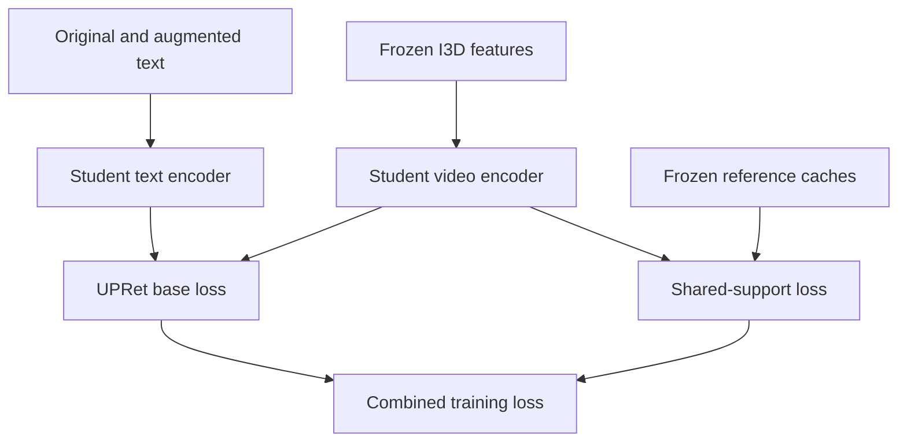

# Method 1: Shared-Support Sign Contrast

**End-to-end implementation specification for an AI coding agent**  
Version: 1.0 · Prepared: 2026-09-13 · Research cutoff: 2026-09-12

This is a self-contained engineering specification derived from Method 1 in `SLRet_Research_Report_2026-09-12.md`. The attached copy and the original report have SHA-256 `bf06af0cfe22a60ea83127d6d0199546ddea0c044ad32391936f247588fa0868`. This document specifies code to build; it is not a claim that the implementation or experiments already exist.

The implementation has one central intervention: **compare an original lexical span and its altered alternative on the same frozen-reference visual support**. Keep the independently reproduced baseline's inference model and scorer. Do not implement Method 2 as part of this task.

## 1. Objective, terminology and non-negotiable constraints

### 1.1 Scientific objective

Test whether independently aligning visually confusable alternatives causes avoidable errors or a fine-grained/full-pool retrieval tradeoff. The primary experiment changes only independent versus shared positive/negative support. A better result than plain UPRet is insufficient to establish the proposed mechanism: the method must also beat the matched independent-support span control and strong transferred hard-negative controls.

The hypothesized cause is **unverified**. Attention is called *visual support*, not a sign boundary or a causal explanation. Contextual video tokens have nonlocal receptive fields. A changed written word is not necessarily a single sign, and string inequality does not prove semantic incompatibility.

### 1.2 Meaning of end to end

Implement the complete workflow: resource audit → data manifests → baseline training → reference selection → caches → automatic negative construction → controlled fine-tuning → validation → established test retrieval → diagnostics → export. The default I3D feature extractor is frozen and offline. This is not a request to backpropagate through raw video or collect new annotations.

### 1.3 Normative language

- **MUST**: necessary for a correct implementation or defensible comparison.
- **DEFAULT**: a concrete first implementation choice; change only through a named configuration and matched controls.
- **OPTIONAL**: excluded from the initial main method; implement after its prerequisite passes.
- **VERIFIED SOURCE BEHAVIOR**: established by inspecting the pinned code.
- **DESIGN DECISION**: a specification choice, not a published optimal setting.
- **UNVERIFIED**: no claim of successful execution, access, reproduction or empirical validity.

### 1.4 Constraints

1. No pretrained SEDS model, component, teacher output or feature cache produced by SEDS.
2. No new dataset, benchmark or replacement main evaluation protocol.
3. No additional manually annotated training data, gloss supervision, external LLM-generated negatives or hidden teacher pretraining.
4. Existing CiCo I3D features and CLIP initialization are permitted with exact provenance. Their external pretraining must be disclosed.
5. Prototype fitting and negative construction use the training split only. Checkpoint selection uses dev only. Existing test annotations are used only to construct and score the established test pool.
6. Every arm shares the same baseline repairs, resource manifests, feature mixture, tokenizer, candidate construction and optimization budget.
7. Do not quietly substitute another backbone, increase token/frame budgets, enable additional losses or report synthetic stress-test improvement as ordinary retrieval improvement.
8. Do not manufacture missing metrics or assets. If data/checkpoints are unavailable, finish code and synthetic tests, list the missing inputs, and label real-data gates unexecuted.

## 2. Fixed first implementation and scope boundaries

| Decision | Initial implementation |
|---|---|
| Baseline | Pinned UPRet `main_task_retrieval.py` / `modules/modeling.py`, with documented common repairs |
| First dataset | PHOENIX-2014T with the CiCo English-text resource regime |
| Confirmation datasets | How2Sign, then CSL-Daily, each with its own baseline/reference/caches |
| Visual input | Published CiCo domain-agnostic and domain-aware I3D features, mixed exactly as the loader specifies |
| Inference encoder | Existing feature Transformer and CLIP text encoder; 512-D projected representations |
| Local feature cap | 64 I3D feature positions; upstream model also returns one class position |
| Text cap | 32 positions including start/end tokens; retain the baseline's long-caption subsampling for ordinary retrieval |
| Auxiliary edit eligibility | DEFAULT: both original and altered captions fit fully within 32 positions; no subsampling in the auxiliary text path |
| Edit granularity | One complete lexical span per negative, `E=1`; retain an E dimension in interfaces |
| Negative count | `K=1` pilot, `K=5` primary controlled experiment |
| Reference | Frozen, dev-selected copy of our reproduced baseline; not EMA |
| Reference execution | DEFAULT: precompute reference video tokens and reference span vectors; same fixed sampler as the student |
| New trainable parameters | None |
| Auxiliary gradient | Shared student video encoder only |
| Text gradient | Ordinary baseline loss only in the proposed arm |
| New inference computation | None |
| Reliability gate | Off initially; optional A/B factorial after support-instability evidence |
| Default support temperature / margin / loss weight | 0.07 / 0.05 / 0.10; proposed settings, not validated optima |
| Fine-tuning budget | 20 additional epochs, restarted baseline optimizer/schedule, equal for all arms |

**Important narrowing from the research report:** requiring fully retained captions and starting with one edit makes the first support-sharing experiment interpretable. Longer captions still participate in ordinary retrieval training/evaluation. They simply receive zero auxiliary edit weight. An extension to partially retained captions or two edits is a separate experiment, not an implicit implementation shortcut.

OpenASL is not an initial target: a verified UPRet OpenASL feature/protocol reproduction is not available in the audited scaffold. Do not invent one to fill a result table.

## 3. Source pins and implementation-critical audit

### 3.1 Primary repositories

| Resource | Exact revision / entry |
|---|---|
| [UPRet](https://github.com/xua222/UPRet/tree/046366227417e1d8ec14145965403462df345984) | `046366227417e1d8ec14145965403462df345984` |
| [CiCo in SLRT](https://github.com/FangyunWei/SLRT/tree/38a4f7b00da7a858d59b7fabe5093876a84db8e0/CiCo) | `38a4f7b00da7a858d59b7fabe5093876a84db8e0` |
| [FSC-CLIP](https://github.com/ytaek-oh/fsc-clip/tree/604015db3f009a8f7485f1fb7e21d8343c67664a) | `604015db3f009a8f7485f1fb7e21d8343c67664a` |
| [SAN](https://github.com/joonmy/SAN/tree/82aba9cbc1beb403abef6e9a3875ca52479805c8) | `82aba9cbc1beb403abef6e9a3875ca52479805c8` |

Keep upstream history, record the implementation commit, and save a patch against the pinned UPRet revision. Do not use a moving branch as the experiment identity. Check and preserve each repository's licensing notices when adapting source; do not assume identical licensing.

### 3.2 Verified behaviors that the agent must account for

| Source location | Verified behavior | Required implementation consequence |
|---|---|---|
| `modules/modeling.py::forward` | Returns a scalar training loss; returns `None` in eval; gathers features before scoring | Add an explicit local-encoding interface; do not call training `forward` to obtain reference embeddings |
| `get_text_video_feat` | Returns nine values; forces `video_frame=1` | Unpack named fields once; do not assume it returns a two-tensor pair |
| `get_video_feat` | Default `video_frame=-1` takes an unsuitable `clip.mlp` path and leaves `visual_cls` undefined in the inspected feature case | Feature-based callers MUST pass `shaped=True, video_frame=1, get_hidden=True` |
| `module_clip.py::FeatureTransformer` | Accepts `[b,1024,64,1]`, applies 1×1 convolution, prepends class token, returns 65 positions | The auxiliary branch slices positions `1:`; the legacy scorer keeps its original class-token mask |
| Video loader mask | `1` means ignored; index 0 is class and is set to 1; valid clips are 0 | Canonical auxiliary mask is `video_mask_raw[:,1:] == 0` |
| `encode_text` | Text mask is 1 through EOT, 0 afterward; projected hidden features include BOS/EOT | Base scoring retains its special-token policy; auxiliary spans exclude special tokens |
| Text loader | Overlong text uses evenly selected BPE positions | Preserve this in baseline; do not use a generic head-truncation tokenizer |
| Feature loader | `F=(1-alpha)*aware + alpha*agnostic` | Name the new config `agnostic_weight`; PHX .9, H2/CSL .8 |
| `flip_similarity_softmax` | Sample-transport similarity is added to training logits before cross-entropy | Preserve logit addition; do not invent a separate weighted OT loss |
| `get_similarity_logits` | Contains `pdb.set_trace()` and an eval visualization call | Remove/gate both before batch scoring |
| `main_task_retrieval.py` | Initializes NCCL at import time | Move initialization behind the CLI main function; imports must work on CPU |
| `get_args` | Several boolean-looking arguments are not safe boolean parsers | Use typed config; reject string booleans and unknown fields |
| Grouped evaluation | Malformed `segment_ids[input_mask,...]` indexing | Correct the input-mask slice in every arm |
| `until_module.py::AllGather` | Backward returns only a local gradient slice | Establish mathematically consistent gather gradients and verify world-size parity; do not rescale the entire loss blindly |
| `optimization.py::BertAdam` | Custom moment update and internal warmup-cosine schedule | Retain it initially; replacing it with AdamW changes the baseline |
| `self.dsu` in main model | Instantiated, but no active invocation was found in the inspected main path | Do not silently activate it or claim the code executes every paper-described regularizer |

Source contracts: [UPRet model](https://github.com/xua222/UPRet/blob/046366227417e1d8ec14145965403462df345984/modules/modeling.py), [CLIP implementation](https://github.com/xua222/UPRet/blob/046366227417e1d8ec14145965403462df345984/modules/module_clip.py), [training/evaluation](https://github.com/xua222/UPRet/blob/046366227417e1d8ec14145965403462df345984/main_task_retrieval.py), [H2 training loader](https://github.com/xua222/UPRet/blob/046366227417e1d8ec14145965403462df345984/dataloaders/dataloader_H2_retrieval_train.py), [optimizer](https://github.com/xua222/UPRet/blob/046366227417e1d8ec14145965403462df345984/modules/optimization.py).

These are static code findings. They do not prove which unpublished patches the authors used. Name the resulting baseline `upret_main_corrected_v1`, and report its measured results. Do not claim exact published-UPRet reproduction until evidence supports it.

## 4. Environment and required resources

### 4.1 Environment target

DESIGN DECISION: start with Linux, Python 3.10, PyTorch 2.5.1 and torchvision 0.20.1, plus NumPy 1.26.4. These are a deliberately pinned compatibility target, not a claim that this environment has been tested here. Official [PyTorch previous-version instructions](https://pytorch.org/get-started/previous-versions/) provide the matching torch/torchvision pair and CUDA wheel variants.

Use the CUDA wheel compatible with the actual GPU/driver. Record it in the lockfile. Do not infer a CUDA toolkit from a machine name. CPU-only installation is sufficient for pure tensor/schema tests, not realistic full training.

Resolve and lock the smallest actually imported set: `ftfy`, `regex`, `numpy`, `PyYAML`, `tqdm`, `pytest`, and baseline dependencies still needed after isolating feature-only code. If retaining upstream EDA, lock `textaugment`, NLTK and the exact required corpus resources. Remove unused visualization/raw-video imports from the training module rather than installing unrelated packages just to satisfy them. Preserve the augmentation algorithm in the primary baseline; removing import-time downloads is not permission to change augmentation.

Commit exact dependency versions and save `pip freeze`, Python/torch/CUDA versions, GPU model and deterministic-kernel settings in each run. A successful install is not a passed model smoke test.

### 4.2 Assets that must exist

| Asset | Required checks |
|---|---|
| CLIP ViT-B/32 initialization and BPE vocabulary | Source URL/repository, checksum, vocabulary IDs, parameter-key load report |
| Domain-agnostic I3D features | Per-split files, feature shape, dtype, finite values, extractor identity |
| Domain-aware I3D features | Same video identities, same clip coordinates and sequence lengths as agnostic stream |
| Train/dev/test annotations | Dataset/version, original source, membership and group hashes |
| Official split identifiers | Especially necessary to resolve the contaminated/combined PHX dev pickle |
| Dataset/resource access | Use legitimately available public/released resources; never invent missing files or credentials |

The [CiCo README](https://github.com/FangyunWei/SLRT/blob/38a4f7b00da7a858d59b7fabe5093876a84db8e0/CiCo/README.md) links its feature releases, domain-aware encoders and the BSL-attend domain-agnostic encoder. Link availability and complete dev-feature coverage must be checked by the implementing agent; they have not been downloaded for this specification.

### 4.3 Feature preparation paths

Preferred route: use the released CiCo features with verified provenance. This keeps Method 1 focused on the training objective.

If features must be regenerated, follow CiCo's existing workflow: its `data_preparation/reaglined_and_crop.py` for signing-aligned How2Sign clips, `data_preparation/gather_frames.py` for frame-based datasets, and `I3D_feature_extractor/get_features.py` for extraction. These entry points are verified from the official README; their complete execution configuration is not specified by that README. The agent must inspect their pinned arguments/constants and emit a resolved extraction manifest before running them. Do not invent a universal FPS, stride or crop setting. Reuse the same extractor and preprocessing for all arms and all official splits.

Training a new domain-aware I3D encoder through `get_pseudos.py` and `I3D_trainer` is an upstream reproduction project, not a hidden component of Method 1. If necessary, complete and document it before the retrieval baseline, using training data only. No SEDS resource is needed anywhere in this chain.

## 5. Proposed repository structure and modification map

Work in a dedicated checkout/branch of UPRet. Existing paths below refer to that repository. All paths under `method1/`, `configs/method1/` and the specified tests are **proposed**, not files already supplied by upstream.

| File or directory | Responsibility |
|---|---|
| `modules/modeling.py` | Refactor encoding versus loss, preserve baseline formulas, add common masks |
| `modules/module_clip.py` | Explicit precision control only where necessary; preserve architecture and key names |
| `modules/until_module.py` | Replace/encapsulate gather behavior with tested semantics |
| `dataloaders/*retrieval*.py` | Either adapt to canonical manifests or retain as audit/reference loaders |
| `method1/config.py` | Typed configuration, validation, fully resolved config serialization |
| `method1/schemas.py` | Dataclasses and tensor/JSON contracts |
| `method1/manifests.py` | Normalize annotations, preserve pool/group membership, audit resources |
| `method1/token_spans.py` | Exact tokenizer replication, lexical spans, edit construction, retained-index maps |
| `method1/sampling.py` | Deterministic video sampling, group-member choice, edit choice, RNG namespaces |
| `method1/reference.py` | Frozen teacher creation and deterministic encoding adapters |
| `method1/cache.py` | Versioned reference arrays, indices, checksums and cache invalidation |
| `method1/mining.py` | Occurrence descriptors, prototypes, candidate lists and edited captions |
| `method1/losses/shared_support.py` | Shared and independent span margins, weighted numerators/counts |
| `method1/losses/control_losses.py` | Global-caption and FSC-style controls, each clearly named |
| `method1/distributed.py` | Gather gradients, scalar reductions, worker initialization |
| `method1/trainer.py` | DDP-safe forward, optimizer steps, checkpointing and dev selection |
| `method1/evaluation.py` | Full established pools, grouping, ranking, export and metrics |
| `method1/diagnostics.py` | Support/gradient/error diagnostics without changing main evaluation |
| `method1/cli.py` | Commands specified in Section 20 |
| `configs/method1/*.yaml` | Dataset/base/arm configurations; all values explicit |
| `tests/method1/` | Meaningful contract, gradient, metric and integration tests |
| `docs/method1/` | Resource ledger, baseline repair ledger, reproduction and experiment reports |

Do not implement a second complete CLIP or a separate unrelated retrieval head. Preserve reusable upstream functions, but do not retain implicit global state or author-specific paths merely for superficial source similarity.

## 6. Canonical dataset manifests and artifact contracts

### 6.1 Identity must be explicit

Use three separate identities:

- `video_uid`: dataset + split + exact source video identifier.
- `text_uid`: dataset + split + official text/group identifier.
- `caption_hash`: SHA-256 of the exact canonical text used by the tokenizer.

Do not merge official groups merely because `caption_hash` is equal. Multiple `text_uid` values may share the same string. Preserve the existing relevance relation. Exact-text collisions are excluded from synthetic negative construction; a multi-positive base-loss variant is not enabled by default.

### 6.2 Manifest files

Use JSONL for reviewable metadata and `.npy` arrays/memory maps for large numeric caches. Each JSONL file is accompanied by schema version and SHA-256 in `manifest_meta.json`.

| Manifest | Minimum fields |
|---|---|
| `texts.jsonl` | `text_uid`, `dataset`, `split`, `group_uid`, `official_order`, `raw_text`, `canonical_text`, `caption_hash`, `language`, `original_language_text` if present |
| `videos.jsonl` | `video_uid`, `dataset`, `split`, `group_uid`, `official_order`, `agnostic_path`, `aware_path`, source-file hashes, `num_feature_rows`, optional signer ID |
| `groups.jsonl` | `group_uid`, ordered `video_uids`, `text_uid`, official group order |
| `splits.json` | Ordered train/dev/test membership lists and their hashes |
| `resources.json` | Dataset/release, preprocessing, source checkpoints, mixture weights, optional true frame intervals, known unknowns |

Every feature row index is sufficient for Method 1's fixed-sampler support cache. Actual frame intervals are optional for richer diagnostics; do not fabricate them if the feature release lacks them.

The source annotation paths are configuration inputs, separate from the generated manifest directory. If an official-membership JSON does not already exist, the agent may generate it mechanically from the established dataset split records, recording those source files and the transformation. It is not a new annotation task. For PHX, the generated memberships must resolve the 7,615-record dev container against the actual official split. The builder must not require its own output directory to be populated before it can run.

### 6.3 Dataset-specific adapters

| Dataset | Adapter requirement |
|---|---|
| PHX | Original dictionary records; one record per group; select the exact 7,096/519/642 memberships. The inspected dev pickle had 7,615 records: use official dev keys, or a verified dev-minus-train derivation whose result exactly matches those keys. Do not derive dev by slicing or random resplitting. |
| H2 | Dictionary of groups containing lists of videos; train sample unit is a group, with one member selected per epoch; eval enumerates every member. Audited CiCo test: 1,969 groups and 2,348 videos. |
| CSL | Same grouping principle; audited test: 798 groups and 1,176 videos. Train has many repeated realizations. |

Counts are checks against the audited release, not a license to filter another release until it has matching counts. Record differing release counts and resolve the cause. Never pad missing test videos with duplicate records or silently discard them.

### 6.4 Required validation

Reject nonfinite/empty features, mismatched streams, invalid IDs, overlapping official train/test video membership, missing group links, multiple conflicting texts within a purported caption group, and unrecognized caption language. Missing training assets also require an explicit filtered-manifest decision before any arm is trained. All arms then use that same manifest, and published comparability is qualified.

Inspect pickles only from trusted, identified dataset/feature releases. Convert them once to reviewable manifests; training need not repeatedly deserialize annotation objects.

## 7. Tensor contracts and exact baseline input processing

Let `b` be local batch size, `B` global contrastive batch size, `L=64`, `M=32`, `d=512`, `K` negative count and `E=1` initially.



Arrows indicate computation dependencies. The shared-support loss backpropagates through the student video path only; the base loss retains its existing trainable paths. Reference caches have no gradient.

| Tensor | Shape / dtype | Meaning |
|---|---|---|
| `video_features` | `[b,1024,L,1]`, float32 storage/input | Mixed and sampled fixed I3D features in upstream layout |
| `video_ignore_raw` | `[b,L+1]`, bool or int64 | True/1 for ignored class/padding keys |
| `input_ids` | `[b,M]`, int64 | Baseline original caption, BOS/EOT included |
| `input_ids_aug` | `[b,M]`, int64 | Ordinary baseline augmented caption; never a mined negative |
| `text_valid`, `text_aug_valid` | `[b,M]`, bool | True through EOT, false afterward |
| `video_raw` | `[b,L+1,d]`, float32 | Projected contextual video tokens before per-token normalization |
| `x` | `[b,L,d]`, float32 | `normalize(video_raw[:,1:], dim=-1)` |
| `video_valid` | `[b,L]`, bool | `~video_ignore_raw[:,1:]` |
| `text_raw`, `text_aug_raw` | `[b,M,d]`, float32 | Projected contextual text, with special positions retained |
| `x_ref` | `[b,L,d]`, float32 | Frozen reference video tokens for exactly the selected video/sampler |
| `q_pos`, `q_neg` | `[b,K,E,d]`, float32 | Frozen normalized complete-span text vectors |
| `edit_valid` | `[b,K,E]`, bool | Real, structurally valid cached edits |
| `support_pos`, `support_neg` | `[b,K,E,L]`, float32 | Positive support; optional negative support for control/diagnostics |
| `confidence` | `[b,K,E]`, float32 | 0/1 initially; optional reliability weight later |
| `delta` | `[b,K,E]`, float32 | Unscaled cosine-space margin |

### 7.1 Mixing and video sampling

The upstream serialized feature arrays are expected to be `[N,1024]`. Verify actual shape; do not guess an orientation from a coincidental dimension match. The sum branch forms

\[
F_n=\alpha F_n^{\rm agnostic}+(1-\alpha)F_n^{\rm aware}.
\]

Use `alpha=.9` for PHX and `.8` for H2/CSL, as the pinned launch/loader configuration indicates. Do not independently normalize each stream before mixing unless creating a separate common baseline experiment.

For `N>=L`, use the exact integer indices from `np.linspace(0,N-1,L,dtype=int)`. For `N<L`, retain all `N` rows in order, then zero-pad to L. Store retained row indices; pad indices are `-1`. Set the class mask to ignored and each valid clip position to unignored. Disable `combine_type=cat`, reversed sampling and random frame order in the first implementation.

### 7.2 Class token and normalization

The video encoder internally produces L+1 tokens. Keep this layout for the base loss, where its existing mask excludes class from scoring. Explicitly remove class for the new auxiliary branch. Do not reinterpret the class token as a real clip or change its attention-mask convention.

Normalize in float32 with `eps=1e-6`. Padding outputs may be nonzero after contextual encoding; masking remains necessary even when input padding was zero. Do not normalize the pooled support vector after summing: the specified margin uses a weighted sum of normalized token scores.

### 7.3 Text special tokens

Derive BOS/EOT IDs from the pinned vocabulary and assert their identities. Do not define validity as `input_ids != 0`: zero is also a vocabulary ID. Validate EOT position and the mask from tokenization against the encoder's generated mask.

The base scorer retains BOS/EOT as in the corrected baseline. The auxiliary branch uses lexical spans only. Removing special tokens globally would be an additional representation/scoring change.

## 8. Exact lexical spans, tokenization and edit eligibility

### 8.1 Canonicalization

Replicate the pinned `SimpleTokenizer` normalization: `ftfy.fix_text`, two HTML unescapes, whitespace cleanup and lowercase. Keep `raw_text` for display, but store edit character offsets against **canonical text**. Offsets into raw text can become invalid after normalization.

Use the existing tokenizer's regex matches and byte-to-Unicode/BPE conversion. Instrument it to emit per-match canonical character offsets and the corresponding full-token indices. The resulting token IDs MUST equal the unmodified tokenizer output exactly on fixtures and sampled actual captions. Do not replace it with a Hugging Face tokenizer unless equivalence is proved for the complete input path.

### 8.2 Lexical units in version 1

Use complete contiguous alphabetic lexical units in canonical English text. Skip punctuation-only spans, numbers, special-token literals, and units that are part of an apostrophe contraction or hyphenated compound in this first version. Match identities at the surface-form level; no lemmatizer, POS tagger, gloss model or semantic oracle is required. This eligibility rule limits coverage and must be reported; it is not a linguistic definition of a sign.

Retain function words in the eligibility inventory rather than introducing an unreported external stopword filter. If they dominate mining, diagnose and report this; a restricted-word variant is separate.

Each occurrence has `occurrence_uid=(text_uid,start_char,end_char)` and a complete list `full_bpe_indices`. Repeated words at different positions are different occurrences. A replacement acts on one occurrence, not all matching strings.

### 8.3 Baseline long-text behavior

For ordinary text with N full BPE tokens, retain all if `N<=M-2`. Otherwise retain zero-based content indices `np.linspace(0,N-1,M-2,dtype=int)`, then prepend BOS and append EOT. This reproduces the inspected loader's one-based indexing convention after conversion. Return `retained_full_bpe_indices` and an inverse map.

### 8.4 Auxiliary eligibility rule

DEFAULT: require `N_pos<=M-2` and `N_neg<=M-2`. This ensures that the original and altered contexts differ only through the specified edit, not through different retained-token selections. It also avoids treating a fragment of a subword sequence as a full lexical target.

The base retrieval pair is retained when the edit is ineligible. There is no example-level training filter for overlong captions.

### 8.5 Edit record

Each cached edit must contain:

```json
{
  "schema_version": 1,
  "edit_uid": "sha256-derived-id",
  "text_uid": "dataset:train:official-text-id",
  "positive_caption_hash": "sha256",
  "negative_canonical_text": "complete altered caption",
  "negative_caption_hash": "sha256",
  "occurrence_uid": "text-id:start:end",
  "source_word": "original surface form",
  "replacement_word": "alternative surface form",
  "positive_char_span": [0, 0],
  "negative_char_span": [0, 0],
  "positive_token_positions": [1],
  "negative_token_positions": [1],
  "positive_full_bpe_count": 0,
  "negative_full_bpe_count": 0,
  "prototype_cosine": 0.0,
  "eligible": true,
  "rejection_reason": null,
  "miner_version": "visual_prototype_v1"
}
```

Values above illustrate types, not a valid example to use as training data. Token positions include the +1 BOS offset. Store complete token IDs/masks or deterministic cache references as well. For E>1 later, replace the single span fields with an ordered edit list and reconstruct offsets after all replacements; do not assume positions remain unchanged.

## 9. Preserve and repair the base retrieval objective first

### 9.1 Separate three layers of work

1. `legacy_audit`: minimally runnable upstream behavior, for attribution checks only.
2. `upret_main_corrected_v1`: common mask, evaluator, distributed and runtime corrections.
3. `sssc_v1`: corrected baseline plus the new shared-support loss.

Save `baseline_repairs.md` with each change, reason, behavioral test and impact when measured. No repair is counted as the method's novelty.

### 9.2 Deterministic directional scores

For normalized video/text tokens let `A[i,j,l,m]` be cosine affinity. Let video weights be the softmax of the existing `video_weight_fc(video_raw)` over valid video positions, and text weights be the softmax of `text_weight_fc(text_aug_raw)` over valid augmented text positions.

For the video-directed score, mask text padding **before** the inner softmax over m. For the text-directed score, mask video padding before the inner softmax over l. Retain the pinned aggregation and its `.07` inner temperature.

Compute products with finite original affinities and masked probabilities. Do not overwrite A with `-inf` and then multiply `A*0`: that produces NaNs. Invalid outer positions contribute exactly zero. Use no `nansum` to conceal malformed inputs.

The first direction uses original text; the second uses the baseline augmented text during training. At inference both use original text. Ordinary text augmentation remains separate from mined negatives.

### 9.3 Distribution branch

Retain the existing PDE modules, two samples (mean plus one sampled vector), pooling, small sample transport and logit combination. Pass correct additive key-padding masks into the PDE attention (`[B,1,1,N]`) and use augmented-text validity for augmented-text pooling. Preserve the branch's deliberate BOS pooling exclusion. These are common padding repairs and must be tested independently of Method 1.

Preserve other architecture constants, including the inspected PDE attention scale, rather than silently replacing them with a familiar Transformer formula. Keep the sample-transport computation in float32; reject nonfinite plans. Do not activate the unused DSU object as a supposed bug fix.

The training matrices have the form

\[
Z_v=g C_v+\omega O,\qquad Z_t=g C_t+\omega O,
\]

where `g=exp(clip.logit_scale)`, `omega=1` initially, C are deterministic directional scores and O is the existing sample-transport score. O is not a new independent loss. Its exact source operations should be extracted into a named helper and preserved, with mask corrections isolated.

For `mix_design=balance` and `beta=dual_mix=.5`, preserve

\[
\mathcal L_{\rm base}=\tfrac12\{
\beta\,CE(Z_v)+(1-\beta)CE(Z_v^\top)
+\beta\,CE(Z_t^\top)+(1-\beta)CE(Z_t)\}.
\]

CE means row cross-entropy with the established paired diagonal labels. This is the implemented baseline objective, not an interchangeable generic InfoNCE substitute.

### 9.4 Practical repairs

Remove interactive debugger hooks, gate optional plots, eliminate import-time NCCL/NLTK downloads, replace removed NumPy integer aliases, implement dev loading, validate boolean arguments, move every tensor to the intended rank's device, and fix grouped-mask slicing.

Precision modernization is a common baseline choice: after initialization use float32 parameters for the correctness reference, rather than relying on scattered upstream half conversions. Optional autocast must pass parity checks and be shared across arms. No claim is made that modernized fp32/AMP runs will exactly reproduce historic half-precision results.

## 10. Reference training, selection and cache lifecycle

### 10.1 Train and select the reference

Train `upret_main_corrected_v1` independently from permitted initialization. Select by the mean of dev T2V and dev V2T R@1; break ties by mean R@5, then earliest optimizer step. This symmetric selector is a common experimental choice, not a new evaluation contribution.

Freeze a deep copy of the selected student: `requires_grad_(False)` and `eval()`. Its state must be identical to the selected baseline checkpoint. Do not use final-epoch weights if a different checkpoint won dev selection. Build separate reference/caches for each dataset and independently reproduced seed.

### 10.2 Cache video tokens

For every actual training video, mix and sample features exactly as Section 7. Call the reference feature encoder in eval/no-grad mode, remove the class token, normalize valid clip tokens in float32 and save:

- `video_uid`, ordered selected feature indices and valid length;
- normalized `x_ref[L,d]`, zero-filled at invalid positions;
- teacher checkpoint hash, feature-file hashes, mixture/sampler config hash and implementation version.

The cache is indexed by actual video UID, not group UID: H2/CSL training may select different group members. Reusing the first member's support for another recording is invalid.

### 10.3 Cache text spans

Encode each eligible original caption once with the frozen text encoder. For complete span J, use

\[
\bar q=\operatorname{normalize}\left(|J|^{-1}\sum_{m\in J}\bar y_m\right).
\]

Pool the raw projected token vectors first, then normalize the span. Do not average separately normalized token vectors unless that is a declared variant. Cache original span vectors by `(teacher_hash,text_uid,span_positions,tokenizer_hash)`.

After mining edits, encode each distinct altered caption and cache the corresponding negative span vector. The text context is the complete original/altered caption under the same tokenizer. Never use the isolated word's embedding as a silent substitute.

### 10.4 Cache format

Use float32 `.npy` memory maps by default, with stable integer row indices recorded in JSONL. Example logical arrays:

- `reference_video_tokens.npy`: `[N_train_videos,L,d]`;
- `reference_video_valid.npy`: `[N_train_videos,L]`;
- `reference_positive_spans.npy`: `[N_eligible_occurrences,d]`;
- `reference_negative_spans.npy`: `[N_cached_edits,d]`;
- optional `support_reliability.npy`: sparse/indexed values by `(video_uid,edit_uid)`.

Do not save full token tensors for every negative in the primary method; only one span vector is needed. Compute large caches in batches and write atomically, marking completion only after all rows and hashes validate. Avoid one tiny file per vector. Cache fp16 is an optional storage optimization with an explicit online/cached equivalence tolerance, shared across arms.

### 10.5 Invalidation rules

Reject a cache if any teacher, tokenizer, caption, feature, sampler, mixture, shape, precision or code-semantic hash differs. A training checkpoint must retain all cache hashes. Never quietly rebuild just one arm with a new teacher or miner.

If the video sampler becomes dynamic, precomputed `x_ref` from the original sampling is no longer valid. Either enumerate and cache the actual variants or run the reference encoder online on the exact student input. Do not index cached contextual embeddings as if they were invariant to a changed Transformer input sequence.

## 11. Complete training-only visual negative miner

This is **DESIGN DECISION: a SAN-inspired reimplementation**, not a claim to reproduce SAN's unreleased complete miner. Its output and costs are shared by every hard-negative arm. It introduces no new trainable model.

### 11.1 Occurrence descriptors

For an eligible original span q and its paired training video reference tokens:

\[
a_l=\operatorname{softmax}_{\rm valid}(\bar x_l^\top\bar q/\tau_s),\quad
z=\operatorname{normalize}\left(\sum_l a_l\bar x_l\right),
\]

\[
h=-\frac{\sum_l a_l\log(a_l+\epsilon)}{\log n},\qquad r=1-h,
\]

where n is valid clip count. Skip n<2 for mining, near-zero pooled vectors and nonfinite values. Save `r`, peak affinity, support entropy, video/text/group IDs and word identity. r measures concentration, not semantic correctness.

### 11.2 Concrete prototype rules

Initial defaults, all proposed rather than validated:

| Setting | Value |
|---|---:|
| Retained occurrences per word | Top `ceil(N_word/2)` by r, using stable ID tie-breaking |
| Minimum r | Greater than `1e-6`, to reject effectively uniform support |
| Minimum retained occurrences | 10 |
| Minimum distinct training groups | 5 |
| Maximum candidates per source word | 20 |
| Minimum prototype cosine | 0.70 |
| Maximum cached negatives per caption | 20 |

For a word w, first average its retained normalized descriptors within each group and normalize that group mean. Average those group means equally and normalize again to obtain prototype p_w. This prevents a word from acquiring extra prototype weight merely because its sentence has more recordings. Store both occurrence and distinct-group counts, mean concentration, dispersion and rejected counts.

If these thresholds yield too few candidates, output the coverage diagnostics. Change thresholds once using training-only coverage/quality diagnostics before freezing the experiment family, recording the decision. Do not tune the miner separately for each loss arm or relax it after inspecting test recall. Do not add semantic labels to repair poor mining.

### 11.3 Candidate vocabulary graph

For each eligible w, compute `p_w dot p_u` against other eligible word prototypes in blocks. Retain up to 20 distinct u with cosine at least .70, sorted by decreasing cosine and then lexical ID. A complete V×V matrix is unnecessary. No learned text similarity threshold is required in version 1; log text similarity later as a separate diagnostic.

The term *visually informed* is intentionally qualified: descriptors are grounded using a cross-modal teacher, so they are not pure articulatory measurements or ground-truth sign minimal pairs.

### 11.4 Caption-level construction

For each eligible occurrence of w in a training caption:

1. Enumerate its candidate replacements u.
2. Reject u=w, u already present as a lexical unit anywhere in the original caption, and replacements violating the lexical-unit rule.
3. Replace only that occurrence's canonical character span.
4. Retokenize the entire altered caption and regenerate complete span positions.
5. Require both captions to fit completely and all span positions to be valid non-special tokens.
6. Reject an altered caption whose canonical hash equals any original training caption hash, even under a different group ID. Do not consult dev/test captions for this training filter.
7. Reject duplicate edited strings for the same original text.
8. Cache the edit and its source prototype statistics; mark semantic validity as unknown.

Build the per-caption cache by round-robin over eligible occurrences, ordered by stable position, taking each occurrence's candidates in prototype-rank order until 20 unique valid negatives are retained. This prevents every cached edit from targeting the first frequent word. It is a fixed shared mining policy, not a claimed contribution.

### 11.5 Epoch sampling

Select K distinct cached edits per chosen caption using a stateless seed derived from SHA-256 of `(experiment_seed,epoch,text_uid,"edit_sampling_v1")`. If fewer than K exist, use all available edits and pad the rest with `edit_valid=False`. Do not repeat a negative to fill K or replace it with an arbitrary caption. A caption with zero edits still trains through the base loss.

The same seed/manifests guarantee the same edit IDs across all paired ablations. Use separate RNG namespaces for group-member selection, text augmentation and edits. Python's process-dependent `hash()` is not suitable for persistent seeds.

### 11.6 Miner output and readiness

Write `mining_report.json` with vocabulary sizes, occurrence/group counts, eligible-caption fraction, edits per caption, rejection reasons, prototype similarities, text similarities, word/position distributions, duplicate collisions and all resource hashes. An empty or nearly empty edit stream is not successful method training. Investigate it before launching the full grid.

The concentration filter and .70 prototype threshold are different quantities from SAN's reported confidence definitions. Do not claim numeric equivalence simply because one threshold has the same number.

## 12. Exact shared-support objective and the decisive control

### 12.1 Definitions

For example i, negative k and changed span e:

- `x[i,l]`: normalized student contextual video token;
- `x_ref[i,l]`: corresponding frozen reference token;
- `q_pos[i,k,e]`, `q_neg[i,k,e]`: normalized frozen contextual span vectors;
- `I_i`: valid local clip positions, excluding class and padding;
- `c[i,k,e]`: eligibility/reliability weight, independent of student gradients.

All affinity, softmax, margin and reduction operations are float32.

### 12.2 Positive-reference support

\[
a^+_{ikel}=\operatorname{stopgrad}\left[
\operatorname{softmax}_{l\in I_i}
(\bar x_{il}^{\top}\bar q^+_{ike}/\tau_s)
\right].
\]

Use the original span only. Do not average positive and negative supports, choose the maximum support or let the student reassign support through this loss.

### 12.3 Proposed margin

\[
\Delta^{\rm shared}_{ike}
=\sum_{l\in I_i}a^+_{ikel}
x_{il}^{\top}(\bar q^+_{ike}-\bar q^-_{ike}).
\]

Do not normalize `q_pos-q_neg`; its magnitude is part of the specified contrast. Do not multiply this margin by CLIP's learned logit scale. Do not normalize the support-pooled student vector after summation.

\[
N=\sum_{ike}c_{ike}[m-\Delta_{ike}]_+,
\quad C=\sum_{ike}c_{ike},
\quad\mathcal L_{\rm shared}=N/\max(C,1),
\]

\[
\mathcal L_{\rm total}=\mathcal L_{\rm base}+\lambda\mathcal L_{\rm shared}.
\]

With no gate, c is simply `edit_valid.float()`. Average over valid edits, not videos; changing K therefore does not multiply loss scale. Do not divide once by K and again by the valid-count denominator.

### 12.4 Gradient contract

Only student video tokens receive auxiliary gradient. At normalized-token level,

\[
\partial\Delta/\partial x_{il}=a^+_{ikel}(\bar q^+_{ike}-\bar q^-_{ike}).
\]

Autograd applies the normalization Jacobian when updating raw features. Reference tokens, reference text vectors, support and confidence must have no gradient. Base retrieval continues updating the student text encoder and the existing weight/PDE heads. Do not freeze the entire student text encoder as a side effect of freezing q.

### 12.5 Independent-support control

Compute a second frozen support

\[
a^-_{ikel}=\operatorname{stopgrad}\left[
\operatorname{softmax}_{l\in I_i}(\bar x_{il}^{\top}\bar q^-_{ike}/\tau_s)
\right]
\]

and use

\[
\Delta^{\rm independent}_{ike}
=\sum_l a^+_{ikel}x_{il}^{\top}\bar q^+_{ike}
-\sum_l a^-_{ikel}x_{il}^{\top}\bar q^-_{ike}.
\]

Everything else—including frozen text targets, eligible edits, hinge, margin, weights, teacher and optimizer—is identical. This is the central scientific comparison. It is not enough to compare shared support against a control that also changes loss family or text gradients.

### 12.6 Edge conditions

Reject videos with no valid clip at dataset audit. Mask invalid edit slots to zero and never rely on `0*NaN` to remove them. A batch with no eligible edits returns a graph-connected zero, e.g. `0.0*x.sum()`, and still performs its base retrieval update.

If `norm(q_pos-q_neg)` is near zero, mark the edit invalid with an explicit reason. Log how often this norm is below m: such an edit may have an unsatisfiable shared margin. Do not silently normalize the direction or increase m to manufacture a training signal. Also log the initial active-hinge fraction; a loss already inactive on nearly every edit cannot explain an improvement.

### 12.7 Small algebraic fixture

Take two reference/student unit tokens `(1,0)` and `(0,1)`, positive span `(1,0)`, negative span `(0,1)`, and `tau=.07`. Independent support makes both alternatives score approximately 1, giving margin approximately 0. Shared positive support gives a margin approximately 1. This is a tensor sanity check, not linguistic or retrieval evidence. It tests the actual intervention and distinguishes it from an accidental independently normalized implementation.

## 13. Optional support-reliability gate

Do not implement this before the ungated shared/independent pair passes correctness tests and support instability is measured. It is a supporting ablation, not a second mandatory contribution.

### 13.1 Deterministic reference views

For each training video with n>=4 valid selected positions, construct one additional reference view by retaining `min(n-1,max(2,floor(.8*n)))` of its selected feature rows in the original order. Select the subset by a dedicated hash seed; repack and pad using the same L=64 encoder input. This changes contextual encoding, so actually run the reference encoder on the second view. Indexing the original cached contextual tokens is not an equivalent second view.

Map positions through their original feature-row indices. On retained intersection I, condition original support as `a_I=a[I]/sum(a[I])` and map second-view support to the same indices. Let `JSD(a_I,a_view)` use natural logarithms and the usual midpoint distribution. Let `mass_I=sum(a[I])`.

Define the proposed soft gate

\[
c=\mathbf1_{\rm eligible}\,(1-h(a))\,
\left(1-\frac{JSD(a_I,a_{\rm view})}{\log 2}\right)\,mass_I,
\]

clamped to [0,1] against numerical roundoff. Reject a reliability measurement if I has fewer than two points or mass is numerically zero; in the gated arm set its weight to zero and report coverage. Use the same **positive-derived** c for the shared and independent controls. Negative-dependent gating would introduce a second difference between them.

The gate combines support concentration, agreement and retained original mass. It does not indicate whether the altered caption is semantically false. Cache its values with teacher/view/sampler hashes; do not update it using the student or validation errors. If it adds no benefit, remove it from the final method.

## 14. Dataloader, sampler and batch construction

### 14.1 Training item

The dataset returns a dictionary rather than an opaque positional tuple:

```python
TrainingItem = {
    "video_uid": str,
    "text_uid": str,
    "group_uid": str,
    "caption_hash": str,
    "video_features": Tensor,       # [1024, L, 1]
    "video_ignore_raw": Tensor,     # [L+1], True means ignored
    "selected_feature_indices": Tensor,  # [L], pad=-1
    "input_ids": Tensor,            # [M]
    "text_valid": Tensor,           # [M]
    "input_ids_aug": Tensor,        # [M], baseline augmentation
    "text_aug_valid": Tensor,       # [M]
    "token_type_ids": Tensor,       # [M], zeros
    "edit_uids": list[str],         # K entries with explicit invalid slots
    "x_ref": Tensor,                # [L,d], omitted for base-only arm
    "q_pos": Tensor,                # [K,E,d]
    "q_neg": Tensor,                # [K,E,d]
    "edit_valid": Tensor,           # [K,E]
    "confidence": Tensor,           # [K,E]
}
```

The collator stacks tensors, preserves identity lists and checks shape/dtype. It never samples new negatives. Memory-map arrays are copied into writable batch buffers before in-place operations. Invalid q slots are zero-filled; all math still explicitly respects validity.

### 14.2 Sample units

PHX samples its ordinary training records. H2/CSL sample each caption group once per epoch, choosing one actual video uniformly through a stateless `(seed,epoch,group_uid,"member")` seed. All arm comparisons get the same member and edits for the same logical sample. The number of optimizer updates depends on groups for those datasets, not on the total number of recordings.

Shuffle group/record indices using the distributed sampler and call `set_epoch`. Ensure each full global batch has distinct sample IDs; sampler padding at epoch boundaries must not introduce the same positive twice into a contrastive batch. A deterministic shuffled list trimmed to a multiple of global batch size is the simplest first implementation. Log dropped tail count and use the same list across arms. Do not globally deduplicate different official IDs with identical captions.

Version 1 does not repeat samples within an epoch; stateless seeds keyed by epoch and IDs therefore suffice. If later using replacement sampling, include draw index in all associated RNG keys and cache logs.

### 14.3 Augmentation versus edits

Preserve the baseline's original-caption and augmented-caption paths. With the default `random_swap`, the inspected loader applies augmentation with probability .5. Record the exact EDA package/resource behavior and seed it per sample in its own RNG namespace. The auxiliary positive span always comes from the canonical **unaugmented** caption.

Randomly swapping the text and then reusing the old edit positions is a correctness bug. A mined negative is not a second positive augmentation. Keep their names, tensors and log fields distinct.

### 14.4 Restart determinism

For exact resume, save epoch, next batch index, sampler permutation/seed, optimizer-step index and relevant RNG states. Avoid hidden persistent-worker RNG dependence by deriving member, augmentation and edit seeds statelessly. Log a hash of `(video_uid,text_uid,edit_uids)` per batch during debug. Paired arms must have identical sample hashes.

## 15. Model APIs and reference pseudocode

The APIs below are **new wrappers to implement**, not upstream APIs. Keep the public signatures stable once tests are written.

### 15.1 Core interfaces

```python
@dataclass
class LocalEncoding:
    video_raw: Tensor             # [b,L+1,d], differentiable
    video_ignore_raw: Tensor      # [b,L+1]
    text_raw: Tensor              # [b,M,d]
    text_valid: Tensor            # [b,M]
    text_aug_raw: Tensor          # [b,M,d]
    text_aug_valid: Tensor        # [b,M]

@dataclass
class AuxiliaryTerms:
    numerator: Tensor            # scalar, differentiable
    denominator: Tensor          # scalar, detached
    diagnostics: dict[str, Tensor]

def encode_local(student, batch) -> LocalEncoding: ...
def baseline_loss_from_local(student, encoding, runtime) -> Tensor: ...
def encode_reference_video(reference, batch) -> tuple[Tensor, Tensor]: ...
def pool_reference_spans(reference, tokens, spans) -> Tensor: ...
def span_contrast_terms(x, x_ref, q_pos, q_neg, video_valid,
                        edit_valid, confidence, mode, tau,
                        margin) -> AuxiliaryTerms: ...
def ddp_weighted_auxiliary(terms, runtime) -> tuple[Tensor, dict]: ...
def score_video_text_pairs(student, video_encoding, text_encoding) -> Tensor: ...
```

`encode_local` is the single owner of the student video/text forward pass. Capture local tokens before global gather. Do not rerun the student video encoder merely to compute the new loss. `baseline_loss_from_local` preserves the scorer and distribution computation from Section 9, including train/eval distinctions.

### 15.2 Safe masked support

```python
def reference_support(x_ref, q, video_valid, tau):
    # x_ref: [b,L,d], q: [b,K,E,d], valid: [b,L]
    # Caller already rejected videos with no valid clips.
    assert video_valid.any(dim=-1).all()
    with torch.no_grad():
        xr = F.normalize(x_ref.float(), dim=-1, eps=1e-6)
        qr = F.normalize(q.float(), dim=-1, eps=1e-6)
        z = torch.einsum("bld,bked->bkel", xr, qr) / tau
        z = z.masked_fill(~video_valid[:,None,None,:], float("-inf"))
        a = z.softmax(dim=-1)
        a = a.masked_fill(~video_valid[:,None,None,:], 0.0)
    return a
```

Invalid edit slots may have zero q, hence uniform support over valid clips. They must be zeroed by edit validity in both numerator and count; never interpret them as genuine edits.

### 15.3 Shared and independent terms

```python
def span_contrast_terms(x, x_ref, q_pos, q_neg, video_valid,
                       edit_valid, confidence, mode, tau, margin):
    x = F.normalize(x.float(), dim=-1, eps=1e-6)
    qp = F.normalize(q_pos.detach().float(), dim=-1, eps=1e-6)
    qn = F.normalize(q_neg.detach().float(), dim=-1, eps=1e-6)
    ap = reference_support(x_ref, qp, video_valid, tau)

    if mode == "shared":
        delta = torch.einsum("bkel,bld,bked->bke", ap, x, qp-qn)
    elif mode == "independent":
        an = reference_support(x_ref, qn, video_valid, tau)
        pos = torch.einsum("bkel,bld,bked->bke", ap, x, qp)
        neg = torch.einsum("bkel,bld,bked->bke", an, x, qn)
        delta = pos-neg
    else:
        raise ValueError(mode)

    c = edit_valid.float() * confidence.detach().float()
    penalty = F.relu(margin-delta)
    numerator = (c*penalty).sum() + 0.0*x.sum()
    denominator = c.sum().detach()
    return AuxiliaryTerms(numerator, denominator, {
        "delta": delta.detach(),
        "active": ((delta < margin) & edit_valid).detach(),
        "support": ap.detach(),
    })
```

The actual implementation must enforce finiteness and shapes before this function. Do not assert `delta>0` as a requirement: incorrect or difficult cases are allowed. Diagnostics must be aggregated with explicit counts instead of treating padded slots as observations.

### 15.4 DDP-visible wrapper

```python
class Method1TrainModel(nn.Module):
    def __init__(self, student, auxiliary_config, runtime):
        super().__init__()
        self.student = student
        self.config = auxiliary_config
        self.runtime = runtime

    def forward(self, batch):
        enc = encode_local(self.student, batch)
        base = baseline_loss_from_local(self.student, enc, self.runtime)
        if self.config.arm == "base_continuation":
            return {"loss": base, "base": base.detach()}

        x = enc.video_raw[:,1:,:]
        valid = ~enc.video_ignore_raw[:,1:].bool()
        terms = span_contrast_terms(
            x, batch["x_ref"], batch["q_pos"], batch["q_neg"],
            valid, batch["edit_valid"], batch["confidence"],
            mode=self.config.support_mode,
            tau=self.config.tau_support,
            margin=self.config.margin,
        )
        aux_backward, aux_logs = ddp_weighted_auxiliary(terms, self.runtime)
        return {
            "loss": base + self.config.aux_weight*aux_backward,
            "base": base.detach(),
            **aux_logs,
        }
```

Put the combined differentiable loss inside the DDP-visible forward. Reference caches are inputs, not trainable submodules. Keep the frozen teacher outside this wrapper when online teacher encoding is needed. Do not register a frozen full teacher and inadvertently save/optimize it with the student.

The illustrative branch above covers the core paired experiment. Control arms dispatch to their explicitly named auxiliary scorers while retaining the same `encode_local` and base loss.

Here `auxiliary_config` is the typed `auxiliary` subsection of the resolved configuration, not the full YAML tree. `runtime` contains distributed state and the already validated base configuration. This avoids an implicit flattening convention between YAML and model code.

## 16. Distributed gradients, precision and memory

### 16.1 Batch-size semantics

Use `global_contrastive_batch=512` for the intended main reproduction, `local_batch=B/world_size`, and accumulation 1 initially. Assert divisibility and equal local training batch sizes. Read rank/world size from `torchrun` environment, not visible-device count or a hardcoded list.

Gradient accumulation does not create the same in-batch negative pool as a single larger contrastive batch. If smaller physical batches are necessary, report a separate regime and reproduce every control at that batch size. Do not advertise accumulated 8×64 as equivalent to a 512-pair contrastive matrix.

### 16.2 Base feature gather

The simplest correct reference implementation evaluates the same complete global base loss on every rank, with a differentiable gather whose backward sums gradient contributions across ranks. For a custom gather:

1. Forward: gather equal-shape local tensors in rank order and concatenate on batch dimension.
2. Backward: sum the full output gradient across ranks, then return the current rank's contiguous local slice.
3. Do not divide this gather-backward sum by world size; DDP will average parameter gradients.

An established autograd-enabled distributed gather can replace this reference implementation after verifying the same semantics in the pinned runtime. A reduce-scatter equivalent can reduce communication storage, but is not necessary for the initial correctness implementation.

Why the upstream local-slice-only backward is insufficient here: encoder parameters only see their local slice's contribution before DDP averaging, while scoring-head parameters can see the full global loss. Multiplying the **whole** base loss by world size does not generally fix both simultaneously. Compare encoder, weighting-head and PDE-head gradients separately against a single-process global-batch reference.

Masks and IDs use ordinary non-differentiable gather. The local tensors for the new auxiliary loss remain local; do not compute the same edit losses again over a gathered global batch.

### 16.3 Correct weighted auxiliary reduction

Let rank r have numerator `N_r` and weight count `C_r`, with W ranks. The intended objective is

\[
\mathcal L_{\rm aux}=\frac{\sum_r N_r}{\max(\sum_r C_r,1)}.
\]

All-reduce detached counts to `C_global`, and backpropagate on each rank through

\[
\mathcal L_{{\rm aux},r}^{\rm backward}
=W N_r/\max(C_{\rm global},1).
\]

DDP's subsequent average produces the desired global gradient. For logging, all-reduce detached numerators and report their sum divided by the same denominator. Do not log the per-rank backward scalar as the global metric. Every rank must execute these collectives even if it has no valid edits.

### 16.4 Stochastic base-branch parity

UPRet's sampled vectors and PDE dropout make exact distributed comparisons sensitive to random draws. The replicated-global-loss reference path must use the same base stochastic realization on each rank: put the distribution-score computation in a scoped RNG context keyed by `(baseline_seed,optimizer_step,microstep,"base_distribution")`, restoring prior RNG state afterward. Do not reset dataloader or augmentation RNGs.

For gradient-equivalence tests, first disable dropout and inject fixed noise; then test the scoped stochastic path. Record this as a common repaired-baseline choice. Never make the proposed arm deterministic while its matched control sees different augmentations/noise.

### 16.5 Precision

Start with float32 model parameters and computation for correctness. Optional bf16/fp16 autocast may accelerate the encoder, but normalize, softmax, log-sum-exp, PDE sample-transport arithmetic, margins and reductions in float32. Use appropriate gradient scaling for fp16, unscale before clipping, and test against the float32 reference. Do not combine upstream manual half conversions with autocast without verifying each path.

NaNs are failures to diagnose, not values to suppress. Log the offending IDs, masks, feature norms, log-standard-deviation range and sample-transport finiteness. A variance clamp or changed attention scale is a separate common baseline modification requiring evidence, not an automatic Method 1 addition.

### 16.6 Matching memory

The full global affinity tensor is expensive on every rank. At B=512, L+1=65 and M=32, one float32 affinity tensor is about 2.03 GiB; two text paths and backward intermediates multiply that. DDP does not automatically shard a globally materialized score tensor.

Implement an optional deterministic block scorer, e.g. 32 video rows × 64 text rows. It outputs only its two score blocks. Checkpoint/recompute each **pure deterministic** block with non-reentrant checkpointing, or implement an equivalent tested memory-saving path; concatenating every gradient-bearing affinity block without checkpointing does not remove total saved-activation cost. Run PDE/sample OT separately rather than changing its stochastic draws per score block.

One 32×64×65×32 float32 affinity block is about 16.25 MiB before its intermediates. This is not a total-GPU-memory estimate. Validate blocked versus dense forward scores and parameter gradients on a small batch before enabling it in all arms. Keep the full candidate set; block scoring is not top-K reranking.

## 17. Training stages, initialization, optimizer and checkpointing

### 17.1 Initialization and trainability

UPRet adapts a CLIP visual Transformer to I3D feature tokens. The CLIP image patch convolution and visual positional embedding can have incompatible shapes. The inspected upstream loader logs shape errors rather than making all such failures fatal. The new loader MUST report every matched/missing/unexpected/mismatched key and use an explicit allowed-mismatch list.

For ViT-B/32 → 64 feature tokens, expected non-transferred visual tensors include `clip.visual.conv1.weight` (RGB patch kernel versus 1024-channel 1×1 projection) and `clip.visual.positional_embedding` (image-token count versus 65). Newly introduced feature-fusion/weighting/PDE parameters are initialized by the baseline model. Preserve that baseline initialization with a recorded seed. Do not resize image patch weights, interpolate positions or initialize new heads from another model without declaring a separate common baseline variant. Any unexpected mismatch in transferable Transformer/text weights is fatal.

When loading a trained baseline/reference/student checkpoint of this exact architecture, require exact state-dictionary compatibility. Do not use permissive initialization rules to excuse missing trained weights.

Build an explicit config-to-upstream bridge. Map `feature_len`, `alpha=agnostic_weight`, `dual_mix`, `mix_design`, `visual_num_hidden_layers=visual_layers`, `linear_patch`, `sim_header`, `loose_type`, `freeze_layer_num`, `coef_lr=1`, and distributed rank fields. Set `aug_choose=t2v`, `not_load_visual=False` and the pinned `cross_model=cross-base`. Preserve other required source defaults in one tested adapter rather than scattering them across commands. The text layer count is inferred from the CLIP state; assert it equals the requested 12 instead of assuming the upstream `text_num_hidden_layers` argument changes it.

Add an explicit initialized-CLIP-state/checkpoint-path argument to the loading adapter, and construct `SimpleTokenizer(bpe_path=...)` from the configured resource. A trained-checkpoint resume must not silently download a fresh initialization file. Distribution sample count, epsilon, iteration cap and weight are hardcoded attributes in the inspected source: expose them through the bridge or assert their fixed values after construction, and include them in the architecture/config hash.

Preserve the effective `freeze_layer_num=0` behavior: visual parameters and text Transformer blocks are trainable; text token and positional embeddings are frozen; final text normalization/projection and relevant logit-scale parameters remain trainable. Existing weighting/PDE heads train through the base loss. Emit a name-by-name `trainable_parameters.json`; do not assume the argument freezes zero parameters. Unused `conv2_trans`/other parameters in the sum path should not generate spurious required-gradient failures.

### 17.2 Stages

| Stage | What runs | Required artifact |
|---|---|---|
| S0 | Resource/manifests/tokenizer/synthetic tests | Audit and repair reports |
| S1 | Corrected base training, up to 200 epochs | Dev-selected baseline checkpoint, dev metrics, train config |
| S2 | Freeze reference and cache all train video/original span encodings | Reference hash and completed cache manifest |
| S3 | Build prototypes/edits and encode negative spans | Miner report, edit table and negative-span cache |
| S4 | Frozen diagnostic check, then K=1 short fine-tuning pilot | Support/margin diagnostics and small-run correctness report |
| S5 | Equal-budget controlled fine-tuning, K=5, 20 epochs | Base continuation, independent and shared arm checkpoints/metrics |
| S6 | Optional gate factorial and strong transferred controls | A/B experiment table, diagnostic outputs |
| S7 | Locked test evaluation and student export | Full-pool metrics, rankings, inference-only checkpoint |

For every seed, S5 arms branch from the **same S1 selected checkpoint**, not from each other's results. Baseline continuation receives the same 20 extra epochs and optimizer restart. The reference remains fixed throughout those arms.

### 17.3 Optimizer defaults

Retain the pinned `BertAdam` with LR `1e-5`, betas `(0.9,0.98)`, epsilon `1e-6`, weight decay `.001`, warmup proportion `.1`, internal `warmup_cosine`, and existing decay-group construction. Its schedule uses its own formula; do not add a second scheduler or silently substitute a rescaled cosine. Preserve the baseline's gradient clipping, documenting the upstream outer norm clip and internal clipping behavior.

For S5, instantiate a fresh optimizer/schedule using the same hyperparameters and the 20-epoch step budget. Every arm does this, including the no-new-loss continuation. This avoids a near-zero inherited end-of-training LR. The teacher has no optimizer. Initial `lambda=.10`, `margin=.05`, `tau_support=.07`; no extra lambda schedule or distillation term.

Clamp the existing learned logit-scale parameter at `log(100)` after each update as in the baseline. It does not scale the new cosine-margin loss.

### 17.4 Training loop

Per optimizer step: get the deterministic batch → move tensors → student/local encoding → corrected base loss → local new/control loss → correct reductions → backward → unscale if needed → clip → optimizer step → logit-scale clamp → log detached global metrics. Do not execute optional gradient diagnostics every step; they are expensive and can alter memory use.

Initially use accumulation 1. If adding accumulation later, divide each microstep objective consistently and document that its in-batch candidate pool remains the physical global microbatch. Keep all rank collectives in the same order.

### 17.5 Checkpoint schema

Save at least: schema/method version, upstream and implementation revisions, student state dict, optimizer state, scaler state if any, epoch/next batch/global step, RNG/sampler state, resolved config, dataset/group/feature hashes, tokenizer hash, teacher and cache hashes, arm, dev selection score and dev metric dictionary. Use atomic writes and preserve `last` separately from `best_dev`.

An S5 resume must load the same selected teacher/cache identities even though training can proceed solely from caches. If they differ, fail rather than silently rebuild. Do not choose the best test checkpoint. After export, student weights must load into the baseline inference architecture without a teacher, miner or auxiliary module.

## 18. Established evaluation, ranking and export

### 18.1 Deterministic scoring

At inference call the student encoder in eval mode and use original captions for both directions. Combine the existing directional scores as the pinned mixed evaluator does:

\[
s(V,T)=\beta C_v(V,T)+(1-\beta)C_t(V,T),\qquad\beta=.5.
\]

No new shared-support score, teacher, negative captions or sampled PDE branch is used. Reuse exactly the same scorer for the corrected baseline and proposed student. Test equality of exported and training-checkpoint inference on fixed inputs.

### 18.2 Candidate construction

Let S have shape `[N_videos,G_text_groups]`, with rows in manifest video order and columns in manifest group/text order. Let g(v) denote the existing positive group for video v.

- **V2T:** for each actual video row, rank all G text columns; the positive is g(v).
- **Grouped T2V:** construct `Gscore[q,g] = max_{v:g(v)=g} S[v,q]`. Rank G video groups for each text query q, with its official matching group as positive.
- **PHX:** the same code works with group size one and the established 642 test records; do not merge repeated caption strings into new positives.

The misleading upstream helper names must not determine the interpretation. Validate axis semantics with a hand-calculated fixture. Candidate grouping is unchanged by the method.

### 18.3 Ties and numerical metrics

The inspected `compute_metrics` can count more than one rank for a query when scores tie. The corrected evaluator MUST produce exactly one rank per query. DEFAULT: sort descending score with stable manifest candidate order as the tie-breaker. Record tie count and policy; keep an explicitly named legacy-metric audit output when comparison requires it. Historical values affected by the repair are not directly identical to corrected results.

Return one-based ranks. R@K is `100*mean(rank<=K)`. Use ordinary numerical median for MedR, arithmetic mean for MeanR, and mean reciprocal rank when reported. The upstream Torch median path can differ from the ordinary median for even-sized lists; record that repair rather than silently relabeling a statistic.

This is evaluator hygiene, not a proposed evaluation-protocol contribution. Never change grouping, relevance or candidate membership to obtain better recall.

### 18.4 Selection and test policy

During training load only train/dev resources needed for those operations. Evaluate the complete dev pool at each selected epoch; choose checkpoints by Section 10's symmetric selector. Lock the chosen configuration and run test only after selection. Test means the complete existing candidate pool; evaluation batching must not reduce it to within-batch retrieval.

Persist metrics with dataset/split/group hashes, query/candidate counts, direction, checkpoint hash, precision, tie policy and evaluation code revision. Save ordered per-query ranks and at least top-10 candidate IDs; these support paired diagnostics without rescoring a changed pool.

### 18.5 Export

`export` writes a student-only baseline-compatible state dictionary and an inference config containing feature/tokenizer/scorer settings. It contains no SEDS dependency, teacher parameters, synthetic negatives or training cache requirement. Re-evaluate a fixed fixture with the exported artifact and verify scores match the pre-export eval model.

## 19. Concrete initial configuration

This YAML is a **configuration contract to implement**, not a current upstream CLI file. `${SLRET_DATA_ROOT}` and `${SLRET_RUN_ROOT}` are user/environment inputs; resolve them explicitly and reject unresolved placeholders. Do not infer data paths from author-specific locations.

```yaml
schema_version: 1
method_version: sssc_v1
baseline_version: upret_main_corrected_v1
upstream_commit: 046366227417e1d8ec14145965403462df345984
seed: 42

data:
  dataset: ph
  language: en
  source_annotations:
    train: ${SLRET_DATA_ROOT}/annotations/ph_cico/train.pkl
    dev: ${SLRET_DATA_ROOT}/annotations/ph_cico/dev.pkl
    test: ${SLRET_DATA_ROOT}/annotations/ph_cico/test.pkl
  official_membership_json: ${SLRET_DATA_ROOT}/annotations/ph_cico/official_membership.json
  manifest_dir: ${SLRET_DATA_ROOT}/manifests/ph_cico
  agnostic_root: ${SLRET_DATA_ROOT}/features/ph_domain_agnostic
  aware_root: ${SLRET_DATA_ROOT}/features/ph_domain_aware
  agnostic_weight: 0.9
  combine_type: sum
  feature_dim: 1024
  feature_len: 64
  feature_sampling: legacy_linspace
  text_max_positions: 32
  text_overlength_policy: legacy_uniform_bpe
  auxiliary_full_caption_only: true
  group_member_sampling: stateless_uniform
  baseline_text_augmentation: random_swap
  baseline_text_augmentation_probability: 0.5

model:
  pretrained_clip_name: ViT-B/32
  clip_checkpoint_path: ${SLRET_DATA_ROOT}/initialization/ViT-B-32.pt
  bpe_path: ${SLRET_DATA_ROOT}/initialization/bpe_simple_vocab_16e6.txt.gz
  visual_layers: 12
  text_layers: 12
  embedding_dim: 512
  linear_patch: 2d
  sim_header: Filip
  loose_type: true
  freeze_layer_num: 0
  inner_similarity_temperature: 0.07
  dual_mix: 0.5
  mix_design: balance
  distribution_samples: 2
  sample_ot_epsilon: 0.1
  sample_ot_max_iterations: 100
  sample_ot_logit_weight: 1.0

reference:
  mode: cached
  checkpoint: ${SLRET_RUN_ROOT}/ph/base/seed42/best_dev.pt
  cache_dir: ${SLRET_RUN_ROOT}/ph/reference/seed42
  cache_dtype: float32
  require_exact_hashes: true

miner:
  version: visual_prototype_v1
  edits_per_negative: 1
  retained_occurrence_fraction: 0.5
  minimum_concentration: 0.000001
  minimum_retained_occurrences: 10
  minimum_distinct_groups: 5
  candidate_cosine_minimum: 0.7
  candidates_per_word: 20
  cached_negatives_per_caption: 20
  reject_existing_train_caption: true
  reject_word_already_in_caption: true

auxiliary:
  arm: shared
  support_mode: shared
  negatives_per_caption: 5
  edits_per_negative: 1
  tau_support: 0.07
  margin: 0.05
  aux_weight: 0.10
  normalize_text_difference: false
  normalize_support_pool: false
  reliability_gate: false

training:
  base_epochs: 200
  finetune_epochs: 20
  global_contrastive_batch: 512
  gradient_accumulation_steps: 1
  optimizer: upstream_bertadam
  learning_rate: 0.00001
  betas: [0.9, 0.98]
  epsilon: 0.000001
  weight_decay: 0.001
  warmup_fraction: 0.1
  schedule: upstream_warmup_cosine
  restart_optimizer_for_finetuning: true
  max_grad_norm: 1.0
  mixed_precision: none
  deterministic_debug: false
  autograd_global_gather: true
  replicated_distribution_rng: true
  train_video_pair_block: 32
  train_text_pair_block: 64
  checkpoint_deterministic_score_blocks: true
  num_workers: 4

evaluation:
  encode_batch_size: 64
  complete_candidate_pool: true
  group_aggregation: max
  tie_policy: stable_manifest_order
  selection_metric: mean_bidirectional_r1
  tie_break_metric: mean_bidirectional_r5
  report_ranks: true
  report_top_k: 10
  test_during_training: false

output:
  root: ${SLRET_RUN_ROOT}/ph/shared/seed42
  save_last: true
  save_best_dev: true
  atomic_checkpoints: true
```

Each arm has a fully resolved config; do not implement hidden inheritance that changes the dataset or teacher. For the independent arm change only `arm`, `support_mode` and output path. For base continuation set new loss off and retain the same 20-epoch optimizer budget. For K=1 pilots, change K identically in the paired arms.

H2 and CSL configs change dataset/manifests/resource paths, `.8` agnostic weight and dataset-specific run/cache paths; language remains the documented English/translated-English regime. The 32-token cap and 64-clip cap remain fixed. Native-language experiments are separate baselines.

## 20. Required command interface

The commands below are **interfaces the coding agent must implement**. They are not executable against untouched UPRet. Each command supports `--help`, validates its inputs, returns a nonzero exit code on failure, and emits a machine-readable status report. CPU-only commands must not initialize NCCL.

| Command | Responsibility / output |
|---|---|
| `python -m method1.cli audit --config CONFIG --stage input` | Validate source assets/annotations before generated manifests exist |
| `python -m method1.cli audit --config CONFIG --stage method` | Validate manifests/reference/cache dependencies; write readiness report |
| `python -m method1.cli build-manifests --config CONFIG` | Convert source annotations using official memberships, preserving order/groups |
| `python -m method1.cli verify-tokenizer --config CONFIG` | Verify token IDs, masks, retention maps and span round trips |
| `python -m method1.cli smoke --config CONFIG --synthetic` | Small CPU tensor/model-interface tests without private data |
| `torchrun --standalone --nproc_per_node=W -m method1.cli train-base --config CONFIG` | Corrected baseline training; no new loss |
| `python -m method1.cli cache-reference --config CONFIG` | Selected reference video/original span caches; chunked encoding |
| `python -m method1.cli mine-negatives --config CONFIG` | Prototypes, edit records, negative span caches and miner report |
| `python -m method1.cli diagnose --config CONFIG --split dev --kind support` | Frozen diagnostic outputs; no teacher/prototype fitting on dev |
| `torchrun --standalone --nproc_per_node=W -m method1.cli train-method --config CONFIG` | Fine-tune selected arm from the same baseline checkpoint |
| `python -m method1.cli evaluate --config CONFIG --checkpoint CKPT --split dev` | Complete-pool dev metrics and ranked IDs |
| `python -m method1.cli evaluate --config CONFIG --checkpoint CKPT --split test` | Locked complete-pool test evaluation |
| `python -m method1.cli export --config CONFIG --checkpoint CKPT --output OUTPUT` | Student-only inference artifact |
| `python -m method1.cli compare-runs --runs RUN_A RUN_B` | Verify paired-resource hashes; produce matched metric/diagnostic comparison |

`CONFIG`, `W`, `CKPT` and `OUTPUT` are placeholders to replace. Do not run an accidental full 200-epoch job during smoke tests. Implement `--max-steps` for explicit debugging and label such outputs `smoke`, never normal experiment results. For single GPU allow ordinary `python -m method1.cli train-*`; use the same loss logic with world size one.

Validation is command-scoped. `train-base` must not require a reference checkpoint that it is supposed to create. `build-manifests` requires source annotations, not prebuilt manifests. `cache-reference` does not require a negative cache that mining has not produced yet. `evaluate`/`export` require inference assets and the selected student, but MUST NOT require a teacher, training-only captions or negative caches. Implement `audit --stage inference` with this narrower dependency set as an export acceptance check.

The `diagnose` command may use a **frozen** training-fitted vocabulary to create clearly labeled dev-only diagnostic alternatives. It must not feed those examples back into training prototypes or edit caches. Test stress candidates, if used, remain their existing separate diagnostic set.

## 21. Acceptance tests and expected outcomes

Write tests for scientific and engineering risks, not tests that merely repeat the implementation. The following tests are required before expensive training. Real-data and GPU gates must be labeled unexecuted when assets/hardware are missing.

### 21.1 Unit and contract tests

| Test | Expected result |
|---|---|
| Tokenizer equivalence | Instrumented tokenizer emits exactly the pinned tokenizer's IDs before/after baseline subsampling |
| Complete spans | Repeated-word, punctuation, Unicode normalization and changed-BPE-length fixtures map only the edited occurrence |
| Long text | Base retains the exact linspace-selected tokens; auxiliary edit is ineligible if either caption exceeds the full-retention cap |
| Feature mixture | Hand-computed arrays verify `.9` means 90% agnostic, not 90% aware |
| Video mask | Class/pad excluded, valid feature rows preserved; `x.shape[1]==64` |
| Padding invariance | Changing ignored padded values does not change valid support or corrected deterministic pair scores |
| Support mass | Each real edit sums to one over valid clips; invalid clip probabilities are exactly zero |
| Shared/independent fixture | Section 12.7 produces approximately 1 versus 0 margin respectively |
| Active and inactive hinge | Correct direction/sign and zero gradient when safely above m |
| Gradient destination | Nonzero auxiliary gradient reaches shared visual parameters; teacher/reference/text parameters receive none from auxiliary alone |
| Raw normalization derivative | Finite-difference/autograd check includes normalization Jacobian; do not compare only normalized-token derivative |
| Missing edits | Entire local/global batch with no edits has finite graph-connected zero auxiliary and normal base update |
| Confidence reduction | Hand weights verify numerator and denominator; no double division by K |
| Cache equivalence | Cached and online reference features/spans match within declared precision tolerance |
| Cache invalidation | Changing teacher/sampler/tokenizer hash is rejected |
| Export | Student-only model yields identical eval scores and needs no cache/teacher |

Use float64 tiny-vector finite differences away from hinge kinks for the mathematical test, then float32 integration tolerances. Suggested tolerances are `1e-5` for small float32 deterministic scores and `1e-4` relative/absolute gradient comparisons on GPU where operation order differs; these are engineering targets to investigate, not licenses to ignore large differences.

### 21.2 Hand-calculated grouped retrieval fixture

Use three videos and two text groups. Group A contains v0/v1; group B contains v2. Define rows=videos, columns=texts:

```python
S = [[0.9, 0.8],
     [0.7, 0.6],
     [0.5, 0.95]]
video_groups = [0, 0, 1]
```

V2T positive ranks are `[1,1,1]`. Grouped T2V score rows are `[[.9,.5],[.8,.95]]`; positive ranks `[1,1]`. Then change `S[1,0]=.99`, `S[1,1]=1.0`: grouped T2V must reflect the distractor group's maximum for text B, rather than counting every individual video as an independent candidate. Include an exact-tie fixture and require exactly one rank per query under stable candidate order.

A separate test must demonstrate that group ranking and flat-video ranking differ on a deliberately duplicated distractor. This prevents an implementation that accidentally replaces the established group protocol.

### 21.3 Distributed and numerical tests

| Test | Required comparison |
|---|---|
| Global base loss | One process with B pairs versus two ranks with B/2, fixed dropout/noise |
| Gradient scaling | Compare encoder, video/text weight heads and PDE heads separately; not just the scalar loss |
| Unequal edit counts | Two ranks with, for example, 3 and 0 eligible edits match a single-process weighted auxiliary |
| Weighted gate | Unequal noninteger confidence sums also match; local means must fail this fixture |
| All ranks empty | Zero global auxiliary with no deadlock or NaN |
| Dense versus blocked score | Same directional matrices and gradients on a small batch |
| fp32 versus chosen AMP | Finite objective and bounded numerical disagreement under the same inputs/noise |
| Resume | Continuous N steps versus save/reload after N/2 preserves next batches, losses and updates within the declared determinism regime |

### 21.4 Real-data integration gates

First load and inspect a small real training batch, including one short/one overlong caption and, for H2/CSL, different group members. Verify all hashes and token positions. Run a short debug training segment and small overfit fixture to show the loss can update shared features; do not interpret overfit recall as generalization.

Before S1/S5 main runs, the complete dev evaluator must produce the expected query/candidate counts and no missing/duplicated records. The baseline must be plausibly reproduced and every material discrepancy investigated. There is no fabricated universal “must reach X dev R@1” threshold because compatible dev reference scores were not established in this investigation.

## 22. Strong controls, experiment sequence and scientific diagnostics

### 22.1 Minimum experiment family

| Arm name | Objective / purpose |
|---|---|
| `base_initial` | Selected S1 checkpoint; records initial performance |
| `base_continuation` | Base loss only for the same extra 20 epochs |
| `span_independent` | Base + Section 12.5 hinge; exact primary control |
| `span_shared` | Base + Section 12.3 hinge; central method |
| `span_independent_gate` | Independent support with Section 13 positive-derived c |
| `span_shared_gate` | Shared support with the identical gate |
| `span_random_support` | Permute positive support among valid positions, preserving weights; use the same random support for both alternatives |
| `caption_hn` | SAN-inspired full-caption hard-negative objective using the same mined alternatives |
| `fsc_local` | FSC-style candidate-dependent local hard-negative objective |
| `fsc_local_caption_hn` | Strong combined control; ported local and full-caption supervision with explicit weights |

Implement the first four and random support before the more expensive controls. Gate arms are conditional. Publication-level claims require the strong controls, not merely the first four.

For the random-support diagnostic, use a deterministic nonzero cyclic shift of the positive-support weights within valid positions, seeded by `(seed,epoch,video_uid,edit_uid,"random_support")`. This preserves support entropy and total mass and avoids an accidental identity permutation. Mark one-valid-clip cases as uninformative for this diagnostic. Do not randomize support in the core proposed arm.

### 22.2 Full-caption hard-negative control

Using the **student** text encoder, encode the original and its K cached altered captions. For each video, form K+1 full-caption scores and cross-entropy with the original at class 0. The SAN source's hard branch uses softmax token matching with temperature .07 followed by a valid-video-position mean and learned logit scale. Port this principle with corrected masks and within-example pairing, while keeping the UPRet base loss unchanged.

This is a `SAN-inspired loss on UPRet`, not a claim of an exact released CiCo/SAN reproduction. Do not substitute the SAN mBART backbone or its separate teacher. Start `lambda_caption=.4` as a documented source-inspired setting, then grant the control a small dev tuning budget. Invalid negative slots are excluded from the softmax classes, not represented by a zero logit. Negative text gradients are allowed in this control; they are deliberately fixed in the stricter span-sharing control.

Relevant source: [SAN models.py](https://github.com/joonmy/SAN/blob/82aba9cbc1beb403abef6e9a3875ca52479805c8/models.py) and [train_vlp_v2.py](https://github.com/joonmy/SAN/blob/82aba9cbc1beb403abef6e9a3875ca52479805c8/train_vlp_v2.py).

### 22.3 FSC-style control contract

Adapt only the relevant token-matching and negative-loss functions from [FSC-CLIP loss.py](https://github.com/ytaek-oh/fsc-clip/blob/604015db3f009a8f7485f1fb7e21d8343c67664a/src/training/losses/loss.py); do not import its entire training framework or duplicate its base CLIP objective on top of UPRet.

Inputs are student video tokens `[b,L,d]`, original/negative student text tokens `[b,K+1,M,d]`, masks and logit scale. Treat clips as the original implementation's visual patches. For each caption independently: compute detached token-to-clip affinities; apply its `minmax` normalization over valid clips; pool and normalize a visual vector per token; compute scaled cosine scores and aggregate with masked log-sum-exp over text positions. Preserve the source's text normalization placement. If max=min, use a documented uniform-valid fallback; otherwise the source formula divides by zero. The optional source softmax normalizer is a separate control setting.

Compare the original-caption score to its K negative-caption scores. Port plain CE and the source's focal/negative-label-smoothing option. A concrete initial calibrated option is gamma 1 and smoothing .1, explicitly a proposed transfer setting. For variable K, apply the class loss only over valid classes; source labels distribute smoothing mass over the positive and valid negatives. Avoid `0*(-inf)` when multiplying smoothed targets by log-probabilities.

Do not hard-lock support in this control: its separate candidate-conditioned supports are precisely the closest difference. Its pooled-vector normalization and all-token aggregation also differ from our hinge. That is why the exact independent-span control is additionally required.

Give each loss family a declared small dev tuning budget; numerical loss weights are not interchangeable across hinge, CE and focal objectives. For the decisive independent/shared span pair use **the same** selected settings before allowing any family-specific exploration. Log total optimizer updates, negative-encoding cost and all tuning trials.

A bounded initial schedule is: first run the exact span pair at lambda .10; if warranted, evaluate paired lambda values {.05,.10,.20} with margin .05 and tau .07 fixed. Give the transferred caption/FSC family a comparable three-value loss-weight budget, such as {.1,.4,1.0}, with its other options fixed. These are proposed search limits, not recommended optimal values. The K=1 engineering pilot can use at most 200 explicit optimizer steps after a trusted baseline is available; its purpose is debugging and signal inspection, not reporting final recall. Do not tune the miner after seeing those comparative results.

### 22.4 Diagnostic outputs

Produce `diagnostics.json` and per-example records for:

- Initial/ongoing active-hinge fraction, margins, q-difference norms and invalid-edit coverage.
- Positive/negative support overlap, JSD, peak displacement in original feature indices and entropy.
- Visual-prototype similarity and text-vector similarity as separate hardness axes.
- Real dev/test candidate rank changes, including improvements and regressions in both directions.
- Selected-support feature removal versus equal-count random removal; report input-corruption details and avoid sign-boundary claims.
- Loss-gradient cosine on shared visual parameters for base versus auxiliary, evaluated on fixed probe batches with `autograd.grad` on a separate unwrapped student copy in a single-process diagnostic run. Use a world-size-one base-loss runtime and fixed noise. This is a matched probe of gradient conflict, not an assertion that its small-batch gradient equals the training global-batch gradient. Do not run `autograd.grad` through the live DDP training wrapper or alter its reducer, RNG or optimizer state.
- Caption/video length, auxiliary eligibility, existing signer ID when available, and duplicated-caption strata.
- Gate acceptance/confidence distributions and whether gated independent support already explains the gain.

Do not calculate artificial semantic accuracy for automatically substituted words. The existing SAN stress set is an optional separate diagnostic only if its language/tokenization matches the experiment. Translating that stress set would change it and must not be presented as the same published evaluation.

### 22.5 Repetition, reporting and kill criteria

Use seeds 42/43/44 for a minimum controlled final replication, with a separate baseline/reference per seed and paired arms within each seed. These are proposed seed choices. Report each seed and the mean; do not pick the best seed. Query-level paired bootstrap analyses can describe uncertainty conditional on fixed rankings, but do not replace seed variation. For grouped V2T analyses, account for multiple videos sharing a group when resampling uncertainty estimates.

Primary success requires improved ordinary full-pool retrieval versus the matched span control, evidence of the intended support mechanism, and competitive performance versus the best strong same-resource control. A small gain over UPRet alone is not broad field SOTA. Further representation transfer is a later publication gate, not authorization to enlarge this implementation before the main hypothesis is tested.

Stop the scientific direction if shared support gives no repeatable benefit, random support works equally well, gains exist only on generated captions, ordinary V2T deteriorates consistently, or common repairs/extra epochs account for the improvement. Also stop adding losses if the reference cannot discriminate relevant versus random support or frozen visual features lack the needed distinction.

## 23. Compute and storage expectations

All figures below are tensor arithmetic, not measured runtime or hardware guarantees.

| Item | Approximate raw storage / implication |
|---|---|
| Reference video tokens | `N*64*512*4` bytes; about 128 KiB per video, roughly 4 GB for 31K videos |
| Original span cache | 2 KiB per float32 512-D span, plus metadata |
| Negative span cache | At most `20*2 KiB` per eligible caption in version 1; roughly 1.2 GB for 30K captions at maximum coverage |
| Per-rank auxiliary support, b=128,K=5,E=1 | 40,960 floats, about 160 KiB |
| Per-rank span directions, same b/K | 327,680 floats, about 1.25 MiB |
| Full global matching | Dominates transient training memory; see Section 16 |
| Teacher parameters in cached S5 | Not needed on GPU; reference construction/encoding cost is paid and reported offline |
| Student optimizer | Existing encoder/PDE/weighting parameters; new loss adds none |

The cached path removes a no-grad teacher forward from each S5 step only because the sampler is fixed. Include baseline-reference training, mining, cache construction and cache I/O in total cost reporting. Do not claim “zero training overhead.” Inference uses the same student architecture and pair scorer, so the method introduces no architectural inference overhead.

Use a small global batch only for smoke tests if hardware is limited. Full B=512 may require score recomputation and substantial GPU memory; actual feasibility must be profiled. Report peak allocated/reserved memory, encoder time, scoring time, backward time, examples/sec and full-pool evaluation latency on named hardware.

## 24. Coding-agent milestones and definition of done

Each milestone ends with a concrete artifact and verification result. Do not ask the user to approve routine reversible code edits. Work through all feasible milestones; if assets or compute are unavailable, finish the implementation/tests that do not depend on them and report precisely which execution gates remain.

| Milestone | Deliverable | Pass condition |
|---|---|---|
| M0: checkout/audit | Source pin, environment plan, source/resource inventory | No hidden author paths or unidentified checkpoints |
| M1: canonical data | Manifest builders, tokenizer/span adapter, feature sampler | Counts/IDs/mixtures/tokens match verified source fixtures |
| M2: corrected baseline | Pure encoding/scoring APIs, repair ledger, CPU imports | No debugger/import-side effects; masking/metrics fixtures pass |
| M3: training infrastructure | Optimizer/DDP gather semantics, checkpoints and dev-only selection | Single-process/two-rank and resume tests pass where hardware permits |
| M4: reference/miner | Cached reference pipeline, prototype miner and edit cache | Hash validation, train-only provenance and coverage reports pass |
| M5: core method | Shared and independent losses, base continuation and random-support arms | Algebraic and gradient-destination tests pass |
| M6: real smoke/pilot | Small real-data training and frozen support diagnostics | Finite gradients, correct example mappings, nontrivial eligible signal |
| M7: controls | Full-caption/FSC adapters and optional reliability factorial | Same assets/miner/budget; source-equivalence fixtures for ported functions |
| M8: experiments/export | Complete-pool metrics, comparisons and student export | No hidden pool change, teacher dependency or selected-test checkpoint |

### Required final implementation handoff

Return: repository revision/patch; file-change map; exact commands; resolved configs and lockfile; tests actually executed with results; blocked/unexecuted tests; asset and baseline repair ledgers; cache/miner statistics; checkpoint and metric paths when produced; inference instructions; observed limitations; and the result of the independent-versus-shared comparison if trained.

Never claim completion of real-data reproduction merely because synthetic tests pass. Never mark a scientific hypothesis confirmed solely because the loss decreases. A method can be correctly implemented and empirically unsuccessful; report both honestly.

## 25. Copy-paste handoff prompt for an AI coding agent

The following prompt can accompany this document. It is intentionally sufficient to start coding without access to the earlier research conversation.

```text
Implement Method 1, Shared-Support Sign Contrast, according to the attached
Method1_Implementation_Spec_2026-09-13.md. Treat this specification as the
normative engineering contract; distinguish its design choices from verified
upstream behavior and unexecuted experimental claims.

Start from xua222/UPRet commit
046366227417e1d8ec14145965403462df345984 in a dedicated checkout/branch.
Inspect applicable AGENTS.md instructions, the pinned source and the available
dataset/checkpoint assets before editing. Preserve unrelated user work.

Implement milestones M0-M8 in order, beginning with the canonical data,
tokenizer/span contracts and common baseline repairs. Implement the plain
base continuation, independent-support span control, shared-support method
and random-support diagnostic before optional reliability or larger controls.
The default method has no new trainable head, one changed lexical span per
negative, frozen reference span targets, and auxiliary gradients only through
the shared student video representation. Its inference scorer stays unchanged.

Pay particular attention to the 65-position upstream video output and the
class-token mask, opposite video/text mask conventions, uniform BPE
subsampling for baseline long captions, exact feature-mixture direction,
complete edited spans, cache identity, UPRet's sample-OT logit addition,
partial checkpoint loading, and DDP gradient normalization. Implement and
pass the stated algebraic, masking, grouping, gradient and resume tests.

Use only existing authorized datasets and identified CiCo/CLIP resources.
Do not use SEDS weights, SEDS teacher outputs, additional manual annotations,
new datasets/benchmarks, external LLM negatives, or a larger backbone as an
unreported shortcut. Fit the miner on train only, select checkpoints on dev
only, and preserve the established full candidate pool and group relevance.

All experimental arms must share features, tokenizer, sampler, mined edits,
reference checkpoint, baseline repairs and extra optimizer-update budget.
The decisive experiment changes only independent versus shared support.
Do not claim SOTA after beating only an inadequately reproduced baseline.

Complete all coding and verification possible with the available assets.
If data, checkpoints or GPUs are missing, provide the implemented code,
synthetic tests and exact missing-input/execution list. Do not fabricate
features, annotations, metrics or successful training. Do not launch an
unbounded sweep before correctness and a short pilot are established.

At completion provide the implementation commit/patch, changed files,
commands, configs/lockfile, executed test results, remaining execution gates,
resource/repair ledgers, and observed experimental results if any.
```

## 26. Provenance and unresolved claims

The scientific proposal comes from the attached September 12 research report. The principal methodological sources are [UPRet](https://arxiv.org/abs/2405.19689), [CiCo](https://arxiv.org/abs/2303.12793), [SAN](https://aclanthology.org/2026.acl-long.1302/) and [FSC-CLIP](https://arxiv.org/abs/2410.05210). Pinned code links above identify implementation evidence.

This specification adds explicit engineering choices where the proposal was open: single-span/full-retention eligibility, prototype filtering and group balancing, deterministic edit scheduling, cached-reference layout, optional gate formula, common repaired-baseline semantics, configuration defaults and acceptance gates. None is represented as a newly measured result or a universally optimal hyperparameter.

The UPRet source was inspected statically. GPU training, downloaded-feature completeness, published-UPRet reproduction, modern-runtime execution, strong-control recall, final novelty and SOTA improvement are **UNVERIFIED**. The expected confidence remains Moderate for improving the best fairly matched control, conditional on the specified decisive experiment; it is not a performance guarantee.
