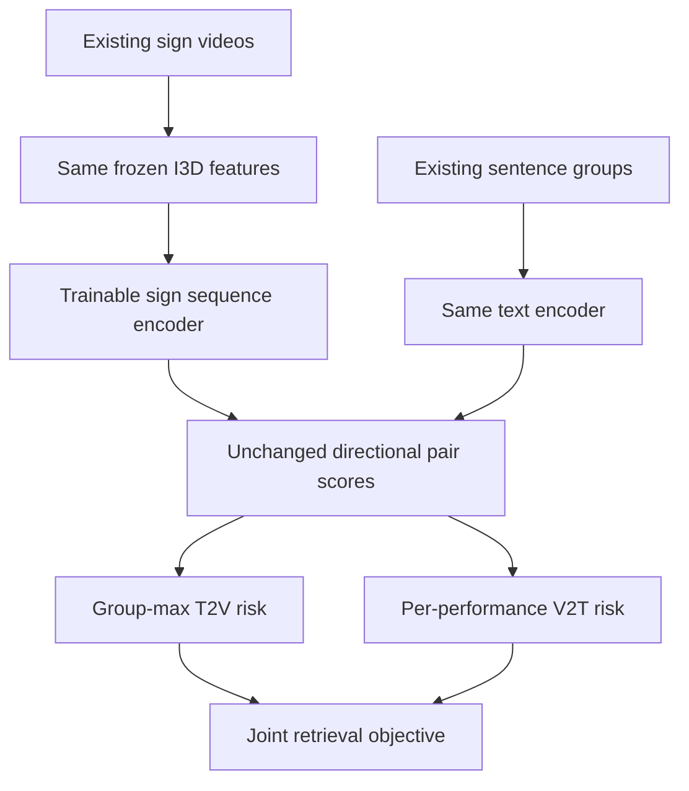
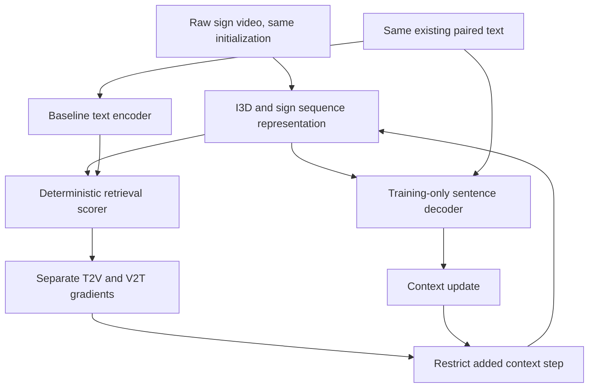

# 1. Executive Summary

**Sign Language Retrieval: evidence, reproducibility, and method discovery**\
Research cutoff: **14 September 2026**. Repository and annotation snapshots were collected on 13 September; a final date-limited freshness check on 14 September did not establish additional relevant evidence. Research status: literature, source-code, and public annotation-manifest investigation; **no neural-model training or retrieval reproduction was performed in this session**.

The strongest conclusion is that the next project should establish which errors affect **standard full-gallery ranking**, before adding supervision for visually plausible local failures. The evidence does not justify treating another local-evidence or partial-alignment loss as the default route to progress.

Five findings change the research priorities:

1. **SAN is not evidence that stronger local discrimination necessarily improves full-gallery retrieval.** Its controlled PHOENIX experiment improves the CiCo variant's fine-grained V2T R@1 from 17.9 to 39.4, while standard T2V/V2T R@1 changes from 69.2/70.1 to 68.1/67.8. These are different evaluation problems. [SAN, Table 1](https://aclanthology.org/2026.acl-long.1302.pdf).
2. **The released benchmark implementations already encode multiple-positive structure.** CiCo samples a performance from each sentence group during training. Its CSL-Daily test metadata contains 1,176 videos in 798 groups. “Add multiple positives” would misdiagnose the baseline. [Training loader](https://github.com/FangyunWei/SLRT/blob/38a4f7b00da7a858d59b7fabe5093876a84db8e0/CiCo/CLCL/dataloaders/dataloader_csl_retrieval_train.py), [public metadata](https://github.com/FangyunWei/SLRT/tree/38a4f7b00da7a858d59b7fabe5093876a84db8e0/CiCo/CLCL/data_csl).
3. **Reproduction hygiene is a prerequisite.** The inspected CiCo/UPRet training entrypoints select checkpoints using the test loader. CiCo's PHOENIX `dev.pkl` includes all 7,096 training IDs plus 519 additional IDs. These observations concern the released snapshots; they do not establish what the authors actually ran. [CiCo training entrypoint](https://github.com/FangyunWei/SLRT/blob/38a4f7b00da7a858d59b7fabe5093876a84db8e0/CiCo/CLCL/main_task_retrieval.py), [PHOENIX metadata](https://github.com/FangyunWei/SLRT/tree/38a4f7b00da7a858d59b7fabe5093876a84db8e0/CiCo/CLCL/data_ph).
4. **The largest verified scores do not form one fair leaderboard.** C²RL, SEDS, UPRet, and large-scale pose pretraining differ in representations, initialization, supervision, and available implementation. C²RL is a strong reported reference; UPRet is the strongest documented candidate in the audited CiCo feature family. Neither has been independently reproduced here.
5. **There is no established dominant residual bottleneck yet.** The best-supported next tests concern the population and ranking objective seen in training, and whether sentence-context supervision can improve the representation without impairing retrieval. Their causal effects remain hypotheses.

**Recommendation after the evidence and collision analysis:** test **Protocol-Matched Gallery Risk (PMGR)** first. It keeps the sign/text representations and local scorer fixed, and tests whether matching the evaluator's sentence-group and individual-video populations improves ranking. The separate, more expensive alternative is **Retrieval-Preserving Context Adaptation (RPCA)**: whole-sentence representation supervision with controlled updates that protect both deployed retrieval directions. Neither introduces local evidence selection or partial transport. Start from a corrected CiCo reproduction and compare against a cleaned, same-feature UPRet reproduction. Neither proposal currently warrants a numerical R@1 forecast or a high-confidence SOTA claim.

Evidence labels used throughout: **[V] Verified fact** from an inspected source or computation; **[A] Author claim** or reported experiment; **[I] Inference** from the evidence; **[H] Hypothesis** requiring an experiment. A published number is verified as *reported*, not verified as independently reproducible. **NOT REPORTED** means absent from the inspected source; **UNVERIFIED** means this investigation could not establish it. **PUBLIC CODE NOT FOUND** does not prove no private or subsequently released code exists.

The investigation treats R1–R5 as closed negative research branches. Their detailed logs were not supplied; explanations for their failure are inferences, not retrospective experimental findings. No SEDS checkpoint or SEDS-produced feature was downloaded or used.

# 2. Definition of Sign Language Retrieval

Sentence-level SLRet learns a compatibility function between a continuous signing clip and a free-form spoken-language sentence. **Text→video (T2V)** ranks signing candidates for a textual query; **video→text (V2T)** ranks textual candidates for a signing query. It differs from gloss recognition, translation generation, isolated-sign dictionary lookup, and sign-video→sign-video search. The distinction prevents importing incompatible “retrieval” results into the same leaderboard. [Original task](https://arxiv.org/abs/2201.02495), [SignSeek's task distinction](https://arxiv.org/html/2609.03695v1), [GTRN](https://ro.ecu.edu.au/ecuworks2022-2026/6028/).

Let \(v_i\) be a video, \(t_j\) a sentence, and \(Y_{ij}\) the dataset's relevance relation. Encoders produce sequences \(V_i\in\mathbb R^{L_i\times d}\), \(T_j\in\mathbb R^{M_j\times d}\); a scorer produces \(s(v_i,t_j)\). There need not be a word-by-word, monotonic, one-to-one linguistic correspondence. Sign languages have their own grammars, simultaneous articulators, and context-dependent realizations.

For a query \(q\), let \(r_q\) be the first relevant candidate's rank. Common sentence-retrieval “R@K” is the fraction of queries for which \(r_q\le K\), rather than the fraction of *all* relevant items recovered. MedR and MnR summarize first-relevant ranks; **MRR is a different metric**, the average reciprocal rank.

The evaluation unit must be explicit. In the inspected CiCo CSL/How2 implementation, V2T evaluates individual performances against sentence groups. T2V takes the maximum score over the performances belonging to each candidate group and ranks those groups. This yields an any-positive interpretation at R@1, but group ranks at R@5/10 can differ from ranks in a raw-video gallery. The helper names are inherited and misleading; their computations determine the protocol. [Evaluation loop](https://github.com/FangyunWei/SLRT/blob/38a4f7b00da7a858d59b7fabe5093876a84db8e0/CiCo/CLCL/main_task_retrieval.py), [metric functions](https://github.com/FangyunWei/SLRT/blob/38a4f7b00da7a858d59b7fabe5093876a84db8e0/CiCo/CLCL/metrics.py).

# 3. Dataset Forensics

## 3.1 Provenance and acquisition

| Dataset | Language / domain / acquisition | Published split counts: train / validation / test | Signers and video | Supervision and pose |
|---|---|---|---|---|
| PHOENIX-2014T | DGS–German; television weather interpretation | 7,096 / 519 / 642 | 9 signers; constrained studio/background; 25 fps, 210×260 frames | German text and glosses; pose in later work is estimated, not native manual pose supervision |
| CSL-Daily | CSL–Chinese; daily-life sentences recorded in a laboratory | 18,401 / 1,077 / 1,176 | 10 signers; roughly 23 hours; recording conditions considerably more controlled than web video | Chinese text and glosses; pose can be estimated; detector provenance must be declared |
| How2Sign | ASL–English; instructional material re-recorded by signers | Dataset paper: 31,128 / 1,741 / 2,322 for the green-screen portion; SLRet variants below | 11 participants across collection settings; 9 in green-screen recordings; frontal RGB 1280×720, 30 fps; multiview and a Panoptic subset | English transcripts, timing, 2D keypoints and richer capture for a subset; not a uniform full-training gloss resource |
| OpenASL | ASL–English; online news and vlogs, principally TheDailyMoth, Sign1News and NAD | Paper: 96,476 / 966 / 975 | 288 hours, over 200 signers; variable framing, backgrounds, subtitles and editing | Caption-derived training text; validation/test translations and boundaries manually checked, with held-out gloss annotation; no uniform native pose ground truth |

Sources: [PHOENIX official release](https://www-i6.informatik.rwth-aachen.de/~koller/RWTH-PHOENIX-2014-T/), [CSL-Daily official release](https://ustc-slr.github.io/datasets/2021_csl_daily/), [How2Sign paper, Table 2 and supplement](https://arxiv.org/pdf/2008.08143), [OpenASL paper, Section 3](https://arxiv.org/pdf/2205.12870). Unlisted codec, exact per-split signer counts, and uniform pose-error rates are **UNVERIFIED** here.

How2Sign's counts require special care:

| Source / processing version | Train | Validation | Test | Interpretation |
|---|---:|---:|---:|---|
| Original green-screen dataset table | 31,128 | 1,741 | 2,322 | Original dataset accounting |
| SPOT-ALIGN initial pool | 31,164 | 1,740 | 2,356 | Retrieval realignment accounting |
| SPOT-ALIGN filtered pool | 31,075 | 1,739 | 2,348 | Invalid timing pairs removed |
| CiCo paper and inspected train/test manifests | 31,085 | 1,739 in paper | 2,348 | Ten more training entries than SPOT's stated filtered pool |
| SEDS stated pool | 31,019 | 1,738 | 2,348 | Additional processing difference; exact ID correspondence **UNVERIFIED** |

These counts are not interchangeable. Freeze the actual IDs, not only the dataset name. [SPOT-ALIGN supplement](https://arxiv.org/pdf/2201.02495), [CiCo](https://arxiv.org/pdf/2303.12793), [SEDS](https://arxiv.org/html/2407.16394v1).

## 3.2 Public-manifest measurements conducted in this investigation

The following are **[V] newly computed aggregate checks**, not results quoted from a paper. The supplied audit script loads only primitive pickle data, normalizes Unicode NFC and whitespace, and performs no semantic clustering, case folding, punctuation removal, or new annotation.

| Manifest | Videos | Existing groups | Distinct exact texts | Videos with repeated exact text | Largest text multiplicity |
|---|---:|---:|---:|---:|---:|
| PHOENIX train | 7,096 | 7,096 | 6,827 English; 6,853 German | 321 | 63 |
| PHOENIX test | 642 | 642 | 630 | 18 | 6 |
| CSL-Daily train | 18,401 | 6,598 | 6,573 English; 6,578 Chinese | 18,356 | 6 |
| CSL-Daily test | 1,176 | 798 | 798 | 756 | 2 |
| How2Sign train | 31,085 | 30,852 | 30,041 | 1,493 | 92 |
| How2Sign test | 2,348 | 1,969 | 1,930 | 775 | 11 |
| OpenASL current train TSV | 96,477 | Not supplied as CiCo-style groups | 84,414 tokenized texts | 13,322 | 722 |
| OpenASL current validation TSV | 967 | Same qualification | 917 | 69 | 7 |
| OpenASL current test TSV | 976 | Same qualification | 928 | 67 | 6 |

The code snapshots and SHA-256 hashes are in the companion audit bundle. Source manifests: [CiCo data directories](https://github.com/FangyunWei/SLRT/tree/38a4f7b00da7a858d59b7fabe5093876a84db8e0/CiCo/CLCL), [OpenASL TSV](https://github.com/chevalierNoir/OpenASL/blob/c7d2350b22f344c5a6669ad37518b493c8f78822/data/openasl-v1.0.tsv).

Important interpretations:

- CSL's train groups contain 45 singletons, 1,486 doubles, 4,884 triples and 183 quadruples. Its test groups contain 420 singletons and 378 doubles. **Most repetition is already known to the loader.** The remaining discrepancy between 6,598 groups and 6,573 English strings is much smaller than the raw repetition count.
- How2Sign has 233 two-performance training groups; test has 311 doubles and 34 triples. Grouping is not simply identical-text deduplication: 1,969 test groups contain only 1,930 distinct strings.
- Differences between original-language and English unique-text counts do **not** by themselves prove which meanings were merged by machine translation.
- Exact test-text overlap with training is 33/642 in PHOENIX, 2/1,176 in CSL, 71/2,348 in How2Sign, and 103/976 in the current OpenASL TSV. Repeated text is not proof of duplicated video or improper splitting.
- OpenASL's current TSV has three more rows than the paper and three empty training tokenized texts. The exact historical filtering responsible for the paper counts is **UNVERIFIED**. Do not silently invent a replacement split.
- Every one of the 456 test source-video IDs in the current OpenASL TSV also occurs in training; 471 of 472 validation source IDs do. This follows a sentence-pair split and is not evidence of identical time intervals. Clip-boundary overlaps, frame hashes and signer labels still require checking.
- CiCo's released PHOENIX `dev.pkl` contains **7,615 entries**, including all 7,096 training IDs. The remaining 519 must be cross-checked against the official validation IDs before use. This is recovery of an existing split, not a proposal for a new one.

## 3.3 Retrieval consequences

**PHOENIX.** Weather templates, repeated greetings, a limited topic range and few signers make lexical frequency and contextual shortcuts plausible. They do not prove a trained retriever uses them. Performance here cannot establish open-domain ASL capability. Identity-sensitive diagnostics must use existing metadata, without changing the official leaderboard split.

**CSL-Daily.** Multiple performances make the asymmetry between a textual query and a video query measurable. Pushing every performance to be equally strong may optimize a different target from retrieving any valid performance. Conversely, optimizing only the best performance can harm V2T coverage. This is a testable population/objective issue, not evidence that all nonmatching sentences are false negatives.

**How2Sign.** Translation timing, long instructional context, repeated performance groups and source-text/signing-order differences complicate correspondence. Short common captions can be valid for several unrelated clips. Signer crops and feature-extraction timing are consequential preprocessing choices.

**OpenASL.** Caption boundaries and wording can imperfectly track signing; varied imaging conditions increase pose-estimation and cropping risks. Shared source videos make background/topic recognition a plausible shortcut. Demonstrating a shortcut requires controlled masking or nuisance probes; source overlap alone is insufficient.

**Multiplicity and pose.** A gloss is a transcription convention, not a complete encoding of meaning. Identical text does not guarantee identical sign realization; different text does not establish a negative. Estimated hand landmarks are especially vulnerable to occlusion and rapid motion, and detector accuracy cannot be assumed equal across these datasets. SEDS provides evidence that pose can help, not that pose is universally reliable. These observations motivate diagnostics using existing data, not a new benchmark.

# 4. Evolution of SLRet Methods

The progression is from **obtaining useful sign features**, to **fine-grained cross-lingual scoring**, to **distributional/fused representations**, and then **representation pretraining and targeted negative construction**. Later work does not uniformly supersede earlier work under matched conditions.

| Work / year / venue | Task and representation | Initialization / extra supervision | Alignment and objective | Negatives / datasets / metrics |
|---|---|---|---|---|
| SPOT-ALIGN, 2022, CVPR | Both; spotted-sign I3D; How2Sign word2vec / PHOENIX German GPT-2 text and cross-modal embeddings, plus sign-recognition score | BOBSL/BSL resources, How2Sign pseudo-spottings, WLASL/MSASL dictionary evidence | Global cross-modal matching and lexical recognition score fusion; ranking objective | Paired retrieval training; exact negative sampler **UNVERIFIED** without training code; How2Sign, PHOENIX; recalls and MedR |
| CiCo, 2023, CVPR | Both; fused domain-agnostic/adapted I3D features; CLIP-initialized sequence and text encoders | BSL-1K I3D; target-domain pseudo-labels; CLIP; English translations of German/Chinese | Clip–token soft correspondence followed by directional sentence scores; bidirectional contrast | In-batch negatives with one sampled performance per group; PHOENIX, CSL, How2Sign; recalls and MedR |
| UPRet, 2024, ECCV | Both; CiCo-family features; deterministic sequences plus Gaussian parameter heads | CiCo-family initialization, not a new raw-video foundation model | Distribution sampling and pooled-sample transport during training, deterministic retrieval at inference | In-batch contrast; same three datasets; recalls, MedR, MnR |
| SEDS, 2024, ACM MM | Both; offline RGB I3D, online hand-pose graph/temporal stream, CLIP text | SignBERT initialization for pose; estimated RTMPose; RGB sign features | Cross Gloss Attention Fusion; Pose–RGB matching; retrieval contrast | In-batch; same three datasets; recalls and MedR |
| C²RL, manuscript 2024 / TCSVT 2025 | Both downstream; ResNet18+temporal/context encoder; retrieval uses learned sign features and mBART encoders | ImageNet, target paired-text pretraining, mBART; no target gloss needed | ICL cross-lingual contrast plus ECL autoregressive context learning; later retrieval fine-tuning | Batch contrast; all four target datasets; recalls |
| Scaling up Multimodal Pre-training, manuscript 2024 / TPAMI 2025 | Both; manual/nonmanual pose representation and multilingual text encoder | SL-1.5M external pretraining, pose extraction | Masked pose reconstruction plus fine-grained sign–text contrast | Batch contrast; PHOENIX and CSL retrieval shown; recalls and MedR |
| SAN, 2026, ACL | Both standard directions plus a fine-grained V2T task; CiCo/GFSLT-based variants | Teacher-derived sign–word relations; generated substituted captions | Adds sign-aware negative supervision to retrieval | Visually confusable sign alternatives; PHOENIX; recalls and MRR |
| CMCM, 2026, CVIU | Cross-modal SLRet; multi-grained/causal design claimed | Exact executed setup **UNVERIFIED** | Causal-confounder intervention claimed | Numerical protocol/results **UNVERIFIED**; incomplete public implementation |

Primary sources: [SPOT](https://arxiv.org/abs/2201.02495), [CiCo](https://arxiv.org/abs/2303.12793), [UPRet](https://www.ecva.net/papers/eccv_2024/papers_ECCV/papers/06074.pdf), [SEDS](https://doi.org/10.1145/3664647.3681237), [C²RL](https://ieeexplore.ieee.org/document/10933970), [multimodal pretraining](https://doi.org/10.1109/TPAMI.2025.3599313), [SAN](https://aclanthology.org/2026.acl-long.1302/), [CMCM](https://www.sciencedirect.com/science/article/abs/pii/S1077314225003546).

| Work | Bottleneck it aimed to fix | Evidence-based remaining limitation | Public implementation / reproduction difficulty |
|---|---|---|---|
| SPOT | Few suitable sign features and scarce dense labels | Heavy pseudo-spotting pipeline; global/recognition fusion cannot represent arbitrary sentence distinctions | Official project repo inspected; **PUBLIC TRAINING CODE NOT FOUND**; high |
| CiCo | General video embeddings poorly model signing as language | Fixed features; limited batch population; directional score aggregation and protocol details matter | Substantial public pipeline, but data/config/evaluation issues; medium–high |
| UPRet | Deterministic embeddings underrepresent ambiguous correspondence | Uncertainty is trained but not used for deployment-time ranking/calibration; does not establish calibrated ambiguity | Public code with cleanup required; medium–high |
| SEDS | RGB extraction is costly and misses useful pose semantics | Pose quality/pretraining and fusion cost; not a controlled demonstration of an unresolved RGB-only loss problem | Public model/configs; medium–high; analysis only here |
| C²RL | Content alone is insufficient for context-sensitive representations | Two-stage transfer and different text/backbone initialization confound direct comparison with CiCo | Complete official retrieval code **PUBLIC CODE NOT FOUND**; high |
| Multimodal pretraining | Scale and manual/nonmanual coverage | External training corpus and pose pipeline change the comparison | Complete retrieval reproduction **UNVERIFIED**; high |
| SAN | Textual hardness does not match sign confusability | Fine-grained gains need not transfer to ordinary gallery ranking | Partial official repository; mining artifact generation incomplete; high |
| CMCM | Observable/unobservable nuisance factors | Full evidence needed to audit causal and performance claims | Module skeleton inspected; high |

This history provides no license to assume that the dominant remaining problem is another inaccurate local correspondence. CiCo already applies fine-grained interaction; C²RL reuses that idea; SAN directly addresses sign-aware negatives. A new claim must establish what those mechanisms leave unresolved.

# 5. Current SOTA and Fair Comparison Table

## 5.1 Comparison contracts

**Fair** means identical split IDs, gallery/relevance function, feature/checkpoint provenance, external data, text processing, tuning policy and comparable compute. **Mostly fair** means a plausible shared implementation family with unresolved reproduction details. **NOT DIRECTLY COMPARABLE** means a consequential difference is known, or essential protocol information is missing.

Feature contracts below apply to every corresponding results row:

| Contract | Visual/text features and pretraining | Target gloss / pose / frozen policy | Comparison with CiCo-family baseline |
|---|---|---|---|
| A: SPOT | Spotted-sign I3D + word2vec (How2Sign) / German GPT-2 (PHOENIX), global retrieval; dictionary and BSL resources | Pseudo sign labels, not pose; feature-based retrieval | **NOT DIRECTLY COMPARABLE** initialization and pipeline |
| B: CiCo | 1,024-D I3D feature inputs; CLIP ViT-B/32 initialized sequence/text stack | Target pseudo-label adaptation; no pose; RGB extractor offline, retrieval encoders trainable | Reference contract; **fair** only within a pinned reproduction |
| C: UPRet | CiCo-family RGB/text plus distribution heads | Same feature family; no pose; RGB offline; distribution additions training-only | **Mostly fair** to B; check exact features, alpha, masks, validation |
| D: SEDS | Offline RGB plus trainable hand-pose graph/temporal encoder; CLIP text | Estimated pose and SignBERT pretraining; mixed frozen/trainable streams | **NOT DIRECTLY COMPARABLE** extra modality/initialization |
| E: C²RL | Target-trained ResNet18/context features; independent mBART retrieval encoders | No target gloss/pose; representation stage trainable, then features frozen for retrieval | **NOT DIRECTLY COMPARABLE** representation, language and pretraining |
| F: large pose pretraining | Pose representation trained with SL-1.5M and multilingual text | External paired data and estimated pose | **NOT DIRECTLY COMPARABLE** data and representation |
| G: SAN | Paper's CiCo/GFSLT variants plus mined caption alternatives | Teacher pseudo-correspondences; no new target manual labels | **Fair** within each controlled ±SAN table; **not directly comparable** to original CiCo scores without complete matching |

“Gloss-free” here never means “no external supervision”: CLIP, ImageNet, BSL labels, pose detectors and language-model training must still be declared. No proposed experiment may obtain its features from SEDS.

## 5.2 Text → video

All recall values are percentages. **NR = NOT REPORTED in the inspected table.** These are reported results, not measurements from this investigation.

| Dataset | Method / contract | R@1 | R@5 | R@10 | MedR | MnR | Source |
|---|---|---:|---:|---:|---:|---:|---|
| PHOENIX | SPOT combined / A | 55.8 | 79.6 | 87.2 | 1 | NR | [SPOT](https://arxiv.org/pdf/2201.02495) |
| PHOENIX | CiCo / B | 69.5 | 86.6 | 92.1 | 1 | NR | [CiCo T2](https://arxiv.org/pdf/2303.12793) |
| PHOENIX | UPRet / C | 72.0 | 89.1 | 94.1 | 1 | 4.4 | [UPRet T2](https://www.ecva.net/papers/eccv_2024/papers_ECCV/papers/06074.pdf) |
| PHOENIX | SEDS / D | 76.8 | 91.7 | 95.3 | 1 | NR | [SEDS](https://arxiv.org/html/2407.16394v1) |
| PHOENIX | C²RL / E | 78.7 | 92.2 | 94.9 | NR | NR | [C²RL Table VI](https://arxiv.org/pdf/2408.09949) |
| PHOENIX | Large pose pretraining / F | 74.5 | 93.3 | 95.6 | 1 | NR | [SLP TX](https://arxiv.org/html/2408.08544v1) |
| CSL-Daily | CiCo / B | 75.3 | 88.2 | 91.9 | 1 | NR | [CiCo T3](https://arxiv.org/pdf/2303.12793) |
| CSL-Daily | UPRet / C | 78.4 | 89.1 | 92.0 | 1 | 6.7 | [UPRet T3](https://www.ecva.net/papers/eccv_2024/papers_ECCV/papers/06074.pdf) |
| CSL-Daily | SEDS / D | 85.8 | 94.4 | 95.6 | 1 | NR | [SEDS](https://arxiv.org/html/2407.16394v1) |
| CSL-Daily | C²RL / E | 90.3 | 96.4 | 97.7 | NR | NR | [C²RL Table VI](https://arxiv.org/pdf/2408.09949) |
| CSL-Daily | Large pose pretraining / F | 87.5 | 95.2 | 97.6 | 1 | NR | [SLP TX](https://arxiv.org/html/2408.08544v1) |
| How2Sign | SPOT combined, original table / A | 32.8 | 47.7 | 52.9 | 7 | NR | [SPOT T6](https://arxiv.org/pdf/2201.02495) |
| How2Sign | CiCo / B | 56.6 | 69.9 | 74.7 | 1 | NR | [CiCo T1](https://arxiv.org/pdf/2303.12793) |
| How2Sign | UPRet / C | 59.1 | 71.5 | 75.7 | 1 | 54.4 | [UPRet T1](https://www.ecva.net/papers/eccv_2024/papers_ECCV/papers/06074.pdf) |
| How2Sign | SEDS / D | 62.5 | 75.1 | 80.1 | 1 | NR | [SEDS](https://arxiv.org/html/2407.16394v1) |
| How2Sign | C²RL / E | 62.4 | 75.9 | 80.1 | NR | NR | [C²RL Table VI](https://arxiv.org/pdf/2408.09949) |
| OpenASL | C²RL / E | 62.2 | 81.7 | 86.8 | NR | NR | [C²RL Table VI](https://arxiv.org/pdf/2408.09949) |

## 5.3 Video → text

| Dataset | Method / contract | R@1 | R@5 | R@10 | MedR | MnR | Source |
|---|---|---:|---:|---:|---:|---:|---|
| PHOENIX | SPOT combined / A | 53.1 | 79.4 | 86.1 | 1 | NR | [SPOT](https://arxiv.org/pdf/2201.02495) |
| PHOENIX | CiCo / B | 70.2 | 88.0 | 92.8 | 1 | NR | [CiCo](https://arxiv.org/pdf/2303.12793) |
| PHOENIX | UPRet / C | 72.0 | 89.4 | 93.3 | 1 | 4.6 | [UPRet](https://www.ecva.net/papers/eccv_2024/papers_ECCV/papers/06074.pdf) |
| PHOENIX | SEDS / D | 78.7 | 92.5 | 95.2 | 1 | NR | [SEDS](https://arxiv.org/html/2407.16394v1) |
| PHOENIX | C²RL / E | 77.6 | 91.3 | 94.2 | NR | NR | [C²RL](https://arxiv.org/pdf/2408.09949) |
| PHOENIX | Large pose pretraining / F | 75.1 | 92.1 | 95.3 | 1 | NR | [SLP](https://arxiv.org/html/2408.08544v1) |
| CSL-Daily | CiCo / B | 74.7 | 89.4 | 92.2 | 1 | NR | [CiCo](https://arxiv.org/pdf/2303.12793) |
| CSL-Daily | UPRet / C | 77.0 | 89.2 | 92.7 | 1 | 5.5 | [UPRet](https://www.ecva.net/papers/eccv_2024/papers_ECCV/papers/06074.pdf) |
| CSL-Daily | SEDS / D | 85.4 | 93.8 | 95.8 | 1 | NR | [SEDS](https://arxiv.org/html/2407.16394v1) |
| CSL-Daily | C²RL / E | 88.4 | 95.7 | 97.1 | NR | NR | [C²RL](https://arxiv.org/pdf/2408.09949) |
| CSL-Daily | Large pose pretraining / F | 87.2 | 95.0 | 97.2 | 1 | NR | [SLP](https://arxiv.org/html/2408.08544v1) |
| How2Sign | SPOT combined, original table / A | 23.3 | 48.5 | 53.7 | 7 | NR | [SPOT](https://arxiv.org/pdf/2201.02495) |
| How2Sign | CiCo / B | 51.6 | 64.8 | 70.1 | 1 | NR | [CiCo](https://arxiv.org/pdf/2303.12793) |
| How2Sign | UPRet / C | 53.4 | 65.4 | 70.0 | 1 | 76.4 | [UPRet](https://www.ecva.net/papers/eccv_2024/papers_ECCV/papers/06074.pdf) |
| How2Sign | SEDS / D | 57.9 | 70.4 | 74.9 | 1 | NR | [SEDS](https://arxiv.org/html/2407.16394v1) |
| How2Sign | C²RL / E | 57.5 | 68.4 | 73.0 | NR | NR | [C²RL](https://arxiv.org/pdf/2408.09949) |
| OpenASL | C²RL / E | 61.6 | 79.8 | 84.6 | NR | NR | [C²RL](https://arxiv.org/pdf/2408.09949) |

Do not replace absent MedR/MnR with values inferred from R@1. Later papers quote a different SPOT How2Sign row, including T2V 34.2/48.0/52.6 and V2T 23.6/47.0/53.0. This report preserves the original inspected table and flags the mismatch rather than combining them. C²RL's OpenASL prose says 62.6 T2V while its table says 62.2; the table is used.

## 5.4 SAN's controlled comparison and frontier limits

| PHOENIX model | Fine-grained V2T R@1 / R@5 / R@10 | Standard T2V R@1 / R@5 / R@10 | Standard V2T R@1 / R@5 / R@10 |
|---|---|---|---|
| CiCo variant | 17.9 / 55.3 / 79.1 | 69.2 / 87.2 / 92.2 | 70.1 / 87.7 / 92.9 |
| CiCo variant + SAN | 39.4 / 75.4 / 92.5 | 68.1 / 87.4 / 91.7 | 67.8 / 87.4 / 91.7 |
| GFSLT variant | 16.8 / 53.1 / 78.0 | 67.9 / 88.4 / 93.8 | 69.4 / 88.7 / 93.3 |
| GFSLT variant + SAN | 49.1 / 85.9 / 94.9 | 70.2 / 89.3 / 94.4 | 67.4 / 85.4 / 90.5 |

The fine-grained task uses an original caption and 40 generated alternatives per video; its recall is not full-gallery recall. [SAN](https://aclanthology.org/2026.acl-long.1302.pdf).

**Frontier qualification:** C²RL has the largest verified CSL-Daily R@1 entries here; SEDS has the largest verified How2Sign R@1 entries; PHOENIX winners depend on direction and metric. CMCM is newer than several seeds, but its complete quantitative evidence was not accessible for verification. Therefore this is an **audited reported frontier**, not a claim to have certified a universal September-2026 SOTA.

**Baseline decision before method design:** start from pinned CiCo code, reproduce it with independently generated CiCo-compatible features, and establish cleaned UPRet as the primary strong comparator. UPRet reports its own CiCo reproduction, which differs from the original: PHOENIX T2V/V2T R@1 70.4/70.9, CSL 76.3/73.9, How2Sign 56.4/50.3. Use local paired comparisons rather than subtracting numbers from different papers. Feature acquisition remains a reproduction risk, as illustrated by [UPRet issue 2](https://github.com/xua222/UPRet/issues/2) and [CiCo issue 55](https://github.com/FangyunWei/SLRT/issues/55). C²RL remains an additional representation-control experiment, not an assumed downloadable official retrieval baseline.

# 6. Detailed Analysis of the Six Seed Papers

## P1 — SPOT-ALIGN

**[V/A]** The original contribution joins automatic sign spotting with sentence retrieval. Mouthing and dictionary evidence support recognition features; a recognition-based score complements the learned cross-modal score. The project illustrates errors that can preserve topic while missing the intended content. **[I]** This supports a distinction between topic retrieval and exact correspondence, but does not quantify a modern model's error causes. The public repository inspected is the project website, not a complete executable training release. [Paper and supplement](https://arxiv.org/pdf/2201.02495), [project](https://imatge-upc.github.io/sl_retrieval/), [repository](https://github.com/imatge-upc/sl_retrieval).

**Critical point:** inherited sign pretraining is a substantive resource. Reimplementing its score fusion on stronger representations would not establish a new mechanism. Its manually annotated analysis subset is historical context; this project must not turn new annotation into its contribution.

## P2 — CiCo

**[V]** Domain-agnostic and target-adapted I3D outputs are blended. Retrieval learns clip–token compatibility with separate directional aggregation. The inspected code uses original text for one direction and an augmented text branch for the other during training. **[A]** The paper's ablations support this cross-lingual scorer and show sensitivity to batch size and extraction stride. **[I]** A claim that modern SLRet lacks fine-grained interaction is already obsolete. [Model](https://github.com/FangyunWei/SLRT/blob/38a4f7b00da7a858d59b7fabe5093876a84db8e0/CiCo/CLCL/modules/modeling.py), [paper](https://arxiv.org/pdf/2303.12793).

**Critical point:** different language order does not establish that arbitrary word swaps preserve meaning. Conversely, removing the augmentation is an ablation, not automatically a research contribution. Existing group sampling also invalidates a blanket claim that its training treats every alternative performance of the same sentence as an in-batch negative.

## P3 — SEDS

**[V]** SEDS combines offline RGB sign features with an online pose path; Cross Gloss Attention Fusion and Pose–RGB matching connect the streams. The configuration loads SignBERT initialization and includes a matching coefficient. The term “gloss” in the fusion name does not itself imply manually supplied gloss labels. [Model files](https://github.com/longtaojiang/SEDS/tree/434e3f714fcb6a7d1f4001fb9a246bbd93ec0246/modules), [PHOENIX script](https://github.com/longtaojiang/SEDS/blob/434e3f714fcb6a7d1f4001fb9a246bbd93ec0246/scripts/train_ph.sh).

**[I]** Its gains mix representation information, initialization and optimization. They do not isolate evidence that an RGB-only lexical loss is missing. Pose offers useful information but adds detector dependence and computation. **No proposed method inherits a SEDS checkpoint, feature, pose representation or fusion module.** Any baseline numbers attributed to it remain literature comparisons.

## P4 — UPRet

**[V]** Its executed model path extends CiCo with distribution heads, sampling and transport. In the inspected implementation, sampled sequences are pooled before the transport operation; with `sample_num=2`, the transport support is sampled sentence representations, not an arbitrary token×clip alignment matrix. The Sinkhorn solution is obtained without differentiating through its iterations, then used in a score term. [Active implementation](https://github.com/xua222/UPRet/blob/046366227417e1d8ec14145965403462df345984/modules/modeling.py), [distribution head](https://github.com/xua222/UPRet/blob/046366227417e1d8ec14145965403462df345984/modules/PDE.py).

**[V]** Added distribution/transport modules are inactive at inference. This is explicitly acknowledged in the final paper's efficiency discussion, so it is **not a paper–code discrepancy**. **[I]** Its reported improvement is compatible with useful training regularization; it does not establish calibrated probabilistic rankings at deployment. [Final paper](https://www.ecva.net/papers/eccv_2024/papers_ECCV/papers/06074.pdf).

## P5 — C²RL

**[V/A]** ICL supplies cross-lingual contrast and ECL supplies conditional language modeling during representation learning. Retrieval subsequently uses frozen learned sign features and trainable retrieval encoders. On PHOENIX, its reported ICL-only, ECL-only and joint T2V/V2T R@1 are 74.7/73.5, 74.1/74.5 and 78.7/77.6. **[I]** This motivates investigating sentence supervision at the representation level, but those deltas cannot be transferred numerically to CiCo. [C²RL](https://arxiv.org/pdf/2408.09949).

**Code qualification:** the independent `sltbaselines` repository publicly includes a similarity function explicitly credited to code shared by the C²RL authors, and a joint-training implementation. It is a translation reproduction framework, not verification of the original full retrieval pipeline. Its controlled SLT study finds smaller gains and transfer/plateau issues; those are SLT findings, not a refutation of C²RL's retrieval table. [Shared-function attribution](https://github.com/ozgemercanoglu/sltbaselines/blob/f741330d0b1e2e8e9a602d7ce4ff6e2e06a4ac13/models/models.py), [independent study](https://arxiv.org/abs/2603.13240).

## P6 — Sign-Aware Hard Negative Mining

**[A]** SAN distinguishes semantic similarity from similarity of sign realization. A trained model supplies high-confidence sign–word correspondences; different words with visually similar representations generate substituted caption negatives. **[I]** A different lexical string is not by itself a guarantee of a semantically invalid sentence, and a teacher-derived visual space can impose systematic mining biases. Its generated fine-grained evaluation and ordinary gallery must be assessed separately. [Paper](https://aclanthology.org/2026.acl-long.1302/).

**[V]** The public training code consumes a pickled hard-negative table. A complete public path to reconstruct that table was not found in the pinned repository, whose README says “Coming Soon.” The available model uses sequence interactions and retains several inherited infrastructure choices. [Dataset loader](https://github.com/joonmy/SAN/blob/82aba9cbc1beb403abef6e9a3875ca52479805c8/datasets.py), [training/model files](https://github.com/joonmy/SAN/tree/82aba9cbc1beb403abef6e9a3875ca52479805c8).

**Consequence:** “use visually harder lexical negatives” is neither an untouched gap nor a reliable full-gallery improvement argument. This paper strengthens the decision to abandon R1–R5 rather than decorate them.

# 7. Code & Reproducibility Audit

## 7.1 Audit scope and pinned sources

This was a static source audit plus executed annotation checks. It did not download model weights, run author training pipelines, measure FLOPs, or establish numerical reproduction. Incomplete public releases are identified explicitly.

| Repository | Audited commit | Files / active functions inspected | Status |
|---|---|---|---|
| FangyunWei/SLRT, CiCo subtree | `38a4f7b00da7a858d59b7fabe5093876a84db8e0` | `CLCL/modules/modeling.py::CLIP4Clip`, `flip_similarity_softmax`; `until_module.py::CrossEn`; `main_task_retrieval.py::{prep_optimizer,eval_epoch}`; `metrics.py`; dataset loaders; `I3D_feature_extractor/{get_features.py,extract_sign_features.py,get_pseudos.py,generate_pseudo_labels.py}`; `data_preparation/reaglined_and_crop.py` | Substantial implementation; qualified reproduction base |
| xua222/UPRet | `046366227417e1d8ec14145965403462df345984` | `modules/modeling.py::{CLIP4Clip,flip_similarity_softmax,get_similarity_logits}`; `PDE.py::DisTrans`; main trainer, datasets, `train_ph.sh` | Cleanup and provenance verification required |
| longtaojiang/SEDS | `434e3f714fcb6a7d1f4001fb9a246bbd93ec0246` | `modules/{modeling.py,modeling_signbert.py,modeling_gcn.py,modeling_graph.py,module_fusionencoder.py}`; pose loaders; `scripts/train_{ph,csl,h2s}.sh` | Analytical audit only |
| joonmy/SAN | `82aba9cbc1beb403abef6e9a3875ca52479805c8` | `models.py`, `datasets.py::S2T_Dataset`, `utils.py::CrossEn`, `train_vlp_v2.py`, `configs/config_gloss_free.yaml`, `model/generate_vis_encoder.py` | Public mining/reproduction chain incomplete |
| imatge-upc/sl_retrieval | `071f1683b6169c954c95024e49235c7355c29bd9` | Repository tree, README, project material | **PUBLIC TRAINING CODE NOT FOUND** |
| vddong-zjut/CMCM | `5d458719d1da2f082e188cc44705003d919e7e97` | `modules/Encoder.py::VideoEncoder`, `CCG_Module.py`, `CSA_Module.py`, `TMCP_Module.py`, `MPNCOV/MPNCOV.py`; dataset modules | No verified complete training/configuration route |
| chevalierNoir/OpenASL | `c7d2350b22f344c5a6669ad37518b493c8f78822` | Dataset metadata and preparation/download code | Dataset audit; not a C²RL retrieval reproduction |

For CiCo entries, filenames in the table are relative to the verified `CiCo/` subtree. Remaining repositories use root-relative filenames. Full source URLs and hashes accompany the report.

## 7.2 Operational settings

| Item | CiCo | UPRet | SEDS | C²RL | SAN |
|---|---|---|---|---|---|
| Visual input | Offline I3D, 1,024-D | CiCo-family offline features | RGB 1,024-D; pose pathway features 1,536-D before projection | ResNet18 and temporal/context representation | Paper CiCo/GFSLT variants; released config points to CiCo features |
| Shared retrieval dimensionality | CLIP space 512; visual transformer internal width 768 | CiCo-family 512 space | Internal width 768; common 512 | Representation and retrieval stages differ; do not equate lightweight 512 with mBART's internal width | Released code has alternative encoders; one universal dimension **UNVERIFIED** |
| Text | CLIP BPE; max 32 | CLIP-family tokenizer; max 32 | CLIP BPE; max 32 | Lightweight context training; mBART-large-cc25 downstream | Released `TextCLIP` loads German BERT; full paper-variant correspondence **UNVERIFIED** |
| Temporal processing | 16-frame I3D windows, stride 1; max 64 clip features | Inherited feature contract; max 64 | PH script window 16, stride 1, 64 features, max 300 frames | 25% temporal sampling in representation stage; train random frame per chunk, test first | Released max video length 300; raw extraction depends on supplied features |
| Retrieval batch / epochs | 512 / 200 | 512 / 200 | 128 / 200 | 128 total / 80 retrieval; representation 64 total / 200 | Paper 256 CiCo or 32 GFSLT / 100 |
| Optimizer / rate | Code `BertAdam`, 1e-5; warmup cosine, warmup 0.1, betas 0.9/0.98 | Same family, 1e-5 | 1e-5 main, 1e-4 pose/fusion | Retrieval Adam 1e-4; representation SGD momentum 0.9, 1e-2 cosine | Paper SGD 1e-2, cosine |
| Important coefficients | Inner softmax 0.07; trainable contrast scale; alpha default 0.8, PH script 0.9 | `sample_num=2`, epsilon 0.1, OT weight 1.0 in active code | PH Pose–RGB matching 0.4; pose threshold 0.4, frame threshold 0.1 | ICL:ECL 1:1; language-model label smoothing 0.2 | Paper mining thresholds alpha/beta 0.7, added loss lambda 0.4 |
| GPUs reported / scripted | Run-specific; do not infer universal count | Paper 4 A100; PH launch script 2 devices | PH script 8 devices | Paper 8 RTX3090 | Exact hardware **NOT REPORTED HERE** |

Sources for implementation settings: [CiCo trainer](https://github.com/FangyunWei/SLRT/blob/38a4f7b00da7a858d59b7fabe5093876a84db8e0/CiCo/CLCL/main_task_retrieval.py), [UPRet trainer](https://github.com/xua222/UPRet/blob/046366227417e1d8ec14145965403462df345984/main_task_retrieval.py), [SEDS scripts](https://github.com/longtaojiang/SEDS/tree/434e3f714fcb6a7d1f4001fb9a246bbd93ec0246/scripts), [C²RL implementation section](https://arxiv.org/pdf/2408.09949), [SAN paper](https://aclanthology.org/2026.acl-long.1302.pdf) and [released model](https://github.com/joonmy/SAN/blob/82aba9cbc1beb403abef6e9a3875ca52479805c8/models.py).

CiCo pseudo-domain adaptation is a separate stage: BSL-1K initialization, confidence threshold 0.6, 24-frame NMS, approximately 64K pseudo examples/1,220 words in the reported How2Sign setting, learning rate 1e-2, batch 4, 15 epochs. These are not retrieval-stage settings. SPOT's recognition stage likewise uses its own 25-epoch SGD schedule and augmentations; do not substitute it for the retrieval training recipe.

SPOT's supplement specifies a 512-dimensional joint embedding, ranking margin 0.2, 40 retrieval epochs, RAdam at 0.001, weight decay 1e-5 and batch size 128. It selects the epoch with the best validation geometric mean of R@1/R@5/R@10. Its text NetVLAD has 20 clusters; the reported dataset-specific text inputs are 300-dimensional word2vec for How2Sign and 768-dimensional German GPT-2 for PHOENIX. These are paper-reported settings; a complete public executable retrieval recipe was not found. [SPOT supplement](https://arxiv.org/pdf/2201.02495).

## 7.3 Findings that matter for reproduction

| Finding | Evidence and classification | Required handling |
|---|---|---|
| Test-based checkpoint selection | **[V]** CiCo `main_task_retrieval.py` calls `eval_epoch(...test_dataloader...)` inside training and updates its best checkpoint; UPRet inherits this | Use genuine validation only in all new runs. Do not allege published test tuning without experiment logs |
| Incorrect/insufficient dev wiring | **[V]** CiCo `DATALOADER_DICT` maps PH `dev` to the How2 loader; loader aliases default to `subset="test"`; PH public dev metadata is a train+dev union | Explicitly wire official validation IDs and assert disjointness |
| PH feature-stream path | **[V]** `dataloader_ph_retrieval_train.py` builds both `video_path` and `video_path_retrain` from `self.features_path`, despite storing a separate retrain path | Verify intended source streams and repair identically in every experimental arm |
| Evaluation text-mask indexing | **[V]** The grouped branch of CiCo `eval_epoch` assigns its selected `input_mask` using `segment_ids[input_mask, ...]`, while selecting the other text tensors with `filter_inds` | Validate the intended mask selection and resulting tensor shapes before running evaluation; this is static evidence, not a claim about the authors' executed version |
| Inner attention masking | **[V]** In CiCo `flip_similarity_softmax`, candidate-axis softmax is formed before masking; masks are applied to outer reductions | Test pad invariance. If changing it, call it a baseline correction and rerun all comparisons |
| Tie handling | **[V]** `compute_metrics` collects every sorted score equal to the diagonal value; tied queries can contribute multiple entries to its denominator | Preserve a legacy readout and add a documented deterministic metric implementation for matched runs |
| UPRet interactive breakpoint | **[V]** Unconditional `pdb.set_trace()` in `get_similarity_logits`; evaluation also includes visualization-related behavior | Remove interactive/visualization side effects in the reproduction branch |
| UPRet transport scope | **[V]** Transport is over pooled sampled representations and absent at inference; paper explicitly states additions are inactive at inference | Do not describe the released path as train-and-test token-level OT or call inactivity a discrepancy |
| SAN external mining table | **[V]** `datasets.py` opens `args.neg_table_name`; complete table-generation path absent in the inspected tree | **UNVERIFIED** faithful mining reproduction; do not replace with an invented miner and call it SAN |
| C²RL implementation boundary | **[V]** Independent source credits an authors-shared similarity routine; its whole framework is a controlled SLT reimplementation | No claim that original retrieval numbers are reproducible from that repository unchanged |
| CMCM backbone label | **[V]** `Encoder.py::VideoEncoder` accepts `pretrained_i3d_path` but instantiates `torchvision.models.video.r2plus1d_18(pretrained=True)` | Executed architecture and complete published recipe **UNVERIFIED**; no quantitative conclusion from the skeleton |

Primary code evidence: [CiCo dataloader dispatch](https://github.com/FangyunWei/SLRT/blob/38a4f7b00da7a858d59b7fabe5093876a84db8e0/CiCo/CLCL/dataloaders/data_dataloaders.py), [PH training loader](https://github.com/FangyunWei/SLRT/blob/38a4f7b00da7a858d59b7fabe5093876a84db8e0/CiCo/CLCL/dataloaders/dataloader_ph_retrieval_train.py), [CiCo metrics](https://github.com/FangyunWei/SLRT/blob/38a4f7b00da7a858d59b7fabe5093876a84db8e0/CiCo/CLCL/metrics.py), [UPRet model](https://github.com/xua222/UPRet/blob/046366227417e1d8ec14145965403462df345984/modules/modeling.py), [CMCM encoder](https://github.com/vddong-zjut/CMCM/blob/5d458719d1da2f082e188cc44705003d919e7e97/modules/Encoder.py).

The issue audit found concrete user reports about [CiCo feature availability](https://github.com/FangyunWei/SLRT/issues/55), [PH reproduction/alpha](https://github.com/FangyunWei/SLRT/issues/50), [incomplete extraction](https://github.com/FangyunWei/SLRT/issues/53), [missing preparation metadata](https://github.com/FangyunWei/SLRT/issues/32), [UPRet features](https://github.com/xua222/UPRet/issues/2), and [single-GPU support](https://github.com/xua222/UPRet/issues/3). These are reproduction leads, not proof of a paper error. No relevant public issue entries were returned for SEDS, SAN or CMCM at inspection.

One further provenance check is necessary: CiCo's README training command names `bsl5k.pth.tar`, while the paper describes BSL-1K pretraining. A filename does not establish the checkpoint's training corpus or class inventory. Resolve its ancestry and hash before claiming identical initialization. [README command](https://github.com/FangyunWei/SLRT/blob/38a4f7b00da7a858d59b7fabe5093876a84db8e0/CiCo/README.md).

# 8. Important Adjacent Literature

## 8.1 Sign-specific representation research

| Work | Verified relevance | What transfers / what does not |
|---|---|---|
| [SignCLIP, EMNLP 2024](https://aclanthology.org/2024.emnlp-main.518/) | Multilingual text–sign representation learning over dictionary-scale isolated signs | Evidence that text–sign semantics can transfer across languages; isolated-sign retrieval is not a sentence-gallery result. Its external pretraining cannot be a hidden advantage |
| [A Tale of Two Languages: Continuous Sign Language Recognition from Spoken Language Supervision, ECCV 2024](https://arxiv.org/abs/2405.10266) | BOBSL/spoken-supervision representation and retrieval connections | Useful evidence on subtitle supervision and domain adaptation; its annotation contributions are not available as this project's novelty |
| [GFSLT-VLP, ICCV 2023](https://openaccess.thecvf.com/content/ICCV2023/html/Zhou_Gloss-Free_Sign_Language_Translation_Improving_from_Visual-Language_Pretraining_ICCV_2023_paper.html) | Contrastive visual-language pretraining for gloss-free SLT | Whole-sentence supervision may improve visual features. Translation gains do not prove retrieval gains; use matched initialization and retrieval evaluation |
| [SignCL, NeurIPS 2024](https://arxiv.org/abs/2405.14312) | Temporal feature contrast to reduce representation density | The [public module](https://github.com/JinhuiYE/SignCL) makes “add local temporal contrast” an established baseline, not an untouched mechanism |
| [SHuBERT](https://arxiv.org/abs/2411.16765), ACL 2025 | Multi-stream self-supervised sign representations | Relevant to visual information and nonmanual cues; different external video pretraining prevents a loss-only comparison |
| [UniSign, ICLR 2025](https://arxiv.org/abs/2501.15187) | Unified sign-language representation/training | Relevant evidence on transferable sign features; recognition/translation numbers must not be relabeled as SLRet SOTA |
| [Scaling up Multimodal Pre-training, TPAMI 2025](https://doi.org/10.1109/TPAMI.2025.3599313) | Manual/nonmanual pose and large multilingual pretraining | Exposes representation/data headroom; does not isolate which small matched-data modification will work |
| [SignDino: Temporal-Axis Self-Distillation, September 2026 preprint](https://arxiv.org/html/2609.06296) | Temporal self-distillation with pretrained visual features | Collides with a generic proposal to add temporal self-distillation; sentence-level SLRet superiority is **UNVERIFIED** |
| [SignSeek, September 2026 preprint](https://arxiv.org/html/2609.03695v1) | Sign dictionary retrieval explicitly distinguished from SLRet | Relevant representation work, excluded from sentence-level leaderboard comparisons |

There is also a CVPR-2026 work titled *Learning Effective Sign Features without Text for Gloss-free Sign Language Translation*. Do not conflate it with the September-2026 SignDino manuscript merely because similar short names circulate. Detailed transfer claims about that CVPR work are **UNVERIFIED** in this report.

The independent [CVIU evaluation of gloss-free SLT](https://doi.org/10.1016/j.cviu.2025.104498) is especially useful as a reproducibility warning. It standardizes implementations and reports that some apparent gains narrow under controlled conditions. This does not supply a new SLRet SOTA number; it strengthens the requirement for matched feature, batch, schedule and text controls.

## 8.2 Retrieval, optimization and alignment literature

| Mechanism / source | Inductive bias relevant to SLRet | Limitation or collision |
|---|---|---|
| [ColBERT, SIGIR 2020](https://arxiv.org/abs/2004.12832); [FILIP, ICLR 2022](https://arxiv.org/abs/2111.07783) | Retain token-level evidence until scoring | CiCo already adopts related late interaction. Another late-interaction branch is insufficient novelty |
| [Smooth-AP, ECCV 2020](https://arxiv.org/abs/2007.12163) | Optimize ranking rather than only pair classification; relevant to gallery errors and metric learning/re-ID | Off-the-shelf code assumes equally sized ordered classes and square same-modality affinities; SLRet's rectangular groups require a different risk definition |
| [Recall@k surrogate, CVPR 2022](https://arxiv.org/abs/2108.11179) | Approximate recall with large candidate sets | Direct recall optimization plus large batches already exists. Cannot claim this combination itself as new |
| [GradCache, RepL4NLP 2021](https://aclanthology.org/2021.repl4nlp-1.31/) | Preserve many contrastive candidates despite encoder activation memory | Corrects a compute limitation, not a new retrieval principle; does not eliminate pairwise token-interaction memory |
| [Cross-Batch Memory, CVPR 2020](https://arxiv.org/abs/1912.06798) | Increase represented negative population | Memory features can be stale. Use as a control, not evidence of exact current-model gallery gradients |
| [QB-Norm, CVPR 2022](https://arxiv.org/abs/2112.12777) | Reduce over-retrieved gallery hubs using a query bank | Plain gallery normalization is already published; a training query bank must not quietly become test-query transduction |
| [Frame-length bias, 2023 manuscript](https://arxiv.org/abs/2309.09311) | Longer candidates can receive biased text–video scores | Rules out presenting generic length correction as a new SLRet mechanism; existence of bias in this baseline still needs measurement |
| [PCME++, ICLR 2024](https://arxiv.org/abs/2305.18171) | Distributional embeddings and soft/pseudo-positive handling | Direct collision with “Gaussian embedding + false-negative filtering”; UPRet already covers nearby SLRet territory |
| [ALBEF, NeurIPS 2021](https://arxiv.org/abs/2107.07651) | ID-aware positives, momentum targets and cross-modal matching | False-negative handling and contrast-then-match are established; not automatic SLRet novelty |
| [Debiased Contrastive Learning, NeurIPS 2020](https://arxiv.org/abs/2007.00224) | Account for negative samples that share latent semantics | Requires assumptions about class/positive distributions that are not known for signed sentence equivalence |
| [ARL, AAAI 2025](https://arxiv.org/abs/2506.07471) | Detect uncertainty/overlap in partially relevant video retrieval | Strong collision with uncertainty-driven multi-positive/local-alignment proposals; partial relevance differs from full sentence equivalence |
| [TempCLR, ICLR 2023](https://arxiv.org/abs/2212.13738); [COOT, NeurIPS 2020](https://arxiv.org/abs/2011.00597) | Sequence context, temporal order and hierarchical video–text representation; applications include action-step localization | Monotonic sentence–clip alignment cannot be imposed on sign words by analogy. Another cycle/DTW alignment risks both external collision and R5 proximity |
| [Collaborative Experts, BMVC 2019](https://arxiv.org/abs/1907.13487) | Query-dependent weighting of complementary modalities | Mixture-of-experts fusion is established; many semantic experts useful for ordinary video may be irrelevant or shortcuts for signing |
| [PCGrad, NeurIPS 2020](https://arxiv.org/abs/2001.06782); [ATTITTUD, ICLR 2021](https://openreview.net/forum?id=1GTma8HwlYp) | Restrict auxiliary-task updates that impair a primary objective | Gradient surgery and primary-task auxiliary learning are not new; negative gradient cosine alone does not prove harmful transfer |
| [Denoising-Contrastive Alignment, revised 2024 manuscript](https://arxiv.org/abs/2305.03614) | Combines sign/gloss context learning with gradient modulation | Direct sign-domain precedent against claiming “first gradient conflict handling for sign language”; uses gloss recognition, not the proposed sentence-retrieval objective |

## 8.3 External code actually read

| Source / commit | Exact inspected file and function | Verified behavior and consequence |
|---|---|---|
| Smooth-AP / `59927ec4c59565bff209301d2c2b449ed1937806` | `src/Smooth_AP_loss.py::{sigmoid,compute_aff,SmoothAP.forward}` | Fixed ordered equal-cardinality classes; dense cubic comparison tensor; not a drop-in rectangular SLRet loss |
| Recall@k / `ed052029d258555df2f94dd82d6f7df60ef7cc6f` | `src/losses.py::RecallatK.forward` | Class-group arithmetic, positive-count normalization and sigmoid ranks; directly limits novelty of a generic recall surrogate |
| GradCache / `906f03835fbc183132a9db32612a9e8f180ca3b4` | `src/grad_cache/grad_cache.py::{forward_no_grad,build_cache,forward_backward,cache_step}`; `context_managers.py::RandContext` | No-grad encoding, representation-gradient caching, stochastic-state replay and surrogate backpropagation |
| QB-Norm / `76d4d90783c1085fe88c52d34acaa3d4d89eea8a` | `dynamic_inverted_softmax.py::{qb_norm,get_retrieved_videos,get_index_to_normalize}` | Normalizes using train-query/gallery similarities and selectively applies the correction |
| PCME++ / `8829c0d75b734e36c193b998b5963c1187fa59b2` | `pcmepp/criterions/pcmepp.py::ClosedFormSampledDistanceLoss`, `_recompute_matched`, `_compute_closed_form_loss` | Mean distance plus variance contribution, learned scale/shift, BCE and optional pseudo-positive smoothing |
| ALBEF / `b9727e43c3040491774d1b22cc27718aa7772fac` | `models/model_retrieval.py::ALBEF.forward`, momentum/queue methods | Repeated-ID positives, momentum-soft targets, within-batch negative sampling and image–text matching |
| PCGrad / `c5fbd7c856526373828074f06875230f7f3ee79e` | `PCGrad_tf.py::PCGrad.compute_gradients` | Flattens task gradients and projects conflicts; official implementation is TensorFlow, so a PyTorch adaptation needs verification |
| Independent C²RL reproduction / `f741330d0b1e2e8e9a602d7ce4ff6e2e06a4ac13` | `models/models.py::{CiCo.cross_lingual_similarity_v2,gloss_free_model.forward,config_decoder}`; `train_slt.py` joint-loss branch; `configs/phoenix/config1.yaml` | Public authors-shared similarity routine inside independent code; joint language-model/contrast training; config loads local mBART-derived checkpoints |

Repository links: [Smooth-AP](https://github.com/Andrew-Brown1/Smooth_AP), [Recall@k](https://github.com/yashvarpatel/RecallatK_surrogate), [GradCache](https://github.com/luyug/GradCache), [QB-Norm](https://github.com/ioanacroi/qb-norm), [PCME++](https://github.com/naver-ai/pcmepp), [ALBEF](https://github.com/salesforce/ALBEF), [PCGrad](https://github.com/tianheyu927/PCGrad), [sltbaselines](https://github.com/ozgemercanoglu/sltbaselines). Some nonessential downloads of Recall@k/ATTITTUD timed out; the listed loss files were successfully read. Neither repository is represented as fully executed.

# 9. Failure-Mode Taxonomy

| Failure mode | Evidence | Affected datasets / existing response | What remains unresolved |
|---|---|---|---|
| Visual ambiguity | **[A]** SAN's generated alternatives expose poor discrimination; sign content can depend on location, orientation, motion and nonmanual signals | All; SAN, pose representation, sign recognition pretraining | Prevalence among natural full-gallery errors is not established by the synthetic test |
| Semantic ambiguity | **[V]** Repeated text and multiple performances in manifests; **[I]** unlabelled paraphrases may create more valid matches | All; existing groups, UPRet/PCME-style uncertainty | Exact strings are only a lower-bound diagnostic, not semantic labels; most CSL known multiplicity already handled |
| Alignment uncertainty | **[V]** CiCo implements soft clip–token compatibility; UPRet training models distributions | All, especially translated captions and How2/OpenASL timing | No verified evidence that more localized alignment is the missing ingredient; R1–R5 argue against making it the next bet |
| Temporal information loss | **[A]** CiCo stride ablation is strongly sensitive: How2Sign T2V R@1 56.6 at stride 1 versus 44.8 at stride 2 | Long/fast signing; dense extraction, temporal encoders, recent SSL | Stride 1 is already the baseline; recovering the loss from an artificially sparse control is not a SOTA contribution |
| Content/context conflict | **[A]** C²RL joint representation learning exceeds its single-objective ablations; independent SLT reproduction reports transfer plateaus | All; C²RL, GFSLT-VLP | Whether harmful retrieval/context gradients exist under a matched large batch is **UNVERIFIED** |
| Signer/domain nuisance | **[V]** Few controlled signers in PH/CSL; shared OpenASL source videos; **[I]** nuisance shortcuts plausible | All; domain adaptation, multimodal pretraining, CMCM | Need nuisance probes and intervention, not assumed causal explanations or signer labels inferred from appearance |
| False negatives | **[V]** Residual identical strings across groups; **[I]** further paraphrases | How2/OpenASL and some PH; group sampling already helps CSL | No trustworthy broad semantic-positive oracle; aggressive merging can erase negation, names or quantities |
| Hard-negative mismatch | **[A]** SAN directly distinguishes visual and semantic hardness | Primarily demonstrated on PH; SAN | Standard full-gallery improvements remain inconsistent; another lexical miner has weak justification |
| Gallery/population mismatch | **[V]** Group-uniform single-performance training versus group-max T2V and performance-weighted V2T evaluation; batch-limited contrast | CSL most directly; How2; ordinary finite-batch issue in PH/OpenASL | Does correcting the training measure improve held-out ranking beyond matched large-batch contrast? This is untested |
| Hubness / score calibration | **[V]** Adjacent retrieval work demonstrates hubness corrections; **[H]** analogous SLRet effect | Potentially all; QB-Norm and related methods | Must first measure length/frequency/hub correlations; generic normalization already published |
| Collapse / shortcut geometry | **[I]** Topic-level mistakes, repeated templates, frozen recognition features make this plausible | All; existing content/contrast pretraining | No singular-value, nuisance-decoding or neighbourhood measurement on a trained model was run here; “collapse” cannot be asserted |

Sources for the non-code empirical observations: [SAN](https://aclanthology.org/2026.acl-long.1302.pdf), [CiCo supplement](https://arxiv.org/pdf/2303.12793), [C²RL](https://arxiv.org/pdf/2408.09949), [independent SLT reproduction](https://arxiv.org/abs/2603.13240), [QB-Norm](https://arxiv.org/abs/2112.12777). Manifest/code facts refer to Sections 3 and 7.

The appropriate causal sequence is therefore: observed mismatch or controlled ablation → measured full-gallery consequence → intervention → falsification. A visually persuasive attention map is not sufficient evidence at either end of that sequence.

# 10. Research Gap Matrix

“Accepted” below means accepted for a falsifiable pilot, not established as the dominant bottleneck.

| Candidate gap | Evidence / existing solutions | Relation to R1–R5 and why they do not resolve it | Remaining limitation / impact / risk | Decision |
|---|---|---|---|---|
| Training population differs from the evaluated retrieval population | Group sampling/evaluation code and measured group sizes; rank/large-batch literature already exists | Whole-gallery query/candidate weighting; no local supports or lexical rivals | Mismatch is certain, harm is not; plausible direct ranking impact; medium risk | **Accept pilot** |
| Context information may be hard to transfer without sacrificing retrieval | C²RL ablation plus independent SLT plateau evidence; PCGrad/auxiliary learning are established | Changes which representation updates are applied, not where lexical contrast is applied | Harmful gradient mechanism not yet observed in SLRet; potentially higher ceiling, high risk | **Accept conditional pilot** |
| Fixed sign features impose an information ceiling | CiCo extraction ablations, SEDS and C²RL representation changes | Upstream information, not local auxiliary loss | Better features may simply reflect extra modality/pretraining; expensive to isolate | Accept as diagnostic and control, not standalone novelty |
| Remaining exact/semantic positives are mishandled | Public repetition counts; ALBEF/PCME++/ARL and existing groups | Sentence-level labels; far from local evidence | Exact residual is small in CSL; semantic filtering noisy; impact uncertain | Reject as primary method |
| Gallery hubs or duration inflate scores | Strong adjacent evidence, no current SLRet embedding measurement | Global calibration, mechanistically distant | Generic normalizers already solve the proposed intervention; novelty weak | Diagnostic baseline only |
| Signer/source shortcuts dominate retrieval | Acquisition/metadata risks; CMCM already targets confounders | Nuisance intervention, distant from failed families | Dominance not demonstrated; avoiding useful correlated linguistic variation is difficult | Reject until causal evidence |
| Missing temporal self-supervision | Sensitivity to timing; several sign SSL works | Could be distant, but consistency formulations approach R5 | Established mechanisms; no evidence a new SSL objective beats dense extraction under equal data | Reject current formulation |
| Better local evidence or partial transport | Existing local interaction; negative project results; SAN targeted/global discrepancy | Direct collision with R1–R5 | No new evidence explains failure or creates a different causal path | **Reject entire family** |

The failures of R1–R5 do not experimentally prove any accepted gap. They lower the priority of their hypothesis family. The accepted alternatives still need independent evidence of benefit, with all baseline fixes shared across arms.

# 11. Rejected Research Gaps

## Gaps I considered but rejected

1. **“SLRet needs fine-grained clip–word interaction.”** CiCo already implements it. Renaming a local contrast branch would collide externally and internally.
2. **“Constrain competing words to use different frames.”** This is OCEM/support-capacity reasoning. No new evidence satisfies the user's mechanistic-departure conditions.
3. **“Use OT with a consistent teacher across samplings.”** This is R5, with nearby external distribution/alignment work. Discarded before implementation design.
4. **“Mine more visually confusing lexical negatives.”** SAN already investigates this; its ordinary gallery results do not establish the desired benefit. It is especially close to the project's rejected causal hypothesis.
5. **“Treat all duplicate performances as positives.”** Known CSL/How2 group membership already influences training. Residual exact-caption duplication is not enough to justify a broad new method.
6. **“Correct duration/hubness with a query bank.”** A worthwhile baseline check, but QB-Norm and length-bias work are direct precedents. No distinct SLRet null model has been validated.
7. **“Add probabilistic soft positives.”** UPRet, PCME++ and ARL cover the ingredients; uncertain negative labels can reduce discrimination. No evidence-backed new mechanism survived.
8. **“Improve signer invariance using causal disentanglement.”** A source-video overlap is not causal evidence of harmful shortcut reliance. CMCM also prevents claiming this as an unoccupied SLRet direction.
9. **“Add temporal distillation or more modalities.”** Recent sign SSL and fusion work make this crowded. A different pretrained encoder or RGB+pose concatenation violates the intended contribution standard.
10. **“Fix evaluation and call the resulting score a method gain.”** Necessary engineering, not a modeling contribution. Corrections must precede paired experimentation.

# 12. Research Questions

| RQ | Independent variable and hypothesized mechanism | Outcome / datasets | Falsification condition |
|---|---|---|---|
| RQ1 | Replace single-performance, group-uniform contrast with training risk that matches group-max T2V and performance-weighted V2T | Full-gallery recall, directional coverage and group-size-conditioned errors; CSL, How2; PH negative control | No improvement over identical encoders, candidates and compute with ordinary contrast, or gain explained entirely by weighting/extra exposure |
| RQ2 | Increase the number of **current-model** competing groups while holding representation, update count and training-video exposure controlled | Full-gallery rank margins and recall; all available datasets | Gains disappear against a same-effective-batch contrastive baseline or derive only from longer training |
| RQ3 | Add whole-sentence context supervision to the same trainable visual representation | Full-gallery retrieval and conditional-text loss; PH, CSL, then How2 | Context loss improves but held-out retrieval does not; raw-video retrieval-only adaptation matches it |
| RQ4 | Restrict context-induced updates using separate T2V/V2T retrieval gradients rather than an undifferentiated sum | Actual one-step retrieval-loss changes, conflict magnitude, final ranking; same datasets | Harmful transfer is absent, negligible, or unaffected by the restriction; simple scalar weighting performs equally well |
| RQ5 | Use only existing known groups versus exact-caption/uncertainty-based expanded positives as controlled alternatives | Negative contamination proxies and full-gallery precision/recall; CSL, How2, OpenASL | Additional positives erase genuine distinctions or benefit only an altered relevance metric |
| RQ6 | Probe duration, source/signer information, temporal compression and background dependence without changing the benchmark | Conditional errors, score/length dependence, nuisance probes; dataset-specific metadata | Correlations disappear under content-matched controls or do not predict retrieval errors; no new nuisance method justified |

RQ1/RQ2 examine training and inference statistics; RQ3/RQ4 examine representation transfer. RQ5/RQ6 protect the interpretation and test competing explanations. None requires local lexical labels or a new split.

# 13. Candidate Method Pool

Eight serious candidates were assessed before selecting a method. Names describe mechanisms, not asserted inventions. Scores are subjective research judgments, **not probabilities or measured results**.

## 13.1 Mechanisms, closest work and failure conditions

| ID / candidate | Failure, current insufficiency and proposed difference | Closest prior / novelty scope | Why it could improve ranking / what could defeat it | Implementation / orthogonality |
|---|---|---|---|---|
| C1: Protocol-matched group ranking | Optimize the actual directional units: one query per sentence group in T2V, one per performance in V2T; compare whole candidate groups rather than random representatives | CiCo groups + Smooth-AP/Recall@k. Novelty, if any, is the demonstrated SLRet population mismatch and its exact correction, not ranking loss | Directly changes ranking gradients. Could fail because stochastic contrast already learns better generalizable features, or max pooling neglects weak performances | Moderate; CiCo + cached embeddings; independent of local alignment and compatible with UPRet scoring |
| C2: Retrieval-constrained context adaptation | Update the existing visual representation with sentence modeling while limiting context-induced harm to both retrieval directions; preserve effective contrastive batch | C²RL + PCGrad/ATTITTUD + GradCache; incremental composite, not a new projection algorithm | Adds information before frozen features become the bottleneck. Could fail through language-prior shortcuts, absent harmful conflict, or overconstrained updates | High; public joint-training skeleton and gradient code exist; may complement C1 but must be tested independently |
| C3: Equivalence-aware sentence positives | Use known original-language/exact-caption relations to avoid residual contradictory labels | ALBEF, PCME++, ARL; generic version already published | Could relieve demonstrably contradictory training labels; could merge different meanings or optimize uncredited positives | Low–moderate; data/objective change; likely redundant with grouping and insufficient residual headroom |
| C4: Query-conditioned gallery calibration | Correct excessive score attraction to common/long candidates using training-query statistics | QB-Norm, dual-bank normalization, frame-length debiasing; severe collision | Could reduce hubs without encoder change; could suppress truly common correct candidates or exploit test distribution | Low; postprocessing and differentiable variant possible; inference-level orthogonality but weak novelty |
| C5: Signer/source nuisance intervention | Remove content-irrelevant appearance/source signals while retaining signing information | Domain adaptation, causal retrieval, CMCM | Could improve generalization if shortcut reliance is causal; can erase identity-correlated language variation, handshape or style | Moderate–high; annotations incomplete; no controlled evidence that this is dominant |
| C6: Temporal information-preserving representation learning | Preserve temporal information lost during visual preprocessing/compression | SignCL, SHuBERT, SignDino, TempCLR | Could improve subtle timing/content information; existing stride-1 pipeline may already preserve it, and SSL gains may depend on pretraining | High; raw video needed; no specific novel equal-data mechanism established |
| C7: Analytic distributional retrieval with soft positives | Use closed-form uncertainty-aware scores and inferred positive relations | PCME++ and UPRet | Could represent multimodality more efficiently; same mechanism is already established and uncertainty can absorb errors | Moderate; public loss available; substantial redundancy with current methods |
| C8: Global compositional/order verification | Represent sentence-level relations or sequence order rather than selecting rival lexical supports | TempCLR, COOT, compositional retrieval; simple order perturbation also overlaps existing negative methods | Could distinguish relations missed by bags of features; sign/text order differs and no measured relation-error fraction is available | High; relation supervision unreliable; no justified component beyond established architectures |

## 13.2 Ten-axis scoring

Higher is better. “Gain” scores expected potential under matched conditions; “feasibility” and “compute” reward ease and efficiency.

| ID | Novelty | Plausibility | Gain | Feasibility | Reviewer defensibility | Reproducibility | Dataset compatibility | Compute | Distance from R1–R5 | New supporting evidence |
|---|---:|---:|---:|---:|---:|---:|---:|---:|---:|---:|
| C1 | 6 | 8 | 6 | 8 | 6 | 8 | 9 | 7 | 10 | 7 |
| C2 | 5 | 7 | 7 | 5 | 5 | 6 | 9 | 4 | 10 | 6 |
| C3 | 3 | 7 | 4 | 8 | 4 | 8 | 8 | 9 | 10 | 6 |
| C4 | 2 | 7 | 4 | 9 | 3 | 9 | 9 | 9 | 10 | 4 |
| C5 | 4 | 6 | 5 | 5 | 4 | 5 | 7 | 5 | 10 | 4 |
| C6 | 3 | 7 | 6 | 4 | 4 | 5 | 8 | 3 | 8 | 6 |
| C7 | 2 | 8 | 4 | 7 | 3 | 8 | 9 | 7 | 9 | 5 |
| C8 | 4 | 5 | 5 | 4 | 4 | 4 | 7 | 4 | 9 | 3 |

C1's strongest evidence is the executable population mismatch plus a real batch constraint; its weakest part is the unmeasured causal effect. C2 has representation-ablation support but only indirect evidence of transfer conflict. C3/C7 are plausible implementations with published mechanisms. C4 is efficient but primarily an established baseline. C5/C8 lack a measured dominant error source. C6 has evidence that temporal information matters, but not that another SSL component solves a remaining problem at equal resources. High distance from R1–R5 is necessary, not sufficient.

## 13.3 Rejected-method distance check for every candidate

The five checks are: derivation from R1–R5; same causal hypothesis; same graph without names; cosmetic change only; evidence-backed reason it could succeed independently.

| Candidate | Derived / same hypothesis / same graph / cosmetic? | Independent reason or rejection |
|---|---|---|
| C1 | No / no / no / no | Changes whole-gallery loss population and metric units. Any success must occur with the local scorer unchanged; no recovery of a local-evidence effect is needed |
| C2 | No / no / no / no | Changes representation learning and allocation of whole-sentence gradients. No lexical teacher, support mask or transport exists. Success requires measured context benefit and reduced harmful retrieval transfer |
| C3 | No / no / no / no | Known sentence labels, not local supports; nevertheless rejected because the generic mechanism is known and residual headroom is uncertain |
| C4 | No / no / no / no | Post-score calibration has an independent mechanism; rejected for external collision and missing SLRet-specific evidence |
| C5 | No / no / no / no | Nuisance removal is independent; rejected because the required causal evidence has not been observed |
| C6 | Not necessarily / potentially if framed as sampling consistency / implementation dependent / potentially | A temporal SSL version could drift into R5; current candidate is rejected, and no teacher-consistency rescue is allowed |
| C7 | Not necessarily / no for global distribution scoring / no local graph / external mechanism largely unchanged | Internally distant but externally redundant; rejected rather than rebranded |
| C8 | No for full-sequence relations / no / no / no | Could address a different failure, but its empirical premise is too weak; rejected until measured |

No candidate using teacher-selected local evidence or primary OT/partial transport survived into the serious pool. The eight candidates do not use the failed internal methods as building blocks.

# 14. Novelty Collision Search

The search actively tried to defeat the strongest candidates. Concept-level queries included **recall surrogate + large batch**, **multiple positives + reciprocal rank**, **group + video retrieval + ranking**, **primary task + auxiliary + gradient projection**, **sign language + gradient conflict**, **querybank + hubness**, **frame length + video retrieval**, **uncertainty + multi-positive**, and **temporal self-distillation + sign representation**. Searches were resumed only for unresolved claims and collisions, not to inflate the source count.

| Candidate | External collision found | Internal collision | Result / claim that remains permissible |
|---|---|---|---|
| C1 | Smooth-AP, Recall@k surrogate and GradCache already cover differentiable ranks and large candidate sets; CiCo and ALBEF already know positive groups | None if local scoring stays unchanged | Reject “new rank loss,” “first multi-positive retrieval” and “large-batch SLRet” as standalone claims. Retain a **conditional study of direction-specific population matching**, requiring superiority over these exact controls |
| C2 | C²RL already combines content/context; PCGrad and ATTITTUD already handle auxiliary gradient conflict; DCA already applies gradient modulation in sign recognition | None if there is no local evidence module | Reject “C²RL + generic PCGrad” as an algorithmic novelty claim. Retain a **code-backed retrieval-priority adaptation framework** only if protecting both retrieval directions and controlling batch size demonstrate a distinct causal effect |
| C3 | ALBEF IDs, PCME++ pseudo positives and ARL ambiguity handling | None | Reject as selected method; retain simple exact-positive control |
| C4 | QB-Norm, dual-bank normalization and frame-length correction | None | Reject as selected novelty; retain inexpensive diagnostic baseline |
| C5 | CMCM directly occupies causal SLRet; broader domain-invariant learning also mature | None | Reject absent new causal evidence and full CMCM comparison |
| C6 | SignCL, SHuBERT, SignDino and temporal representation literature | Potential R5 if made sampling-consistent | Reject generic SSL or teacher-consistency formulation |
| C7 | PCME++/UPRet | Possible proximity if converted to local partial transport | Reject; no distinct contribution established |
| C8 | COOT/TempCLR and established compositional retrieval; SAN for lexical substitutions | Would collide if implemented as localized rival-unit discrimination | Reject current formulation; missing measurable premise |

Relevant exact implementations were read, not inferred from abstracts: [Recall@k loss](https://github.com/yashvarpatel/RecallatK_surrogate/blob/ed052029d258555df2f94dd82d6f7df60ef7cc6f/src/losses.py), [Smooth-AP loss](https://github.com/Andrew-Brown1/Smooth_AP/blob/59927ec4c59565bff209301d2c2b449ed1937806/src/Smooth_AP_loss.py), [PCGrad](https://github.com/tianheyu927/PCGrad/blob/c5fbd7c856526373828074f06875230f7f3ee79e/PCGrad_tf.py), [C²RL reimplementation](https://github.com/ozgemercanoglu/sltbaselines/blob/f741330d0b1e2e8e9a602d7ce4ff6e2e06a4ac13/models/models.py), [DCA's gradient-modulation equation](https://arxiv.org/html/2305.03614v5).

**Selection boundary:** C1 and C2 survive as falsifiable research programs with deliberately narrow novelty claims. Neither is a verified new optimizer or a ready-to-submit SOTA result. If their distinguishing controls fail, reject the method claim rather than enlarging the architecture. Sections 1–14 establish the evidence and collision analysis before the following method specifications.

# 15. Method 1 — Safest SOTA-Targeting Method

## A. Temporary name

**Protocol-Matched Gallery Risk (PMGR).** “Safest” is relative to the surviving candidates. The available evidence does not warrant calling any untested proposal a high-certainty SOTA improvement.

## B. One-sentence hypothesis

**[H]** Training on the same directional query populations and candidate units used by evaluation will improve standard SLRet ranking more reliably than adding another local discrimination objective, provided that the improvement survives equal-candidate, equal-compute ranking and contrastive controls.

## C–D. Core insight and exact failure addressed

A CSL sentence can have several recorded performances. A text query is credited if a suitable performance wins, while every video remains a separate V2T query. CiCo's one-performance-per-group training is useful for avoiding known duplicate positives in a batch, but it does not optimize the same group-max and per-performance risk as evaluation.

There are two distinct mismatches:

1. **Candidate representation:** a random performance is not the maximum-scoring performance in a competing group.
2. **Query measure:** uniform sentence-group sampling with one performance weights a group equally in V2T, whereas the evaluator counts every performance.

Neither observation proves a harmful effect. Repeated sampling might be a better regularizer, and a group-max objective might overfit easy performances. PMGR earns a recommendation only if the predicted mismatch explains held-out ranking errors.

A constructed example clarifies the difference without pretending to be a dataset result. For one text query, its two relevant performances score 0.9 and 0.1, while a rival group scores 0.8. Group-max T2V succeeds; a uniformly sampled relevant performance succeeds half the time. V2T still has to handle the weak performance. PMGR preserves both requirements instead of replacing them with a universal all-positive or best-positive rule.

## E. Why the seed methods do not already resolve this question

| Baseline | Relevant limitation relative to this hypothesis |
|---|---|
| SPOT-ALIGN | Recognition/global-score fusion does not test the training/evaluation population correction |
| CiCo | Already handles known groups in sampling, but its inspected objective uses sampled representatives and diagonal batch contrast |
| SEDS | Changes features/fusion; no audited ablation establishes group-risk matching as solved |
| UPRet | Changes training representations/transport while retaining the inherited batch/group infrastructure |
| C²RL | Supplies stronger representation pretraining; does not report this controlled population-risk test, and full retrieval code is unavailable |
| SAN | Changes negative captions; its own standard results do not establish improved full-gallery population risk |

These are bounded statements about inspected evidence, not claims that the papers are incapable of being extended.

## F. Architecture and implementation base

Use **pinned CiCo `CLIP4Clip`** as the implementation base and cleaned UPRet as the strong comparator. Preserve the original source/target-adapted I3D feature lineage, CLIP initialization, feature sampling and scorer. All features must be independently extracted or obtained from a verified non-SEDS source.



Each sampled group contributes its existing performances and one textual record. With \(B\) groups, \(B_v=\sum_g n_g\) videos, maximum video length \(L\), text length \(M\), and dimension \(d\), the encoded tensors are \(V\in\mathbb R^{B_v\times L\times d}\), \(T\in\mathbb R^{B\times M\times d}\), plus validity masks and explicit group IDs. No text-generated positives or local-support annotations are introduced.

## G. Mathematical formulation

**Existing scorer.** For normalized clip/token vectors, define \(C_{iq\ell m}=V_{i\ell}^{\top}T_{qm}\). A mask-corrected CiCo-style scorer is

\[
a_{iq}=\frac{1}{L_i}\sum_{\ell\in\mathcal V_i}\sum_{m\in\mathcal T_q}
\operatorname{softmax}_{m}(C_{iq\ell m}/\sigma)C_{iq\ell m},
\]

\[
b_{qi}=\frac{1}{M_q}\sum_{m\in\mathcal T_q}\sum_{\ell\in\mathcal V_i}
\operatorname{softmax}_{\ell}(C_{iq\ell m}/\sigma)C_{iq\ell m}.
\]

Here \(a\) supplies V2T scores, \(b\) supplies T2V scores, and each softmax excludes padding. If padding is repaired, this exact scorer is used by **all** controls. Existing text augmentation is held fixed across arms; \(T_q\) denotes the input of the relevant training branch. No novelty is claimed for these equations or their masking.

Let \(g(i)\) identify video \(i\)'s existing sentence group, \(\mathcal V_g\) its performances, and \(n_g=|\mathcal V_g|\). Use the evaluator's group score

\[
S_{qg}=\max_{i\in\mathcal V_g} b_{qi}.
\]

This maximum is across **whole recorded performances**, not frames, lexical supports or teacher-selected evidence. It is piecewise differentiable; use a documented deterministic tie rule. A log-sum-exp version is an ablation, not an extra mechanism.

**Protocol-matched contrastive control.** Let \(z\) be the learned contrast scale, \(G\) the total number of training groups, and \(N=\sum_g n_g\) the number of training videos. For a uniformly sampled set \(\mathcal B\) of \(B\) groups,

\[
L^T_{\mathrm{CE}}=-\frac1B\sum_{q\in\mathcal B}
\log\frac{e^{zS_{qq}}}{\sum_{g\in\mathcal B}e^{zS_{qg}}},
\]

\[
L^V_{\mathrm{CE}}=-\frac{G}{NB}\sum_{g\in\mathcal B}\sum_{i\in\mathcal V_g}
\log\frac{e^{za_{ig}}}{\sum_{q\in\mathcal B}e^{za_{iq}}}.
\]

The factor \(G/(NB)\) corrects group-uniform sampling toward a video-uniform query measure. It avoids pretending the batch's random video count is the global population. It does **not** make a nonlinear finite-gallery loss an unbiased estimator of full-gallery loss.

**First-relevant rank surrogate.** With \(h_\eta(x)=1/(1+e^{-x/\eta})\), using unscaled similarities so a learned contrast temperature cannot trivially absorb \(\eta\), define

\[
\widetilde r^T_q=1+\sum_{g\in\mathcal B\setminus\{q\}}h_\eta(S_{qg}-S_{qq}),\qquad
\widetilde r^V_i=1+\sum_{q\in\mathcal B\setminus\{g(i)\}}h_\eta(a_{iq}-a_{i,g(i)}).
\]

\[
L_{\mathrm{rank}}=\frac{1}{2B}\sum_{q\in\mathcal B}\log\widetilde r^T_q
+\frac{G}{2NB}\sum_{g\in\mathcal B}\sum_{i\in\mathcal V_g}\log\widetilde r^V_i,
\]

\[
L_{\mathrm{PMGR}}=(1-\lambda)\frac{L^T_{\mathrm{CE}}+L^V_{\mathrm{CE}}}{2}+\lambda L_{\mathrm{rank}}.
\]

This is a proposed use of established differentiable-ranking principles; **it is not a newly invented rank surrogate**. The contrastive term retains useful optimization when sigmoid rank derivatives saturate. Compare it directly with Smooth-AP/Recall@k-style alternatives on the same scores and groups.

**Negative selection:** all nonmatching sampled groups are competitors. There is no lexical miner, inferred paraphrase graph, EMA teacher or OT solver. Existing group IDs remain unchanged. Enlarging the candidate set is an independently controlled implementation option, not the novelty claim.

## H. One training iteration

```text
sample B existing sentence groups uniformly, without replacement
load all existing performances of those groups and the group's text
apply the same video/text preprocessing used by the matched baseline
encode videos and texts, with gradient caching if required
compute unchanged directional pair scores in bounded-size blocks
reduce whole-video T2V scores by maximum within each candidate group
compute group-uniform T2V and population-weighted V2T cross-entropy
compute first-relevant rank surrogate on the same candidate scores
backpropagate the fixed mixture of CE and rank risk
replay cached encoder chunks; update parameters once
log both directions, candidate counts, group sizes and score gradients
```

Distributed workers must not independently duplicate groups in the effective batch. Candidate and query normalizers use global counts, with correct all-gather gradient accounting.

## I. Complexity and compute

The original late interaction costs \(O(B_vBLMd)\); PMGR's group reduction/rank loss adds \(O(B_vB)\), which is small relative to token interaction. Encoding all existing performances increases work relative to one-performance CiCo by approximately the sampled mean group cardinality. CSL can therefore approach about 2.8 times the video-side work at equal group count; this is not a “free” gain.

Against an **all-performances, same-candidate control**, parameter count and pair-scoring cost are effectively unchanged. Gradient caching reduces activation memory to chunk-scale, with cached representations \(O((B_vL+BM)d)\) and scalar scores \(O(B_vB)\). Pairwise interaction must still be blockwise; GradCache alone does not remove an \(O(B_vBLM)\) tensor if it is materialized. [GradCache implementation](https://github.com/luyug/GradCache/blob/906f03835fbc183132a9db32612a9e8f180ca3b4/src/grad_cache/grad_cache.py).

Inference uses the same encoders, score, gallery and aggregation as the baseline. Additional inference parameters and asymptotic cost: **zero**. Actual throughput/memory measurements are **NOT MEASURED**.

## J–K. Contribution and SOTA argument

**Existing:** I3D, CLIP, CiCo/UPRet scoring, known groups, differentiable ranking, gradient caching. **Modified:** group sampler, directional query weights and loss aggregation. **Potentially new:** a demonstrated SLRet-specific mismatch between training measure and evaluation units, together with a correction that improves held-out full-gallery ranking beyond generic multi-positive and large-batch losses.

The causal argument is direct: training now sees which entire rival group can actually win, and V2T gradients represent the videos the evaluator counts. If those differences explain baseline errors, correcting them can improve rank without asking noisy local objectives to transfer to the final score. This is an opportunity, not an established effect.

## L–M. Failure conditions and confidence

Stop if the benefit is explained by extra video exposure, a larger negative pool, corrected evaluation, or generic rank training. Stop if weak performances lose V2T coverage, or if improvement occurs only under a changed gallery definition. On singleton groups, much of the distinctive mechanism disappears; PHOENIX is a useful negative control for that reason.

Subjective estimates before experiments: implementation succeeds **high, about 90%**; beats the strongest matched feature-family baseline **moderate-low, about 45%**; exceeds a reported frontier R@1 under defensibly comparable resources **low, about 10%**. These probabilities are judgments, not calibrated forecasts. A positive pilot could substantially change them.

# 16. Method 2 — Code-Backed Composite Method

## A–D. Name, hypothesis and mechanism

**Retrieval-Preserving Context Adaptation (RPCA).**

**[H]** Whole-sentence context supervision can improve sign representations beyond retrieval-only adaptation, but only the part of its update that does not locally impair either **deployed** retrieval direction should be added to the visual encoder.

This takes a different approach from PMGR: it targets information learned by the visual representation, rather than the query/candidate population. It does not use PMGR's proposed rank loss in its initial experiment. The motivation is C²RL's representation ablation, qualified by independent transfer/plateau observations and by UPRet's distinction between training additions and deployment scoring.

The specific unverified premise is **harmful auxiliary transfer to deployment-time retrieval**, after batch size, backbone, frame sampling and optimizer have been controlled. An arbitrary negative gradient cosine is not enough; the actual auxiliary update must measurably worsen retrieval before a projection mechanism is justified.

## E. Borrowed components and actual code evidence

| Component / source | Exact inspected code | Reuse and SLRet modification | Dependencies / compatibility |
|---|---|---|---|
| Whole-sentence content/context learning — C²RL, TCSVT 2025; independent CVIU reproduction | `sltbaselines/models/models.py::{gloss_free_model.forward,CiCo.cross_lingual_similarity_v2,config_decoder}`; `train_slt.py` joint language-model/contrast branch | Reuse the joint-supervision pattern and conditional text-loss construction. Attach the decoder to the same visual representation used by the retriever; keep retrieval as the primary task | Original independent config loads local mBART-derived checkpoints. **Do not import these implicitly.** Use the baseline tokenizer and existing initialization, with a declared newly initialized decoder |
| Gradient conflict control — PCGrad, NeurIPS 2020 | `PCGrad/PCGrad_tf.py::PCGrad.compute_gradients` | Reuse per-task gradients and projection geometry. Preserve the primary retrieval update, and restrict only the context-induced step using **separate deterministic T2V/V2T losses** | Official code is TensorFlow; port to PyTorch and verify. A two-constraint exact projection is used instead of claiming a sequential PCGrad pass guarantees all constraints |
| Large effective contrastive batch — GradCache, RepL4NLP 2021 | `grad_cache.py::{forward_no_grad,build_cache,forward_backward,cache_step}`; `context_managers.py::RandContext` | Reuse encoder replay so adding an autoregressive branch need not shrink the retrieval candidate set. Cache the needed gradients separately | Replay RNG and inputs; freeze BatchNorm running statistics; blockwise token scoring; more backward passes, not a compute-free improvement |

Sources: [C²RL](https://arxiv.org/abs/2408.09949), [joint-training code](https://github.com/ozgemercanoglu/sltbaselines/blob/f741330d0b1e2e8e9a602d7ce4ff6e2e06a4ac13/train_slt.py), [PCGrad paper](https://arxiv.org/pdf/2001.06782), [PCGrad code](https://github.com/tianheyu927/PCGrad/blob/c5fbd7c856526373828074f06875230f7f3ee79e/PCGrad_tf.py), [GradCache paper](https://aclanthology.org/2021.repl4nlp-1.31.pdf), [GradCache code](https://github.com/luyug/GradCache).

**Delete-a-component test:** remove context learning and the representation receives no extra sentence-supervision signal; remove retrieval-priority projection and any measured harmful context transfer returns; remove caching and an activation-limited implementation either loses effective negatives or requires more memory. Caching is infrastructure, not a claimed modeling contribution. If context is not harmful without projection, remove the projection and reject the proposed novelty rather than pretending it is necessary.

## F. Architecture, initialization and implementation base

Base: **CiCo retrieval implementation plus an independently extracted, same-lineage I3D encoder**, with cleaned UPRet as the strong retrieval objective/scorer control. Adaptation proceeds from the same initial checkpoint in every arm. C²RL supplies a code-backed training pattern, not pretrained representations.



Start with existing offline features and trainable sequence layers to test the optimization premise cheaply. In the full raw-video arm, preserve CiCo's two-source feature construction: \(H(v)=\alpha h_\xi(v)+(1-\alpha)h_\theta(v)\), where \(h_\xi\) is the frozen domain-agnostic I3D and \(h_\theta\) is the target-adapted I3D. Unfreeze only the final two inception blocks of the target-adapted stream, together with the existing sign sequence encoder; keep the original stream, lower visual layers and BatchNorm statistics fixed. The exact module names must be resolved from the encoder implementation during integration, rather than invented here. Hold \(\alpha\) at the reproduced baseline value. The matched retrieval-only control unfreezes exactly the same parameters and processes exactly the same raw-video clips. [CiCo feature construction](https://arxiv.org/pdf/2303.12793), [implemented feature blend](https://github.com/FangyunWei/SLRT/blob/38a4f7b00da7a858d59b7fabe5093876a84db8e0/CiCo/CLCL/dataloaders/dataloader_csl_retrieval_train.py).

A proposed training-only decoder uses width 512, three layers and eight heads, following the lightweight context-learning scale rather than introducing a larger language model. It predicts the **same caption string** already used by the baseline. Its token embeddings may be copied from the baseline's CLIP embedding matrix into a **separate parameter object**; its new layers are randomly initialized. This avoids an undeclared pretrained mBART/LLM advantage and prevents context gradients from silently altering a shared text encoder outside the projection. Decoder choices are proposed settings, not claims about the official C²RL retrieval implementation.

The decoder attends to the full sign sequence \(V_i\in\mathbb R^{L_i\times512}\). There is no teacher-selected interval, sign-word target, gloss label, region-specific margin, or partial transport. At inference the decoder and gradient-control machinery are removed.

## G. Formulation

Let \(\theta\) denote shared trainable visual parameters, \(\phi\) the retrieval text/scoring parameters, and \(\psi\) the private decoder parameters. Let \(L_R\) be the chosen baseline's complete training objective; for UPRet this includes its active training additions. Let \(L_T^D,L_V^D\) be losses computed using the **deterministic deployment scorer** on the same legitimate training pairs and fixed candidate batch.

The conditional sentence loss is

\[
L_C(\theta,\psi)=-\frac{1}{\sum_i M_i}\sum_i\sum_{m=1}^{M_i}
\log p_\psi(t_{im}\mid t_{i,<m},V_\theta(v_i)).
\]

Compute \(g_C=\nabla_\theta L_C\), \(g_T^D=\nabla_\theta L_T^D\), and \(g_V^D=\nabla_\theta L_V^D\). Retrieval parameters \(\phi\) receive their ordinary baseline update. Decoder parameters \(\psi\) receive their ordinary context update. Only the additional shared-visual step is restricted.

For technical correctness with Adam-like optimizers, perform the restriction in **actual parameter-step coordinates**, not on raw gradients followed by an unrelated preconditioner. Let \(\Delta_R\) be the baseline optimizer's proposed visual step and \(P_t\) a fixed positive diagonal step preconditioner derived from the retrieval-only optimizer state, including the relevant learning rates. Form the nominal added context step \(a_C=-\lambda P_tg_C\). Solve

\[
u^*=\arg\min_u\frac12\|u-a_C\|_2^2
\quad\text{subject to}\quad
(g_T^D)^\top u\le0,\qquad(g_V^D)^\top u\le0.
\]

Then scale \(u^*\) down if necessary to satisfy \(\|u^*\|\le\rho\|\Delta_R\|\), which preserves the homogeneous halfspace constraints, and apply

\[
\theta\leftarrow\theta+\Delta_R+u^*.
\]

For two constraints, enumerate the unconstrained, single-active and two-active cases using their 2×2 Gram matrix; choose the feasible minimum-distance solution. Handle zero/collinear gradients explicitly and verify feasibility numerically. Zero is always feasible. This is standard convex projection geometry, **not a new optimization theorem**.

The local comparison with the baseline is

\[
L_d^D(\theta+\Delta_R+u^*)-L_d^D(\theta+\Delta_R)
\approx(g_d^D)^\top u^*\le0,\qquad d\in\{T,V\},
\]

up to second-order terms. It guarantees neither a finite-step decrease nor held-out recall improvement. Keeping the retrieval-only optimizer moments prevents context from bypassing the restriction through hidden moment updates. Weight decay and momentum remain part of \(\Delta_R\).

**Total objective:** \(L_R+\lambda L_C\) is the nominal multitask objective, but the executed algorithm is the constrained update above. It is not generally gradient descent on one fixed scalar loss; claiming otherwise would be incorrect.

**Negatives and alignment:** use the unchanged baseline candidate construction and scorer. No new lexical negatives, support selection, transport or pseudo-localization enter the method. Deployment-score losses use original captions; all controls match that evaluation of the guard.

## H. Training algorithm

```text
sample the same effective retrieval batch as the matched baseline
load/replay exactly the same visual inputs and text
compute baseline training loss LR
compute deterministic deployment-score losses LT_D and LV_D
compute sentence loss LC from the private decoder
obtain shared-visual gradients separately, with cached/replayed encoders
construct baseline optimizer step Delta_R and retrieval-only moments
construct context step a_C using the fixed step preconditioner
project a_C into both deployment-loss halfspaces; apply norm cap
update shared visual parameters by Delta_R + projected context step
update text/scoring parameters from LR only; decoder parameters from LC
log constraint residuals, actual step effects and video dependence
```

For a first correctness prototype use plain SGD and confirm the step-coordinate equations before integrating the existing `BertAdam` state. Do not infer an Adam-step guarantee from a raw-gradient PCGrad implementation.

## I–K. Cost, new contribution and why it could work

Cost is dominated by raw-video adaptation, the training-only decoder, and separate gradient calculations. Up to three or four shared-encoder gradient contributions may be needed depending on whether the deployment losses coincide with \(L_R\). Caching bounds activations but adds replay forward passes. Actual GPU hours, memory and FLOPs are **NOT MEASURED**. The method is materially more expensive than frozen-feature PMGR.

Once adapted, the visual features can be re-extracted offline with the same I3D architecture and sampling. Deployed parameters and retrieval interaction remain the same; feature extraction must be included in total training cost. Keeping the raw-video encoder live is an optional deployment choice, not a hidden performance advantage.

**Existing:** C²RL's sentence-supervision idea, PCGrad/auxiliary-learning geometry, GradCache and baseline encoders. **Modified:** retrieval-only optimizer state, separate deployment-direction guards, matched effective batch during context adaptation. **Potential contribution:** evidence that *deployment-specific bidirectional protection* makes sentence context useful for SLRet when ordinary joint training or a guard on the summed training loss does not.

SPOT/CiCo do not conduct this context-adaptation experiment; SEDS changes modality; UPRet's additions regularize training but are absent at deployment; C²RL supplies context learning without this deployment-specific control; SAN changes negative supervision. DCA's sign-recognition gradient modulation is the closest sign-domain collision, so RPCA must not claim the first use of gradient surgery for signing.

## L–M. Failure conditions and confidence

The method fails if context supervision does not improve retrieval with the same raw encoder; if the decoder mainly predicts from textual history; if harmful transfer is absent; if separate deployment guards add nothing over scalar weighting or ordinary PCGrad; if constraints suppress nearly all useful adaptation; or if apparent gains come from unfreezing/retraining alone.

Subjective estimates: implementation works **moderate-high, about 75%**; beats the strongest matched baseline **low–moderate, about 35%**; exceeds a reported frontier with defensible resources **low, about 15%**. Its broader representation ceiling motivates the latter estimate, but its evidence and reproducibility are weaker than PMGR's. No numerical R@1 gain is predicted.

# 17. Reviewer #2 Critique

| Attack | PMGR | RPCA |
|---|---|---|
| “This is already published.” | It looks like group pooling plus a known rank surrogate and larger batches | It looks like C²RL plus PCGrad and GradCache; DCA already uses gradient modulation in sign recognition |
| “You are fixing implementation bugs.” | Validation, masking, stream paths and ties could explain the entire gain | Correcting baseline training or changing the raw encoder could explain the entire gain |
| “The comparison is unfair.” | More performances per update mean more video exposure and compute | Raw adaptation, extra decoder capacity, optimizer changes or hidden mBART weights could drive results |
| “Your hypothesis is not proven.” | Random sampling can already optimize a useful expectation; matching benchmark max risk may hurt generalization | Negative cosine need not be harmful; first-order constraints do not preserve finite-step ranking |
| “It is dataset-specific.” | CSL has many groups; PH is almost entirely singleton records | Weather templates may reward language priors, not signing information |
| “Missing baselines invalidate the contribution.” | Need all-positive CE, group CE, ordinary rank loss, equal-batch GradCache and calibration | Need raw retrieval-only, ordinary joint context, scalar weighting, PCGrad, summed guard and one-direction guards |
| “Complexity is hidden.” | Token-interaction memory remains quadratic; complete groups cost more | Multiple gradient passes, raw-video decoding and feature re-extraction are substantial |
| “Is this actually a new solution, or are the authors repairing one of their previous failed local-evidence/alignment methods?” | Must demonstrate an unchanged local scorer and no teacher/support/OT branch | Must demonstrate global sentence supervision and parameter-step control without pseudo-localization |
| “What empirical evidence suggests that this new bottleneck matters more than the bottlenecks targeted by the rejected approaches?” | At present, a verified mismatch plus supporting batch evidence; dominance has **not** been established | At present, representation ablations and indirect transfer evidence; harmful deployment conflict is **not** yet established |

The last question cannot currently be answered with trained-model evidence. That is a material limitation, and it lowers both recommendations. The responsible response is to specify decisive pilots, not to substitute elaborate architecture for evidence.

# 18. Revised Methods after Critique

**PMGR revision.** Keep the encoder and score fixed in form. Begin with population correction alone, then add the rank term only if it contributes beyond a same-candidate group-CE control. Treat large batches, masking repairs, exact-caption handling and tie policy as shared controls. Use exact existing groups; no semantic relabeling. Report gains by multiplicity and direction while keeping the standard full-gallery metric primary. If a generic published rank loss performs equally well, report that result and withdraw the novel-method claim.

**RPCA revision.** Remove any implicit C²RL/mBART pretrained dependency. Use the same visual initialization, same captions and same retrieval tokenizer as the baseline. Preserve batch size with audited replay. Guard the actual additional parameter step against deterministic T2V/V2T losses, while keeping the primary retrieval optimizer state. First measure real harmful transfer and decoder dependence on video. If simple context joint training performs equally well, reject the projection contribution. If raw retrieval-only adaptation performs equally well, reject the context mechanism as well.

Neither revision adds a rescue module. Both tighten what must be demonstrated. The algorithmic novelty confidence remains moderate for PMGR and lower for RPCA; the latter is intentionally an explicitly attributed composite framework.

**Minimum paper contribution, contingent on successful experiments:**

- **PMGR, two claims:** identify and measure a directional training-population mismatch in established SLRet implementations; demonstrate that correcting the risk improves full-gallery ranking beyond matched multi-positive, rank-loss and large-batch controls.
- **RPCA, two claims:** establish harmful transfer from sentence modeling to the deployment retrieval score under matched representation/batch conditions; show that bidirectional retrieval-priority adaptation yields useful visual features without an extra inference module or stronger pretraining.

These are proposed contribution statements, not an abstract asserting results that have already occurred.

**PMGR abstract-style research statement:** We investigate whether sentence-group sampling in sign language retrieval optimizes the same population as the deployed bidirectional evaluator. PMGR trains against whole candidate groups for text queries and weights individual video queries according to their evaluation population, using the existing representation and pair scorer. The intended contribution is a measured account of this mismatch and a correction whose benefit survives matched exposure, multi-positive contrastive learning and established rank-loss controls. Experimental results are pending.

**RPCA abstract-style research statement:** We investigate when whole-sentence supervision improves sign representations without impairing retrieval. RPCA augments the same visual encoder with a training-only sentence decoder and restricts its additional parameter update against both deployment retrieval directions. The intended contribution is a demonstrated harmful-transfer mechanism and a controlled adaptation procedure that improves representation quality under matched initialization, captions and effective batch size. Experimental results are pending; gradient projection and replay are explicitly attributed to prior work.

# 19. Head-to-Head Comparison

| Criterion | PMGR | RPCA |
|---|---|---|
| Philosophy | Training population and ranking risk | Representation adaptation and auxiliary-update control |
| Novelty | 6/10: narrow, tied to demonstrated protocol mismatch | 5/10: attributed composite; crowded optimization precedents |
| Expected R@1 improvement | **Insufficient evidence to predict a numerical improvement** | **Insufficient evidence to predict a numerical improvement** |
| Implementation difficulty | Moderate; sampler/loss and score-blocking changes | High; raw encoder integration, decoder, separate gradients and optimizer-step handling |
| Training compute | Higher than one-view training; approximately matched to all-view control | Substantially higher; raw video, decoder and replay/gradient passes |
| Inference overhead | None beyond existing group evaluation | None if adapted features are extracted offline and decoder discarded |
| Risk | Medium–high: protocol matching may not improve generalization | High: transfer conflict may not be the bottleneck |
| Reproducibility | 8/10 once feature/validation contract is fixed | 6/10; more moving parts and independent C²RL implementation boundary |
| Reviewer defensibility | 6/10, conditional on matched controls and cross-dataset effects | 5/10, conditional on a clean causal interaction effect |
| External code dependence | CiCo/UPRet, optional GradCache, rank-loss controls | CiCo/UPRet, joint-training reference, PCGrad adaptation and GradCache |
| Distance from failed internal methods | 10/10: entire-video groups and full-gallery risk | 10/10: global context gradients and upstream representation |
| Subjective probability of beating strongest matched baseline | About 45% | About 35% |
| Subjective probability of exceeding a verified reported frontier | About 10% | About 15% |

RPCA's higher speculative frontier probability reflects a possible representation ceiling change, not better evidence. PMGR is preferred for the first experiment because its proposed cause is directly inspectable, the intervention is tightly isolated, and its failure can be diagnosed without training a new representation pipeline. This does not imply the smallest code change is always the safest method.

# 20. Experiment & Ablation Plan

## 20.1 Shared experimental contract

**Datasets.** Start with CSL-Daily, where the group hypothesis is directly testable, and PHOENIX as a smaller reproduction and singleton-group control. Validate the result on How2Sign. OpenASL is a later generalization test only after reproducing a compatible baseline and resolving the manifest-version discrepancy. Do not retrofit CiCo's grouped evaluator to C²RL's OpenASL numbers and call the result directly comparable.

**Initialization and data.** Record hashes for the non-SEDS I3D source checkpoint, target-adaptation checkpoint, CLIP initialization and every feature file. Target-domain adaptation uses the existing training split only. Reuse the same feature cache in every frozen-feature arm. For raw adaptation, every arm starts from the same encoder and sees the same frames, crops, captions and number of optimizer updates. No new manual labels, generated dataset, or synthetic-caption benchmark is a contribution.

**Validation.** Recover the official validation IDs from legitimate available metadata and assert that they do not intersect training IDs. In PHOENIX, verify the 519 entries outside the released train/dev union against the official validation list. In CSL/How2, explicitly construct the existing official validation loader; the provided aliases are not enough. If official validation metadata cannot be resolved, stop the affected reproduction rather than select on test or invent a split.

**Model selection.** Predeclare the average of T2V and V2T validation R@1 as primary; use average R@5/10 only to break a prespecified tie, then earliest epoch. Report both directions independently. All trials, selected checkpoints and discarded configurations belong in a run ledger. Keep test metrics locked until selection and analysis rules are fixed.

**Metrics.** Report R@1/5/10 in both directions, MedR and MnR, candidate/query counts, and the exact relevance/group function. Report MRR as a diagnostic only when computed, not as a substitute for MnR. Preserve the original protocol and document any tie-policy correction for all matched arms. Standard full-gallery scores remain primary; conditional slices are diagnostics, not a proposed benchmark.

**Randomness and uncertainty.** Use fixed seeds **0, 1, 2** for final paired runs; these are proposed seeds, not author settings. Report mean and standard deviation over seeds. Add paired query bootstrap intervals conditional on the fixed gallery, clustering performances by existing sentence group and, when available, source recording. Such intervals do not replace training-seed uncertainty. Do not select the best seed.

**Budget.** Assume at most four A100-class GPUs for planning, with microbatching/gradient replay; actual hardware is to be recorded. No GPU-time forecast is supported by this audit. Cap initial PMGR search at seven distinct \((\lambda,\eta)\) settings and RPCA search at nine \((\lambda,\rho)\) settings, one seed and at most 20 pilot epochs from a common validation-selected checkpoint. Give baseline continuation controls the same additional training. Final runs use a fixed full schedule with equal tuning opportunity; do not repeatedly expand the search after a weak result.

Proposed PMGR grid: \(\lambda\in\{0,0.25,0.5\}\), \(\eta\in\{0.01,0.03,0.07\}\), counting \(\lambda=0\) once. Proposed RPCA grid: \(\lambda\in\{0.05,0.1,0.2\}\), \(\rho\in\{0.25,0.5,1\}\). Decoder architecture and unfreezing policy are fixed before that search. These are research-design choices, not previously validated hyperparameters.

## 20.2 PMGR component and mechanism ablations

| Experiment | What it isolates | Required comparison |
|---|---|---|
| Original cleaned CiCo and cleaned UPRet | Reproduction and strong feature-family baseline | Same validation, feature lineage and scoring hygiene |
| Baseline with all performances and standard multi-positive CE | More video exposure / positive labels | Same exact encoded tensors and candidate groups as PMGR |
| Component A: group score and directional population correction, CE only | Population/unit correction | Compare with both one-representative and all-positive CE |
| Component B: rank surrogate with the baseline's one-performance sampling | Generic ranking objective | Compare with published rank-surrogate controls |
| A+B: full PMGR | Interaction of matched population and ranking | Must beat A alone and same-candidate generic rank training to justify the full claim |
| Group maximum → mean / random representative / log-sum-exp | Does evaluation-matched aggregation matter? | Equal candidate membership, independent tuning allowance |
| V2T population weights removed | Does per-video evaluation weighting matter? | Group-size-conditioned error and gradient changes |
| Same-effective-batch CE via GradCache | Larger candidate population | If it explains the result, reject PMGR novelty |
| Fixed video exposure / fixed update count / fixed GPU-hours comparisons | Compute and exposure confounds | Show at least exposure-matched and wall-clock tradeoff views |

Negative controls: random in-batch groups; full sampled group competition; optionally a standard whole-sentence hard-negative baseline with exact positives excluded. Do not introduce a new lexical miner. An original SAN run is useful only if its missing mining chain becomes reproducible; a substitute miner is not an official SAN comparison.

Alignment granularity is **held fixed** for the primary test. A pooled-vector scorer is an optional mechanism control if resources permit: does the population effect survive removal of late interaction? It is not grounds to add a new alignment module. Hyperparameter sensitivity concerns \(\lambda\), \(\eta\) and effective group count, not a large architecture sweep.

## 20.3 RPCA component and mechanism ablations

| Experiment | Question |
|---|---|
| Frozen-feature baseline | Is there any remaining representation ceiling? |
| Raw-video retrieval-only adaptation | Does unfreezing alone explain the gain? |
| Component A: context + retrieval, no projection | Does the same-data sentence objective help? |
| Component B: deployment retrieval constraint with context coefficient zero | Sanity control: should reduce to the retrieval-only update; not an independent performance contribution |
| A + ordinary PCGrad | Is standard published multitask optimization sufficient? |
| A + scalar auxiliary weight, norm matching or gradient clipping | Is direction-specific projection actually needed? |
| A + one summed retrieval guard | Does averaging hide damage to one direction? |
| A + T2V-only / V2T-only guard | Why are two deployment directions necessary? |
| A + both **training-score** guards | Why guard deployment scoring instead of auxiliary training logits? Especially relevant to UPRet |
| Full RPCA | Do context information and deployment-specific protection interact beneficially? |
| Same batch with and without exact replay, on a small feasible problem | Gradient correctness, not a new modeling contribution |
| Matched effective batch versus ordinary gradient accumulation | Does a smaller negative population explain apparent task conflict? |

The projection component has no independent signal when context is absent. Presenting “projection only improves the model” would be conceptually misleading. Its contribution is an interaction claim that must be tested against ordinary joint learning and established optimization methods.

For both methods, count trainable parameters, peak allocated GPU memory, feature-cache bytes, pair-score operations, training seconds/update, total accelerator hours including feature extraction, and complete-gallery inference time. All currently have status **NOT MEASURED**.

## 20.4 Mechanism-specific diagnostics and falsification

| Diagnostic | Implementation using existing data | What would support / falsify the explanation |
|---|---|---|
| PMGR population-gradient discrepancy | On a frozen checkpoint, compute representative-based and all-group loss gradients on identical sampled groups; compare to gradients from a larger training gallery | Support: meaningful disagreement localized to errors that PMGR later corrects. Falsify: negligible discrepancy or no connection to held-out improvements |
| Rival representative instability | Repeatedly sample existing performances for the same candidate groups; track which rival group wins, keeping model fixed | Support: unstable wrong rivals associated with baseline errors. Falsify: instability is rare or training on it does not improve actual group ranks |
| Weak-performance coverage | Report V2T accuracy by known group cardinality and within-group score spread | Support: T2V improves without sacrificing weak performances. Falsify: only easy representatives improve |
| Full-gallery margin distributions | Positive score minus strongest legitimate nonmatching group/text score, per direction | Support: distribution shifts on held-out data, not merely lower training loss |
| RPCA actual harmful transfer | At fixed parameters/optimizer state, compare baseline and baseline+context one-step updates on a separate training monitor batch; restore state after the diagnostic | Support: context improves its objective but harms deployment retrieval; guard reduces actual harm. Negative cosine alone is insufficient |
| Decoder video dependence | Evaluate context loss with the correct versus randomly permuted whole-video features, without training on these pairs | Support: useful conditional information beyond text history. Falsify: near-identical losses and no retrieval gain |
| Constraint activation and retained update | Record projection rate, feasibility residuals, norm ratio and direction-specific loss change | Falsify: constraints almost never activate, almost always erase the update, or activation predicts no useful behavior |
| Representation usefulness | Same fixed retrieval head/protocol on feature snapshots; then equally tuned heads | Separates representation improvement from head retuning; no performance claim based only on feature plots |
| Nuisance and shortcut probes | Use existing signer/source IDs where available; background masking, body-region masking and shuffled temporal order as diagnostics | Correlations are leads; retain no causal claim without matched-content or controlled intervention evidence |
| Calibration/ambiguity alternatives | Querybank normalization; exact-text duplicate counts; score correlations with length/frequency | If simple established calibration explains improvement, revise the gap claim |

Visualize distributions and representative errors only after quantitative tests. Attention or alignment visualizations are optional and cannot rescue a failed full-gallery hypothesis.

# 21. Implementation Roadmap

## Primary roadmap: PMGR

| Stage | Work and expected outcome | Stop / go criterion |
|---|---|---|
| 0 — Baseline reproduction | Resolve official validation, freeze IDs/features/checkpoints, remove interactive code, audit masks/ties. Reproduce CiCo; then cleaned UPRet | Go only after a credible matched baseline. Investigate discrepancies exceeding a predeclared 1-point R@1 tolerance; tolerance is a debugging trigger, not proof of equivalence |
| 1 — Minimum viable change | Existing CSL groups, all performances, directional population weights, CE only; scorer unchanged | Go only if tensors, labels and weighted gradients match a small exact reference and validation behavior is stable |
| 2 — Diagnostic experiment | Representative-instability and population-gradient tests on the baseline; evaluate component A versus same-tensor multi-positive CE | Stop if mismatch has negligible effect or improved training diagnostics do not transfer to full-gallery validation |
| 3 — Full method | Add the rank term; cache/block scores as needed; keep same-tensor and published-rank controls | Go only if improvement exceeds those controls, not just original one-view training |
| 4 — Ablations | Aggregation, V2T weights, rank choice, candidate count, compute/exposure | Stop the method claim if a generic component explains the entire benefit |
| 5 — Cross-dataset validation | Transfer locked settings to How2Sign; PHOENIX singleton control; later OpenASL if protocol reproduced | Need consistent full-gallery benefit beyond one conveniently grouped dataset; do not hide a failed direction |
| 6 — Paper-ready analysis | Three seeds, paired errors, cost ledger, code and provenance, honest limitations | Proceed to a paper only if the causal mechanism and novelty survive; otherwise publish/document a negative result or engineering finding |

The first useful experiment is **not** a new module: it is a controlled comparison using an existing checkpoint and the same CSL groups, asking whether representative sampling materially changes the gradients and rivals relevant to the full gallery.

## Secondary roadmap: RPCA

1. Establish the same baseline and a raw-video retrieval-only adaptation control.
2. Add the private context decoder with fixed effective batch; measure video dependence and actual harmful retrieval transfer.
3. **Stop** if either useful context information or harmful transfer is absent. If both exist, implement two deployment-direction step constraints.
4. Compare scalar weighting, ordinary PCGrad, training-score guards and single-direction guards before scaling.
5. Validate on CSL and How2Sign, accounting for raw-video/feature-extraction compute.
6. Claim a composite contribution only if the protected adaptation outperforms all matched controls and its effect tracks the diagnosed transfer failure.

# 22. Code-Level Modification Plan

These are implementation instructions, not claims that the proposed methods have already been coded or trained. **Existing filenames below were verified. New filenames are explicitly marked proposed.**

## 22.1 PMGR in the CiCo repository

| Existing file / function | Change |
|---|---|
| `CiCo/CLCL/main_task_retrieval.py::train_epoch` | Accept group batches, report actual group/video counts, compute separated directional losses and invoke cached/blockwise backward if enabled |
| `CiCo/CLCL/main_task_retrieval.py::eval_epoch` and main training loop | Keep the existing gallery aggregation; wire a real validation loader for selection, lock test execution, log gallery/protocol identity |
| `CiCo/CLCL/modules/modeling.py::CLIP4Clip`, `get_sequence_output`, `get_visual_output`, `flip_similarity_softmax` | Expose encoded sequences and directional scalar score blocks; separate scoring from loss aggregation; retain existing score mathematics |
| `CiCo/CLCL/modules/until_module.py::CrossEn` | Retain the diagonal CE control. Do not silently repurpose it to mean group risk |
| `CiCo/CLCL/dataloaders/dataloader_csl_retrieval_train.py::csl_DataLoader_train` | Expose original group IDs and all group performances instead of choosing one inside each item |
| `CiCo/CLCL/dataloaders/dataloader_H2_retrieval_train.py::H2_DataLoader_train` | Same group-aware interface, respecting existing How2 metadata groups |
| `CiCo/CLCL/dataloaders/dataloader_ph_retrieval_train.py::ph_DataLoader_train` | Singleton interface; fix feature-path provenance identically for every baseline/method |
| `CiCo/CLCL/dataloaders/data_dataloaders.py` | Explicit official validation routing; distributed sampler must preserve global group uniqueness |
| `CiCo/CLCL/metrics.py::{compute_metrics,tensor_text_to_video_metrics,tensor_video_to_text_sim}` | Add a separately named documented reference metric and tie diagnostics; retain legacy output for reproduction accounting |

Proposed new files:

- `CiCo/CLCL/dataloaders/group_batch_sampler.py`: whole existing groups, variable sizes, distributed batch accounting.
- `CiCo/CLCL/modules/protocol_risk.py`: group reduction, exact population weights, CE and rank surrogate.
- `CiCo/CLCL/modules/cached_scoring.py`: blockwise scoring and replay adapters; no new representation model.
- `CiCo/CLCL/configs/pmgr.json`: manifest/checkpoint hashes, protocol ID, group batch size, chunk sizes, \(\lambda\), \(\eta\), seeds and selection rule.

Approximate new loss interface:

```python
# Proposed pseudocode. a: [num_videos, num_text_groups]
# b: [num_text_groups, num_videos]; group_index: [num_videos]
def protocol_risk(a, b, group_index, train_group_count,
                  train_video_count, contrast_scale, eta, mix):
    B = a.shape[1]
    S = segment_max_over_videos(b, group_index)  # [B, B]
    ce_t = cross_entropy(contrast_scale * S, arange(B), reduction="mean")
    ce_v_each = cross_entropy(contrast_scale * a, group_index, reduction="none")
    video_weight = train_group_count / (train_video_count * B)
    ce_v = video_weight * ce_v_each.sum()
    rt = soft_first_relevant_rank(S, arange(B), eta)  # exclude target
    rv = soft_first_relevant_rank(a, group_index, eta)
    rank = 0.5 * (log(rt).mean() + video_weight * log(rv).sum())
    return (1 - mix) * 0.5 * (ce_t + ce_v) + mix * rank
```

Use ID-indexed relevance, not assumptions about diagonal layout in a rectangular matrix. Scores for repeated identical text in distinct existing groups remain governed by the original protocol; any expanded-positive control must be labeled separately.

## 22.2 Required implementation verification

These tests address concrete numerical risks, not cosmetic code coverage:

1. A tiny unequal-group example verifies group-max T2V, all-performance V2T and population weights against an explicit loop.
2. Singleton groups reduce to the corresponding ordinary directional loss.
3. Chunked/cached gradients match direct full-batch gradients on a feasible small model, including trainable scale/scorer parameters.
4. Reordering groups/videos leaves loss and metrics unchanged after reindexing.
5. Padding invariance, exact duplicate captions and score ties behave according to the documented policy.
6. Distributed and single-process effective batches agree; loss gradients are not multiplied twice by worker count.

Preserve dropout RNG across replay and replay the same already-sampled data augmentation. Raw encoders with mutable BatchNorm require fixed running statistics during replay. Merely accumulating gradients from small independent contrastive batches is not equivalent to a large shared-negative batch.

## 22.3 RPCA integration

Reuse CiCo's verified encoder/scorer interfaces above. Read-only reference code comes from `sltbaselines/models/models.py` and `train_slt.py`; avoid copying its `from_pretrained` configuration blindly. UPRet's verified `modules/modeling.py` and `modules/PDE.py` define the alternative training/deployment score paths to instrument.

Proposed new files:

- `CiCo/CLCL/modules/context_decoder.py`: private baseline-tokenizer decoder; declared random/copy initialization and no shared text-parameter aliasing.
- `CiCo/CLCL/modules/retrieval_step_projection.py`: two-halfspace projection, feasibility checks, norm cap, zero/collinear handling.
- `CiCo/CLCL/modules/raw_sign_adapter.py`: explicit raw-video wrapper around the verified non-SEDS I3D lineage, preserving extraction conventions. This is substantial new integration work, not an existing verified raw-retrieval module.
- `CiCo/CLCL/configs/rpca.json`: unfreezing policy, private decoder setup, effective batch, \(\lambda\), \(\rho\), optimizer-state policy and deployment-guard choice.

```text
theta_shared = explicitly enumerated trainable visual parameters
LR = baseline_training_objective(encoded_batch)
LT_D, LV_D = deterministic_deployment_losses(encoded_batch)
LC = conditional_sentence_loss(private_decoder, visual_sequence, captions)

gR, gT, gV, gC = separately_computed_gradients(theta_shared)
Delta_R, retrieval_state = baseline_optimizer_step_proposal(gR)
aC = -lambda * fixed_step_preconditioner(retrieval_state, gC)
u = project_to_halfspaces(aC, normals=[gT, gV], bound=0)
u = positive_rescale_to_norm_cap(u, rho * norm(Delta_R))
apply_visual_step(Delta_R + u)
commit_retrieval_only_optimizer_state(retrieval_state)
update_private_decoder_from_LC()
update_retrieval_text_and_scorer_from_LR()
```

Verify the projection against a tiny exact constrained solution, test both constraints after projection, and compare actual finite-step loss effects. If the production optimizer cannot expose a well-defined step/preconditioner, use a matched SGD prototype first; do not claim the parameter-step property for an unverified optimizer port.

# 23. Expected Outcomes and Kill Criteria

## 23.1 What can be predicted responsibly

**There is insufficient evidence to predict a numerical improvement in R@1 for either method.** Published ablations show that representation, sampling, batch size and objectives matter, but do not identify the effect of PMGR or RPCA under matched conditions. Transferring C²RL's deltas or SAN's fine-grained gains into a proposed “+2%” forecast would be unjustified.

| Scenario | PMGR | RPCA |
|---|---|---|
| Conservative | Same-candidate CE or an existing rank loss matches the result; useful protocol/engineering findings only | Raw retrieval-only or ordinary joint context training matches the result; no projection contribution |
| Supported success | Population correction improves held-out full-gallery ranking, tracks the predicted errors, survives generic rank controls and transfers beyond CSL | Video-dependent context signal and harmful deployment transfer are measured; the constraint corrects the harm and improves matched retrieval |
| Optimistic | A reproducible gain extends to the strongest matched feature-family scorer with no inference overhead | Improved same-lineage visual features surpass the matched frozen/adapted baselines and approach a reported frontier |
| Adverse | Group-max learning neglects weak performances or overfits group multiplicity | Context learns caption priors or the constraints suppress beneficial representation changes |

## 23.2 Prespecified decision thresholds

Before the pilot, choose a practical minimum gain \(\delta=\max(0.5\text{ R@1 percentage points},\text{baseline seed SD})\) in mean bidirectional validation R@1. This is a **resource-allocation threshold**, not an expected gain or statistical theorem. A final recommendation should additionally require a paired positive effect with uncertainty reported and no hidden loss in the other direction. Report smaller changes honestly, but do not build an elaborate paper around noise.

**PMGR kill conditions:**

- Baseline reproduction/provenance cannot be established: stop method comparisons on that dataset.
- No material representative/population discrepancy or no relationship to validation errors: stop this hypothesis.
- Corrected group CE is no better than equal-tensor standard CE: do not add rank loss to rescue a disproven population claim.
- Full method is matched by same-candidate published rank training or the gain is only additional exposure: withdraw the novel-method claim.
- T2V gains come with material weak-performance V2T loss, or results depend on altering gallery/relevance: reject.
- No consistent improvement on a second compatible dataset after the locked search budget: downgrade to a dataset-specific observation.

**RPCA kill conditions:**

- Context loss is insensitive to whole-video shuffling: decoder may be ignoring signing; stop the context hypothesis.
- Actual context-induced retrieval harm is absent under matched batch/optimizer conditions: remove the guard and reject RPCA's claimed mechanism.
- Projection reduces gradient conflict but not actual harmful step effects or held-out retrieval: stop.
- Ordinary scalar weighting/PCGrad or raw retrieval-only adaptation matches full RPCA: no distinctive contribution remains.
- Benefit depends on extra pretrained language/vision weights, gloss labels or SEDS features: it does not satisfy this project's contract.
- More than the prespecified short search and two compatible datasets are needed to locate a marginal gain: stop rather than accumulate modules.

No kill criterion authorizes reopening R1–R5.

# 24. Why This Is Not Another Version of Our Failed Methods

| Required distinction | PMGR | RPCA |
|---|---|---|
| Abandoned assumption | Better teacher-localized lexical discrimination will transfer to sentence ranking | A stronger local auxiliary loss will repair a fixed representation |
| New bottleneck | Training query/candidate population differs from deployed ranking units | Whole-sentence representation learning may transfer destructively to the deployed retrieval score |
| Evidence | Existing group metadata, inspected evaluator structure, training sampler, batch-size sensitivity | C²RL representation ablation, independent transfer plateau evidence, train/deploy score distinction; gradient harm still **UNVERIFIED** |
| Fundamentally different computation | Max over **whole videos in existing groups**, query-population weighting, sentence-level rank risk | Conditional sentence decoder and projection of **parameter updates** against two deployment objectives |
| Absent computations | No teacher support, lexical rival loss, temporal occupancy, support capacity or partial OT | No teacher support, rival lexical units, overlap constraint, local residual branch or partial OT |
| Separating experiment | Improve ranking while leaving local scorer/representation architecture unchanged; compare identical candidate tensors under different population risks | Compare raw retrieval-only, ordinary global context training and deployment-protected context at identical initialization/batch/data |
| Why success would not depend on recovering the failed effect | Directly optimizes evaluated candidate competition | Changes the information learned and the allowed global update, independently of pseudo-localization accuracy |

The presence of CiCo's inherited clip–token scorer does not make either proposal a new local-evidence method. The proposed intervention operates outside that scorer. Nevertheless, if a later implementation adds teacher-selected supports, rival word margins, occupancy penalties or sampling-consistent partial transport, it would violate this design and require rejection—not a terminology change.

Neither candidate derives its motivation from a presumed failure detail in unavailable internal logs. The supplied negative project assessment is accepted as authoritative; its cause is not invented.

# 25. What We Learned From the Failed Directions

1. Local visual plausibility is not evidence that an objective addresses the dominant gallery-ranking error.
2. Auxiliary improvements need a measured path to the score actually used at inference; lower auxiliary loss is insufficient.
3. A mechanism already implicit in CiCo/C²RL or explicitly targeted by SAN needs a stronger justification than a new margin, teacher or pooling rule.
4. Noisy pseudo-localization can introduce more uncertainty than the discrimination objective resolves; this is a plausible explanation, not a verified diagnosis of the internal runs.
5. Stronger matched baselines can erase apparent gains. Feature ancestry, candidate structure, validation and compute must be fixed first.
6. Closed negative results should change the research hypothesis, not merely expand the module list.
7. Every new method needs a short experiment that can kill it before full-scale training and paper writing.

# 26. Recommended Research Direction

**Run PMGR's population-mismatch pilot first.** It offers the best current balance of observable evidence, bounded implementation, mechanistic distance from R1–R5, and a direct connection to standard full-gallery ranking. Its novelty is moderate and conditional; the present evidence does not justify a claim that it is likely to surpass every published system.

It is preferable to RPCA as the primary direction because RPCA first needs to establish an additional unobserved premise—harmful context transfer under matched conditions—and then integrate raw-video adaptation, multiple gradients and a training decoder. Keep RPCA as an independent second research program with a higher possible representation ceiling and a lower probability of a clean positive result.

**Strongest practical comparator:** cleaned UPRet using the same verified CiCo-compatible features, with validation-only selection and shared scoring/metric corrections. **Implementation base:** pinned CiCo, first reproduced on its own. Add all-performances multi-positive CE and same-effective-batch published rank controls; the strongest of these, not the weakest original score, is the fair baseline PMGR must beat. C²RL/SEDS remain reported-frontier references with their resource/protocol qualifications.

**First experiment:** at one validation-selected CSL checkpoint, take fixed existing sentence groups and all their performances. Compare representative-based, all-positive and evaluator-matched losses on exactly the same score tensor. Measure representative-instability and gradient disagreement, then run a short paired continuation of group-CE and ordinary multi-positive CE with equal exposure. Only add the rank component if this population experiment supports the causal premise.

**Validation of the hypothesis:** evaluator-matched training improves standard full-gallery validation ranking, corrects the predicted unstable rival/group errors, preserves weak-performance V2T coverage, and retains its advantage over same-tensor/same-batch controls on How2Sign.

**Abandonment result:** negligible mismatch, no held-out transfer, a gain wholly explained by extra candidates or generic ranking, or a persistent directional tradeoff. In that case, retain the audited baseline and close PMGR rather than attach a local-evidence module.

### Confidence

- **Research-gap confidence: 7/10** for an observable training/evaluation mismatch; substantially lower confidence that it is the dominant cause of remaining errors.
- **Novelty confidence: 6/10** for a successful SLRet-specific causal demonstration; no novelty claimed for generic ranking or group positives.
- **Implementation confidence: 9/10**, conditional on obtaining a reproducible feature/validation pipeline.
- **Expected improvement confidence: 5/10**; no defensible numeric R@1 forecast.
- **Probability of beating the strongest fair, matched baseline: approximately 45%.**
- **Probability of beating a verified reported SOTA frontier under defensible comparison conditions: approximately 10%.**

These probabilities are **subjective research estimates, not guarantees or calibrated statistical probabilities**. They refer to the proposed investigation before its decisive pilot. The evidence warrants a focused experiment, not a confident promise of SOTA.

# 27. References with Paper + Code URLs

## Mandatory seeds

1. **Duarte et al. Sign Language Video Retrieval with Free-Form Textual Queries. CVPR 2022.** [Paper and supplement](https://arxiv.org/abs/2201.02495); [official project](https://imatge-upc.github.io/sl_retrieval/); [official project repository](https://github.com/imatge-upc/sl_retrieval). Complete public training code: **PUBLIC CODE NOT FOUND**.
2. **Cheng et al. CiCo: Domain-Aware Sign Language Retrieval via Cross-Lingual Contrastive Learning. CVPR 2023.** [Paper and supplement](https://arxiv.org/abs/2303.12793); [official code](https://github.com/FangyunWei/SLRT/tree/main/CiCo).
3. **SEDS: Semantically Enhanced Dual-Stream Encoder for Sign Language Retrieval. ACM MM 2024.** [Publisher](https://doi.org/10.1145/3664647.3681237); [open paper](https://arxiv.org/abs/2407.16394); [official code](https://github.com/longtaojiang/SEDS). Separate supplementary release: **UNVERIFIED**. No SEDS weights/features used.
4. **Wu et al. Uncertainty-aware Sign Language Video Retrieval with Probability Distribution Modeling. ECCV 2024.** [Official paper](https://www.ecva.net/papers/eccv_2024/papers_ECCV/papers/06074.pdf); [arXiv](https://arxiv.org/abs/2405.19689); [official code](https://github.com/xua222/UPRet). Separate supplement availability: **UNVERIFIED**.
5. **Chen et al. C²RL: Content and Context Representation Learning for Gloss-free Sign Language Translation and Retrieval. TCSVT 2025; manuscript 2024.** [Publisher](https://ieeexplore.ieee.org/document/10933970); [open manuscript](https://arxiv.org/abs/2408.09949). Complete official retrieval code: **PUBLIC CODE NOT FOUND**. [Independent framework with an authors-shared similarity routine](https://github.com/ozgemercanoglu/sltbaselines).
6. **Lee et al. Semantic Hardness Is Not Visual Hardness: Sign-Aware Hard Negative Mining for Sign Language Retrieval. ACL 2026.** [Official paper](https://aclanthology.org/2026.acl-long.1302/); [paper with appendices](https://aclanthology.org/2026.acl-long.1302.pdf); [official partial code](https://github.com/joonmy/SAN).

## Datasets, sign representations and recent related work

7. **Camgoz et al. Neural Sign Language Translation. CVPR 2018.** [PHOENIX-2014T official data/project](https://www-i6.informatik.rwth-aachen.de/~koller/RWTH-PHOENIX-2014-T/). The dataset page links its paper and release; this report uses the official split rather than C²RL's printed 7,098 typo.
8. **Zhou et al. Improving Sign Language Translation with Monolingual Data by Sign Back-Translation. CVPR 2021.** [CSL-Daily official paper/data page](https://ustc-slr.github.io/datasets/2021_csl_daily/).
9. **Duarte et al. How2Sign: A Large-scale Multimodal Dataset for Continuous American Sign Language. CVPR 2021.** [Paper](https://arxiv.org/abs/2008.08143); [official data/project](https://how2sign.github.io/).
10. **Shi et al. Open-Domain Sign Language Translation Learned from Online Video. EMNLP 2022.** [Paper](https://arxiv.org/abs/2205.12870); [official code/data](https://github.com/chevalierNoir/OpenASL).
11. **Jiang et al. SignCLIP: Connecting Text and Sign Language by Contrastive Learning. EMNLP 2024.** [Paper](https://aclanthology.org/2024.emnlp-main.518/); [author implementation](https://github.com/J22Melody/fairseq). Repository association verified; full sentence-retrieval code execution not performed.
12. **A Tale of Two Languages: Continuous Sign Language Recognition from Spoken Language Supervision. ECCV 2024.** [Paper](https://arxiv.org/abs/2405.10266). Separate complete code audit: **NOT PERFORMED**; no component borrowed.
13. **Zhou et al. Gloss-Free Sign Language Translation: Improving from Visual-Language Pretraining. ICCV 2023.** [Official paper](https://openaccess.thecvf.com/content/ICCV2023/html/Zhou_Gloss-Free_Sign_Language_Translation_Improving_from_Visual-Language_Pretraining_ICCV_2023_paper.html); [official code](https://github.com/zhoubenjia/GFSLT-VLP).
14. **Ye et al. Improving Gloss-free Sign Language Translation by Reducing Representation Density (SignCL). NeurIPS 2024.** [Paper](https://arxiv.org/abs/2405.14312); [official code](https://github.com/JinhuiYE/SignCL).
15. **Gueuwou et al. SHuBERT: Self-Supervised Sign Language Representation Learning via Multi-Stream Cluster Prediction. ACL 2025.** [Open paper](https://arxiv.org/abs/2411.16765). Full source audit: **NOT PERFORMED**; no pretrained dependency proposed.
16. **UniSign. ICLR 2025.** [Paper](https://arxiv.org/abs/2501.15187); [official repository](https://github.com/ZechengLi19/Uni-Sign). No component borrowed or weights used.
17. **Zhou et al. Scaling up Multimodal Pre-training for Sign Language Understanding. TPAMI 2025.** [Publisher](https://doi.org/10.1109/TPAMI.2025.3599313); [open manuscript](https://arxiv.org/abs/2408.08544). Complete retrieval code: **PUBLIC CODE NOT FOUND** in this investigation.
18. **Sincan et al. Gloss-Free Sign Language Translation: An Unbiased Evaluation of Progress in the Field. CVIU 2025; open preprint posted 2026.** [Publisher](https://doi.org/10.1016/j.cviu.2025.104498); [paper](https://arxiv.org/abs/2603.13240); [code](https://github.com/ozgemercanoglu/sltbaselines).
19. **Causality-inspired multi-grained cross-modal sign language retrieval (CMCM). CVIU 2026.** [Publisher](https://www.sciencedirect.com/science/article/abs/pii/S1077314225003546); [author repository](https://github.com/vddong-zjut/CMCM). Full numerical results: **UNVERIFIED**.
20. **Hu et al. Graph Traverse Reference Network for Sign Language Corpus Retrieval in the Wild. Neurocomputing 2025.** [Author institution record](https://ro.ecu.edu.au/ecuworks2022-2026/6028/); [publisher](https://doi.org/10.1016/j.neucom.2025.130077). Visual-query retrieval; excluded from text↔sign SOTA table. Code: **UNVERIFIED**.
21. **SignDino: Self-Supervised Sign Language Representation Learning via Temporal-Axis Self-Distillation. September 2026 preprint.** [Inspected manuscript](https://arxiv.org/html/2609.06296). Exact full deployment/reproduction and sentence SLRet results: **UNVERIFIED**.
22. **SignSeek: Learning Transferable Representations for Sign Dictionary Retrieval. September 2026 preprint.** [Inspected manuscript](https://arxiv.org/html/2609.03695v1). Dictionary task; not a sentence-gallery comparator. Full code audit: **NOT PERFORMED**.
23. **Guo et al. Denoising-Contrastive Alignment for Continuous Sign Language Recognition. Manuscript, revised 2024.** [Paper](https://arxiv.org/abs/2305.03614); [gradient-modulation section](https://arxiv.org/html/2305.03614v5). Code: **PUBLIC CODE NOT FOUND** in this investigation; used as a collision, not a borrowed implementation.

## Adjacent retrieval and optimization

24. **Brown et al. Smooth-AP: Smoothing the Path Towards Large-Scale Image Retrieval. ECCV 2020.** [Paper](https://arxiv.org/abs/2007.12163); [code](https://github.com/Andrew-Brown1/Smooth_AP).
25. **Patel et al. Recall@k Surrogate Loss with Large Batches and Similarity Mixup. CVPR 2022.** [Official paper](https://openaccess.thecvf.com/content/CVPR2022/papers/Patel_Recallk_Surrogate_Loss_With_Large_Batches_and_Similarity_Mixup_CVPR_2022_paper.pdf); [code](https://github.com/yashvarpatel/RecallatK_surrogate).
26. **Gao et al. Scaling Deep Contrastive Learning Batch Size under Memory Limited Setup. RepL4NLP 2021.** [Paper](https://aclanthology.org/2021.repl4nlp-1.31/); [GradCache code](https://github.com/luyug/GradCache).
27. **Yu et al. Gradient Surgery for Multi-Task Learning. NeurIPS 2020.** [Paper](https://arxiv.org/abs/2001.06782); [official TensorFlow code](https://github.com/tianheyu927/PCGrad).
28. **Dery et al. Auxiliary Task Update Decomposition: The Good, the Bad and the Neutral. ICLR 2021.** [Paper](https://openreview.net/forum?id=1GTma8HwlYp); [code](https://github.com/ldery/ATTITTUD).
29. **Bogolin et al. Cross Modal Retrieval with Querybank Normalisation. CVPR 2022.** [Paper](https://arxiv.org/abs/2112.12777); [code](https://github.com/ioanacroi/qb-norm).
30. **Chun. Improved Probabilistic Image-Text Representations (PCME++). ICLR 2024.** [Paper](https://arxiv.org/abs/2305.18171); [code](https://github.com/naver-ai/pcmepp).
31. **Li et al. Align before Fuse: Vision and Language Representation Learning with Momentum Distillation (ALBEF). NeurIPS 2021.** [Paper](https://arxiv.org/abs/2107.07651); [code](https://github.com/salesforce/ALBEF).
32. **Khattab and Zaharia. ColBERT: Efficient and Effective Passage Search via Contextualized Late Interaction over BERT. SIGIR 2020.** [Paper](https://arxiv.org/abs/2004.12832); [code](https://github.com/stanford-futuredata/ColBERT).
33. **Yao et al. FILIP: Fine-grained Interactive Language-Image Pre-Training. ICLR 2022.** [Paper](https://arxiv.org/abs/2111.07783). Full code audit: **NOT PERFORMED**; discussed through its established mechanism and CiCo relation.
34. **Wang et al. Cross-Batch Memory for Embedding Learning. CVPR 2020.** [Paper](https://arxiv.org/abs/1912.06798); [code](https://github.com/MalongTech/research-xbm).
35. **Chuang et al. Debiased Contrastive Learning. NeurIPS 2020.** [Paper](https://arxiv.org/abs/2007.00224). Code audit: **NOT PERFORMED**; no component borrowed.
36. **Satar et al. Towards Debiasing Frame Length Bias in Text-Video Retrieval via Causal Intervention. 2023 manuscript.** [Paper](https://arxiv.org/abs/2309.09311). Venue/code beyond the inspected manuscript: **UNVERIFIED**.
37. **Cho et al. Ambiguity-Restrained Text-Video Representation Learning for Partially Relevant Video Retrieval. AAAI 2025.** [Paper](https://arxiv.org/abs/2506.07471). Exact code audit: **NOT PERFORMED**; collision only.
38. **Yang et al. TempCLR: Temporal Alignment Representation with Contrastive Learning. ICLR 2023.** [Paper](https://arxiv.org/abs/2212.13738). Exact source audit: **NOT PERFORMED**; no component borrowed.
39. **Ging et al. COOT: Cooperative Hierarchical Transformer for Video-Text Representation Learning. NeurIPS 2020.** [Paper](https://arxiv.org/abs/2011.00597); [code](https://github.com/gingsi/coot-videotext).
40. **Liu et al. Use What You Have: Video Retrieval Using Representations From Collaborative Experts. BMVC 2019.** [Paper](https://arxiv.org/abs/1907.13487); [author project](https://www.robots.ox.ac.uk/~vgg/research/collaborative-experts/).

The companion audit bundle includes the exact inspected repository paths and content hashes, aggregate manifest measurements, and a script to recompute those measurements from pinned public metadata. It contains no SEDS weights/features, no new benchmark, and no claimed model-training result.
